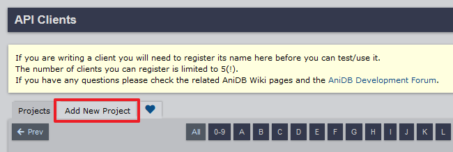
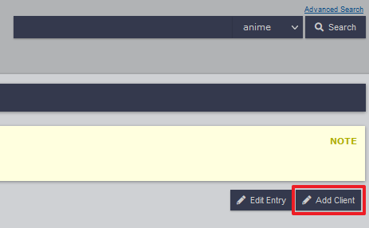
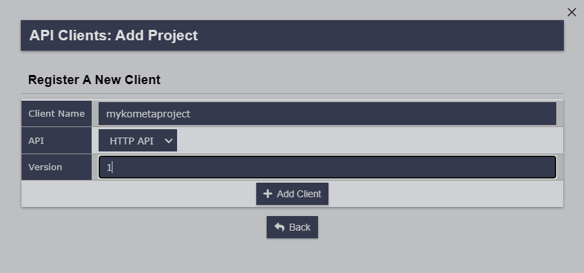

---
search:
  boost: 3
hide:
  - toc
---
# AniDB Attributes

Configuring [AniDB](https://anidb.net/) is optional but can unlock more features from the site.

Using `client` and `version` allows access to AniDB Library Operations.

Using `username` and `password` allows you to access mature content with AniDB Builders.

**All AniDB Builders still work without this, they will just not have mature content**

An `anidb` mapping is in the root of the config file, sampled below.

```yaml title="config.yml AniDB sample"
anidb:
  client: #######
  version: 1
  language: en
  cache_expiration: 60
  username: ######
  password: ######
```

| Attribute          | Description                                                             | Allowed Values (default in **bold**)                                                  |                  Required                  |
|:-------------------|:------------------------------------------------------------------------|:--------------------------------------------------------------------------------------|:------------------------------------------:|
| `client`           | AniDB client name.                                                      | Any lowercase string or leave **blank**<br><strong>Note:</strong> must be lowercase   |  :fontawesome-solid-circle-xmark:{ .red }  |
| `version`          | AniDB client version.                                                   | Any version string or leave **blank**                                                 | :fontawesome-solid-circle-xmark:{ .red }   |
| `language`         | [ISO 639-1 code](https://en.wikipedia.org/wiki/List_of_ISO_639-1_codes) | Two-letter code, e.g. **`en`**                                                        |  :fontawesome-solid-circle-xmark:{ .red }  |
| `cache_expiration` | Days before each cache mapping expires and must be re-cached.           | Integer, e.g. **`60`**                                                                |  :fontawesome-solid-circle-xmark:{ .red }  |
| `username`         | AniDB username.                                                         | Any valid username or leave **blank**                                                 |  :fontawesome-solid-circle-xmark:{ .red }  |
| `password`         | AniDB password.                                                         | Any valid password or leave **blank**                                                 |  :fontawesome-solid-circle-xmark:{ .red }  |

To get a Client Name and Client Version please follow the following steps.

1. Login to [AniDB](https://anidb.net/).
2. Go to you [API Client Page](https://anidb.net/software/add) and go to the `Add New Project` Tab.

    

3. Fill in the Project Name with whatever name you want and then hit `+ Add Project`. The rest of the settings don't matter.
4. After you've added the project you should end up on the Projects Page. If not go back to the [API Client Page](https://anidb.net/software/add) and click your projects name.
5. Once you're on the project page click `Add Client` in the top right.

    

6. Come up with and enter a unique to AniDB Client Name.
7. Select `HTTP API` in the API Dropdown
8. Put `1` for Version.

    

    ???+ example "Case Sensitivity"

        When you press the "Add Client" button, the next page may display your client name as Title Case (i.e. `Mykometaproject` instead of `mykometaproject`.

        Regardless of what the AniDB site shows, **you must enter your client name in full lowercase**.

9. Put the Client Name and Client Version you just created in your config.yml as `client` and `version` respectively.

    ```yaml
    anidb:
      client: mykometaproject
      version: 1
      language: en
      cache_expiration: 60
    ```