---
hide:
  - toc
---
# Online Authentication

When trying to authorize Trakt or MyAnimeList, Kometa needs to run in interactive mode so that you can enter details like a PIN or authentication code. 

This is problematic on some setups [primarily docker] where entering interactive mode is not always simple.

For this reason, Kometa provides a utilities webapp which will take you through the authentication process and will provide the service's authentication block ready to paste into your config.

This webapp is available at [https://utilities.kometa.wiki](https://utilities.kometa.wiki).

There is no logging, but if you feel more comfortable running these things locally you can find the source code [here](https://github.com/Kometa-Team/Kometa-Utilities).

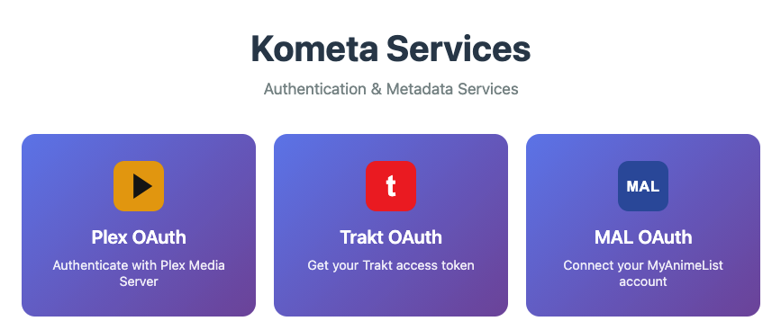

=== "Plex Authentication"

    1. Click the top-level button.

        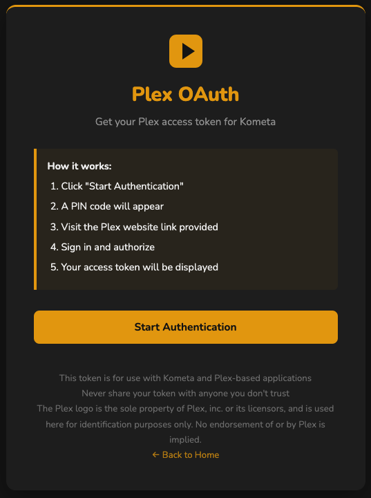

    2. Click "Start Authentication".  This will display a PIN and a link to start authentication.  Click that link [which will open a new tab/window to Plex] and follow any instructions given by Plex:

        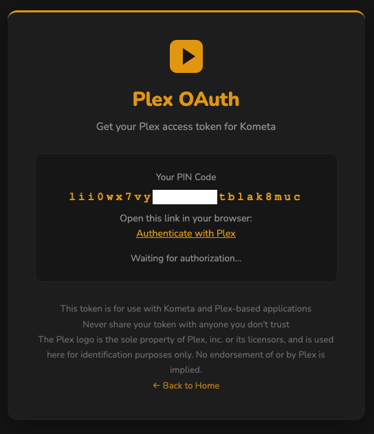

        Close that window when Plex indicates it is safe to do so.

    3. The utilities app will now display a Plex token and user details:

        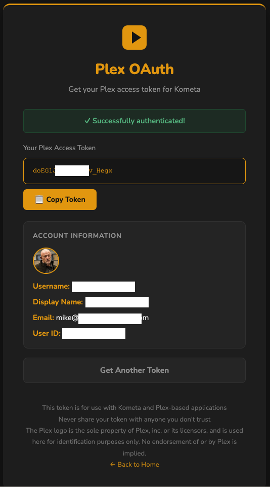

    4. Copy that token to your Kometa `config.yml`

=== "Trakt Authentication"

    1. Click the top-level button, enter your Trakt client ID and Secret.

        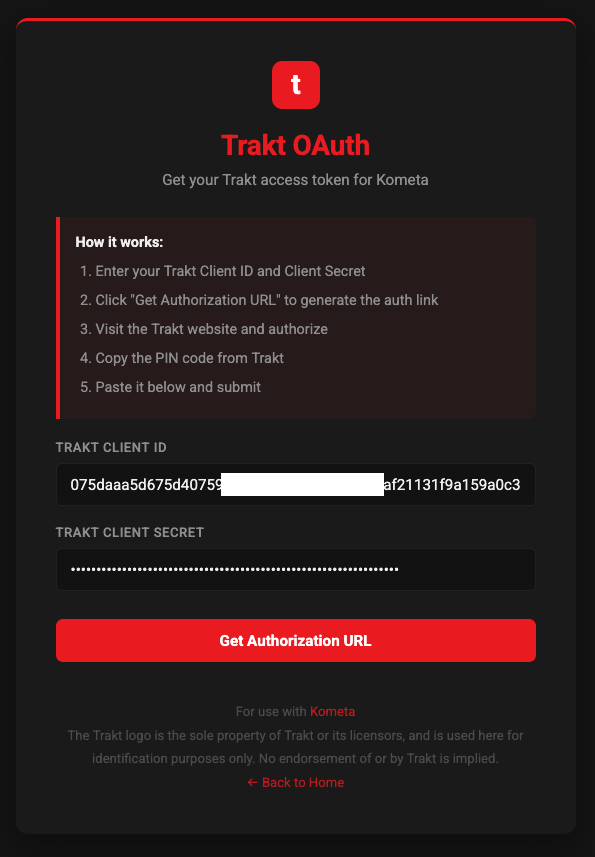

    2. Click "Get Authentication URL".  This will fill in the auth URL:

        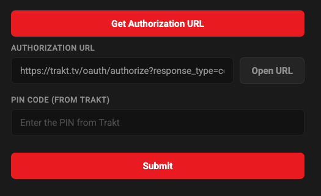

        Click "Open URL" and follow any instructions given.  You will be given a PIN on the Trakt site.

    3. Paste that PIN into the field and click "Submit":

        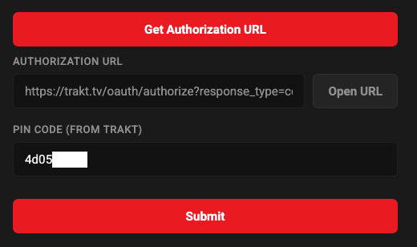

    4. A Kometa Trakt authentication block will be displayed.
    
        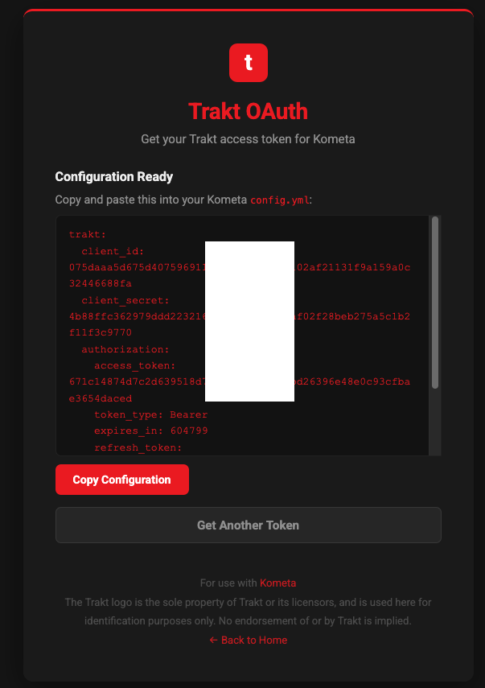
        
        Copy that block to your Kometa `config.yml`

=== "MyAnimeList Authentication"

    1. Click the top-level button, enter your MyAnimeList client ID and Secret.

        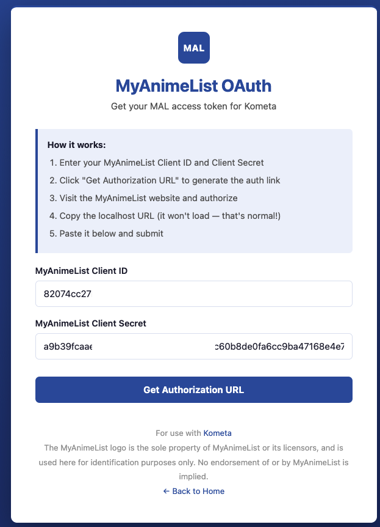

    2. Click "Get Authentication URL".  This will fill in the auth URL:

        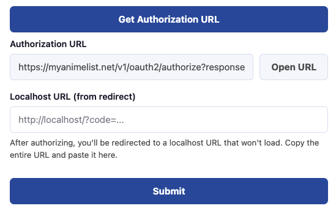

        Click "Open URL" and follow any instructions given.  This will take you to a localhost URL that will fail to load.

    3. Paste that URL into the field and click "Submit":

        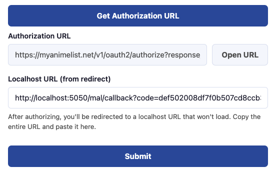

    4. A Kometa MyAnimeList authentication block will be displayed.
    
        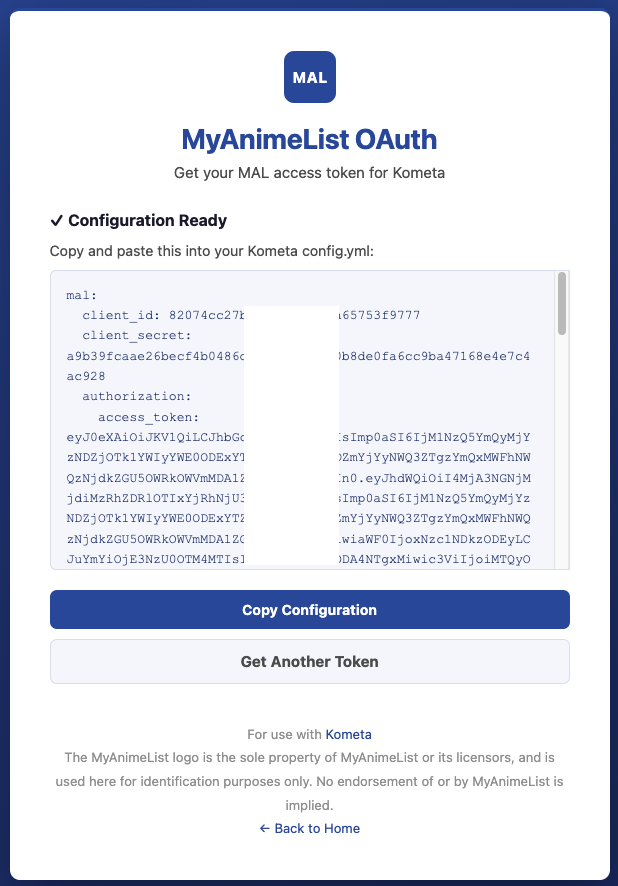
        
        Copy that block to your Kometa `config.yml`
