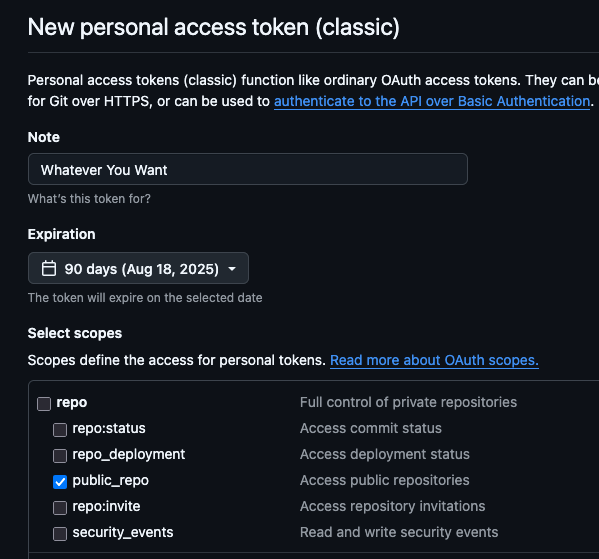
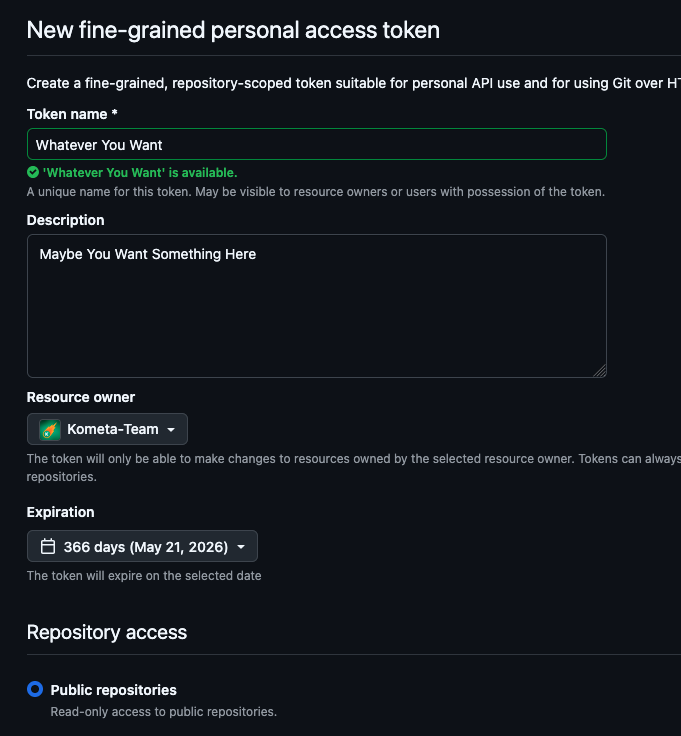

---
hide:
  - toc
---
# GitHub Attributes

Configuring [GitHub](https://github.com/) is optional but can allow you to avoid rate limits when requesting data from GitHub.

Requests made with a GitHub token have a higher rate limit than anonymous requests.

A `github` mapping is in the root of the config file, sampled below.

```yaml title="config.yml GitHub sample"
github:
  token: thisismytoken
```

| Attribute | Description                   | Allowed Values (default in **bold**) |                  Required                  |
|:----------|:------------------------------|:-------------------------------------|:------------------------------------------:|
| `token`   | GitHub personal access token. | Any valid token or leave **blank**   | :fontawesome-solid-circle-check:{ .green } |

* The GitHub Personal Access Token (PAT) can be generated [here](https://github.com/settings/tokens).

Kometa does not have any remarkable requirements here; it requires read access to public repos only.  Kometa does not require write access or access to anything other than public repos.  You may want to use this key to access your own or others' private repos, and if that's the case you will have to set the permissions on this key as required to enable what **you** want to do with it.

All the relevant Kometa repos are public.

A [classic PAT](https://docs.github.com/en/authentication/keeping-your-account-and-data-secure/managing-your-personal-access-tokens#creating-a-personal-access-token-classic) is simplest.



If you wish, you can create a [fine-grained PAT](https://docs.github.com/en/authentication/keeping-your-account-and-data-secure/managing-your-personal-access-tokens#creating-a-fine-grained-personal-access-token) granting finer-grained permissions as required by your intended use.



The expiration, note, name, and description are all up to you.  Kometa has no requirements here and there is no "right answer" aside from what Github accepts in those fields.
