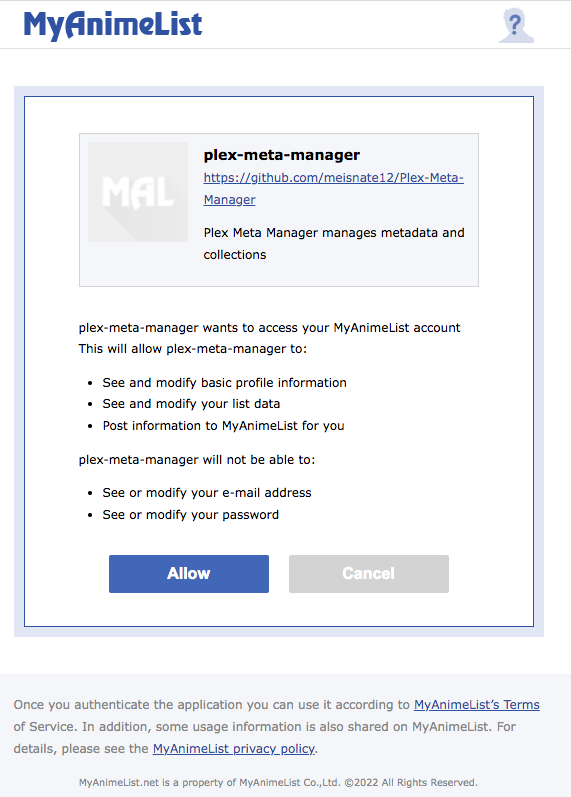

# MyAnimeList Attributes

Configuring [MyAnimeList](https://myanimelist.net/) is optional but is required for MyAnimeList based collections and 
operations to function.

A `mal` mapping is in the root of the config file.

Below is a `mal` mapping example and the full set of attributes:

```yaml
mal:
  client_id: ################################
  client_secret: ################################################################
  localhost_url: 
  authorization:
    access_token:
    token_type:
    expires_in:
    refresh_token:
```

| Attribute       | Allowed Values                        |                  Required                  |
|:----------------|:--------------------------------------|:------------------------------------------:|
| `client_id`     | MyAnimeList Application Client ID     | :fontawesome-solid-circle-check:{ .green } |
| `client_secret` | MyAnimeList Application Client Secret | :fontawesome-solid-circle-check:{ .green } |
| `localhost_url` | MyAnimeList Authorization URL         |  :fontawesome-solid-circle-xmark:{ .red }  |

All other attributes will be filled in by Plex Meta Manager.

To connect to MyAnimeList.net you must create a MyAnimeList application and supply Plex Meta Manager the `client id` and
`client secret` provided, please do the following:

1. [Click here to create a MyAnimeList API application.](https://myanimelist.net/apiconfig/create)
2. Enter an `App Name` for the application. Ex. `Plex Meta Manager`
3. Select `web` for `App Type`.
4. Enter an `App Description` for the application Ex. `Plex Meta Manager manages metadata and collections`
5. Enter `http://localhost/` for `App Redirect URL`.
6. Enter `https://github.com/meisnate12/Plex-Meta-Manager` for `Homepage URL`.
7. Select `non-commercial` for `Commercial / Non-Commercial`.
8. Enter any name under `Name / Company Name`.
9. Select `hobbyist` for `Purpose of Use`.
10. Agree to the API License and Developer Agreement and hit the `Submit` button
11. You should see `Successfully registered.` followed by a link that says `Return to list` click this link.
12. On this page Click the `Edit` button next to the application you just created.
13. Record the `Client ID` and `Client Secret` found on the application page.
14. Go to this URL but replace `CLIENT_ID` with your Client ID 

     ```
     https://myanimelist.net/v1/oauth2/authorize?response_type=code&client_id=CLIENT_ID&code_challenge=k_UHwN_eHAPQVXiceC-rYGkozKqrJmKxPUIUOBIKo1noq_4XGRVCViP_dGcwB-fkPql8f56mmWj5aWCa2HDeugf6sRvnc9Rjhbb1vKGYLY0IwWsDNXRqXdksaVGJthux
     ```

15. You should see a page that looks like this 

     

16. Click "Allow"
17. You will be taken to a page that will not load. That's fine and expected.

     

18. Copy the URL, which will be `localhost/?code=BLAH` and paste in your config file next to `localhost_url`.

     **If you do not see an error as above but instead get taken to some seemingly random website, you probably have a 
     webserver running on your local computer, probably from some sort of tutorial if you don't recall having set one 
     up. For example, some Docker tutorials have you start up local web servers.**
    
     You will need to stop that web server while you're doing this in order to grab that localhost URL.

19. Run PMM and the auth will be completed.

## Alternative Way of Letting PMM make the URL

You can record just your `client_id` and `client_secret` and pmm will create the url for you described below.

On the first run, Plex Meta Manager will walk the user through the OAuth flow by producing a MyAnimeList URL for the 
user to follow. 

After following the URL login to MyAnimeList.net and authorize the application by clicking the `Allow` button which will 
redirect the user to `http://localhost/`. 

Copy the entire URL and paste it into Plex Meta Manager and if the URL is correct then Plex Meta Manager will populate 
the `authorization` sub-attributes to use in subsequent runs.

On first run:
```
|====================================================================================================|
| Connecting to My Anime List...                                                                     |
|                                                                                                    |
| Navigate to: https://myanimelist.net/v1/oauth2/authorize?response_type=code&client_id=BING&code_challenge=BANG |
|                                                                                                    |
| Login and click the Allow option. You will then be redirected to a localhost                       |
| url that most likely won't load, which is fine. Copy the URL and paste it below                    |
| URL:

```

Click on that URL to open your browser to MyAnimeList; you'll be looking at a page like this:


Click "Allow", and you will be taken to a page that will not load.  That's fine and expected.


Copy the URL, which will be `localhost/?code=BLAH` and paste it at the prompt.

**If you do not see an error as above but instead get taken to some seemingly random website, you probably have a 
webserver running on your local computer, probably from some sort of tutorial if you don't recall having set one up. 
For example, some Docker tutorials have you start up local web servers.**

You will need to stop that web server while you're doing this in order to grab that localhost URL.

```
| URL: http://localhost/?code=BOING
| Saving authorization information to /path/to/Plex-Meta-Manager/config/config.yml |
| My Anime List Connection Successful                                                                |
|====================================================================================================|

```

### OAuth Flow using Docker

To authenticate MyAnimeList the first time, you need run the container with the `-it` flags in order to walk through the 
OAuth flow mentioned above. Once you have the MyAnimeList authentication data saved into the YAML, you'll be able to run 
the container normally.

## Online Authorization

