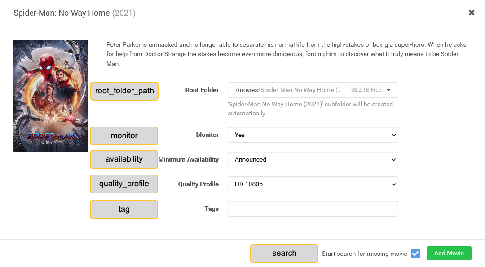

---
search:
  boost: 3
hide:
  - toc
---
# Radarr Attributes

Configuring [Radarr](https://radarr.video/) is optional but will allow you to send movies to a Radarr instance when they're found missing while updating a library's collections.

???+ warning
    
    Radarr V2 may work, but it is not supported. Please upgrade to V3 if you can.

Items in your List Exclusions will be ignored by Kometa.

A `radarr` mapping can be either in the root of the config file as global mapping for all libraries, or you can specify the `radarr` mapping individually per library.

At the library level, only those settings which are different to the global settings need to be specified; there is an example of this at the end of the page.

Below is a `radarr` mapping example and the full set of attributes:

```yaml title="config.yml Radarr sample"
radarr:
  url: http://192.168.1.12:32788
  token: 12ab34cd56ef78gh910
  add_missing: false
  add_existing: false
  upgrade_existing: false
  monitor_existing: false
  root_folder_path: S:/Movies
  monitor: false
  availability: announced
  quality_profile: HD-1080p
  tag: kometa
  search: false
  radarr_path: /media
  plex_path: /mnt/unionfs/Movies
```

<div class="annotate" markdown>

| Attribute            | Description                                                                   | Allowed Values (default in **bold**)                                                               |                  Required                   |
|:---------------------|:------------------------------------------------------------------------------|:---------------------------------------------------------------------------------------------------|:-------------------------------------------:|
| `url`                | Radarr server URL.                                                            | Any valid URL, including URL base if set.<br><strong>Example:</strong> `http://192.168.1.12:32788` | :fontawesome-solid-circle-check:{ .green }  |
| `token`              | Radarr API token.                                                             | Any valid token or leave **blank**                                                                 | :fontawesome-solid-circle-check:{ .green }  |
| `add_missing`        | Add missing movies from collections.                                          | `true` or **`false`**                                                                              |  :fontawesome-solid-circle-xmark:{ .red }   |
| `add_existing`       | Add existing movies from collections.                                         | `true` or **`false`**                                                                              |  :fontawesome-solid-circle-xmark:{ .red }   |
| `upgrade_existing`   | Upgrade existing movies to match collection quality profile.                  | `true` or **`false`**                                                                              |  :fontawesome-solid-circle-xmark:{ .red }   |
| `monitor_existing`   | Apply monitor settings to existing movies.                                    | `true` or **`false`**                                                                              |  :fontawesome-solid-circle-xmark:{ .red }   |
| `ignore_cache`       | Ignore Kometa's cache when adding to Radarr.                                  | `true` or **`false`**                                                                              |  :fontawesome-solid-circle-xmark:{ .red }   |
| `root_folder_path`   | Default root folder path for new movies.                                      | Folder path or leave **blank**                                                                     | :fontawesome-solid-circle-check:{ .green }  |
| `monitor`            | Monitor new movies when adding.                                               | **`true`** or `false`                                                                              |  :fontawesome-solid-circle-xmark:{ .red }   |
| `availability`       | Minimum availability for new movies.                                          | **`announced`**, `cinemas`, `released`, `db`                                                       | :fontawesome-solid-circle-check:{ .green }  |
| `quality_profile`    | Quality profile for new movies.                                               | Name of Radarr profile or leave **blank**                                                          | :fontawesome-solid-circle-check:{ .green }  |
| `tag`                | Tag(s) for new movies.                                                        | List (1) or comma-separated tags or leave **blank**                                                | :fontawesome-solid-circle-xmark:{ .red }    |
| `search`             | Start a search after adding movies.                                           | `true` or **`false`**                                                                              |  :fontawesome-solid-circle-xmark:{ .red }   |
| `plex_path`          | Convert this part of the path to `radarr_path` (used with `add_existing`).    | Path string or leave **blank**                                                                     |  :fontawesome-solid-circle-xmark:{ .red }   |
| `radarr_path`        | Target path replacing `plex_path` (used with `add_existing`).                 | Path string or leave **blank**                                                                     |  :fontawesome-solid-circle-xmark:{ .red }   |

</div>

1.  Lists in YAML are represented by using the hyphen (-) and space. They are ordered and can be embedded inside a map using indentation.
  
    ```{ .yaml .no-copy }
    asset_directory:
      - config/movie assets
      - config/tv assets
    ```

    The first item in the list is `config/movie assets` and the second is `config/tv assets`.

## What are `plex_path` and `radarr_path` and when do I use them?

First:

1. if you are not using `add_existing` or `radarr_add_all` to add movies that are **already in Plex** to Radarr, you can ignore these settings and leave them blank.
2. If you *are* using those, and both Radarr and Plex see your movies at the same paths, then you can leave them blank.

For example, if both Radarr and Plex see Star Wars at:
```
/mnt/unionfs/media/movies/Star Wars (1977)/Star Wars.mkv
```
Then you can leave these blank.

The only time you need to set them to anything is if:
1. you are using `add_existing` or `radarr_add_all` to add movies that are **already in Plex** to Radarr.
2. Radarr and Plex see the same movie file at different paths. 

For example, if Radarr sees Star Wars at:
```
/my-movie-library/Star Wars (1977)/Star Wars.mkv
```
and Plex sees that very same movie file at:
```
/data/movies/Star Wars (1977)/Star Wars.mkv
```
[this will almost certainly be due to docker volume mappings, but might also be caused by Radarr and Plex being on different machines.]

Then you would set these:
```
plex_path: /data/movies/
radarr_path: /my-movie-library/
```
You are filling in the unique part of the paths for each app to enable Kometa to translate the location from Plex when it adds the movie to Radarr.

Note that if you replace `/my-movie-library/` in the Radarr path with `/data/movies/` you get the Plex path and vice versa.

???+ tip
    
    The `token` can be found by going to `Radarr > Settings > General > Security > API Key`.

    The `quality_profile` must be the exact name of the desired quality profile, including all spaces and capitalization.

* You can set most attributes per collection by using the [Radarr Settings](../files/arr.md#radarr-definition-settings) in the collection definition.



Based on that UI, the settings would be [settings not based on things in this image are shown as `#`; url and token are 
of course required they are not shown here to focus on the settings that are shown above]:

```yaml
radarr:
  url: #
  token: #
  add_missing: #
  add_existing: #
  upgrade_existing: #
  monitor_existing: #
  root_folder_path: /movies
  monitor: false
  availability: announced
  quality_profile: HD-1080p
  tag: 
  search: true
  radarr_path: #
  plex_path: #
```

# Other examples:

Specifying different options for specific libraries:

In this example we have two Radarr instances, standard and 4K, and four libraries showing how one can override individual settings at the library level. 
Also, movies are being added to the "Library05" library outside Radarr via a custom script and I want those new movies added to Radarr for tracking.

```
libraries:
  Library01:     # this library uses the default radarr config
    collection_files:
      - file: config/Movies.yml

  Library02:     # this library overrides radarr root path and profile
    collection_files:
      - file: config/Movies.yml
    radarr:
      root_folder_path: /data/media/movies/tony
      quality_profile: Better

  Library03:      # this library overrides radarr quality profile
    collection_files:
      - file: config/Movies.yml
    radarr:
      quality_profile: Best

  Library04:      # this library uses the 4K radarr instance
    collection_files:
      - file: config/Movies.yml
    radarr:
      url: https://radarr-4k.bing.bang
      token: SOME_OTHER_TOKEN
      root_folder_path: /data/media/movies/geezer
      quality_profile: Bestest

  Library05:      # movies get added by a custom script so they should get added to radarr-4k
    collection_files:
      - file: config/Movies.yml
    radarr:
      url: https://radarr-4k.bing.bang
      token: SOME_OTHER_TOKEN
      root_folder_path: /data/media/movies/bill
      quality_profile: Bestest
      add_existing: true
      sonarr_path: /data/media/movies/bill
      plex_path: /mnt/unionfs/movies/bill
...
radarr:
  url: https://radarr.bing.bang
  token: SOME_TOKEN
  quality_profile: Good
  add_missing: true
  add_existing: false
  upgrade_existing: false
  monitor_existing: false
  root_folder_path: /movies
  monitor: false
  availability: released
  tag:
  search: false
  radarr_path:
  plex_path:
...
```
