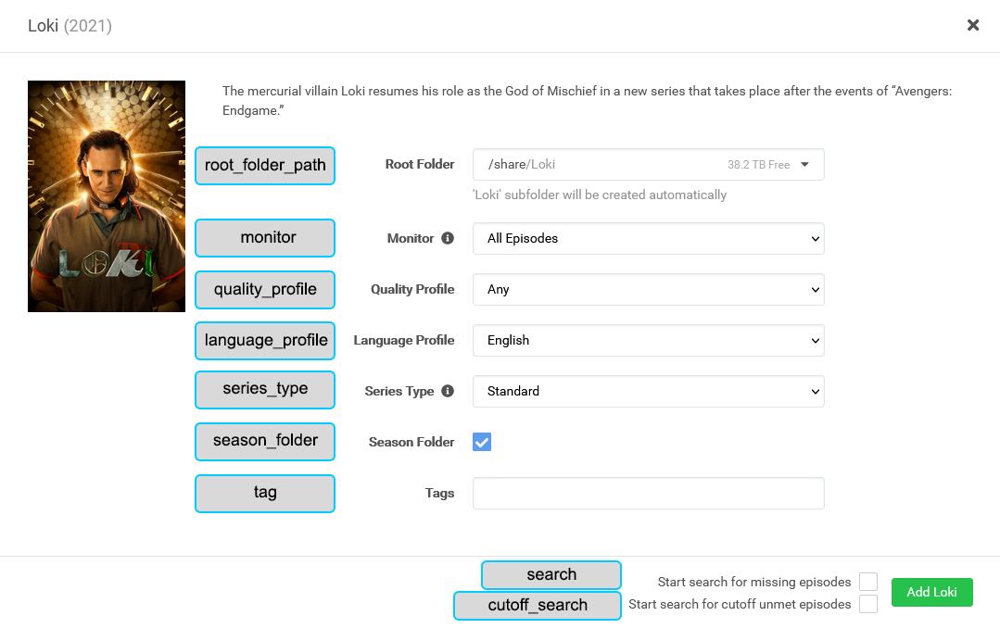

# Sonarr Attributes

Configuring [Sonarr](https://sonarr.tv/) is optional but will allow you to send shows to a Sonarr instance when they're found missing while updating a library's collections.

Sonarr V2 may work, but it is not supported please upgrade to V3 if you can.

A `sonarr` mapping can be either in the root of the config file as global mapping for all libraries, or you can specify the `sonarr` mapping individually per library.

Below is a `sonarr` mapping example and the full set of attributes:
```YAML
sonarr:
  url: http://192.168.1.12:32789
  token: ################################
  add: true
  root_folder_path: S:/Shows
  monitor: all
  quality_profile: HD-1080p
  language_profile: English
  series_type: standard
  season_folder: true
  tag: pmm
  search: false
  cutoff_search: false
  sonarr_path: /media
  plex_path: /share/CACHEDEV1_DATA/Multimedia
```

| Attribute          | Allowed Values                                                                                                                                                                                                                                                                                                                                                                                                                                                                                                                           |    Default    | Required |
|:-------------------|:-----------------------------------------------------------------------------------------------------------------------------------------------------------------------------------------------------------------------------------------------------------------------------------------------------------------------------------------------------------------------------------------------------------------------------------------------------------------------------------------------------------------------------------------|:-------------:|:--------:|
| `url`              | Sonarr URL (Including URL Base if set)<br>**Example:** http://192.168.1.12:32788                                                                                                                                                                                                                                                                                                                                                                                                                                                         |      N/A      | &#9989;  |
| `token`            | Sonarr API Token                                                                                                                                                                                                                                                                                                                                                                                                                                                                                                                         |      N/A      | &#9989;  |
| `add`              | Add missing shows found to Sonarr<br>**boolean:** true or false                                                                                                                                                                                                                                                                                                                                                                                                                                                                          |     false     | &#10060; |
| `add_existing`     | Add shows existing in this collection to Sonarr<br>**boolean:** true or false                                                                                                                                                                                                                                                                                                                                                                                                                                                            |     false     | &#10060; |
| `root_folder_path` | Sonarr Root Folder Path To Use                                                                                                                                                                                                                                                                                                                                                                                                                                                                                                           |      N/A      | &#9989;  |
| `monitor`          | `all`: Monitor all episodes except specials<br>`future`: Monitor episodes that have not aired yet<br>`missing`: Monitor episodes that do not have files or have not aired yet<br>`existing`: Monitor episodes that have files or have not aired yet<br>`pilot`: Monitor the first episode. All other episodes will be ignored<br>`first`: Monitor all episodes of the first season. All other seasons will be ignored<br>`latest`: Monitor all episodes of the latest season and future seasons<br>`none`: No episodes will be monitored |     `all`     | &#10060; |
| `quality_profile`  | Quality Profile To Use                                                                                                                                                                                                                                                                                                                                                                                                                                                                                                                   |      N/A      | &#9989;  |
| `language_profile` | Language Profile To Use (v3 Only)                                                                                                                                                                                                                                                                                                                                                                                                                                                                                                        | First Profile | &#10060; |
| `series_type`      | `standard`: Episodes released with SxxEyy pattern<br>`daily`: Episodes released daily or less frequently that use year-month-day (2017-05-25)<br>`anime`: Episodes released using an absolute episode number                                                                                                                                                                                                                                                                                                                             |  `standard`   | &#10060; |
| `season_folder`    | Use the Season Folder Option when adding to Sonarr<br>**boolean:** true or false                                                                                                                                                                                                                                                                                                                                                                                                                                                         |     true      | &#10060; |
| `tag`              | Add this list or comma-separated string of tags to every show added to Sonarr                                                                                                                                                                                                                                                                                                                                                                                                                                                            |      ` `      | &#10060; |
| `search`           | Start search for missing episodes<br>**boolean:** true or false                                                                                                                                                                                                                                                                                                                                                                                                                                                                          |     false     | &#10060; |
| `cutoff_search`    | Start search for cutoff unmet episodes<br>**boolean:** true or false                                                                                                                                                                                                                                                                                                                                                                                                                                                                     |     false     | &#10060; |
| `plex_path`        | When using `add_existing` or `sonarr_add_all` Convert this part of the path to `sonarr_path`                                                                                                                                                                                                                                                                                                                                                                                                                                             |      ` `      | &#10060; |
| `sonarr_path`      | When using `add_existing` or `sonarr_add_all` Convert the `plex_path` part of the path to this                                                                                                                                                                                                                                                                                                                                                                                                                                           |      ` `      | &#10060; |

* The `token` can be found by going to `Sonarr > Settings > General > Security > API Key`

* The `quality_profile` and `language_profile` must be the exact name of the desired quality profile, including all spaces and capitalization.

* You can set most attributes per collection by using the [Sonarr Details](../metadata/details/arr.md#sonarr-details)
 

