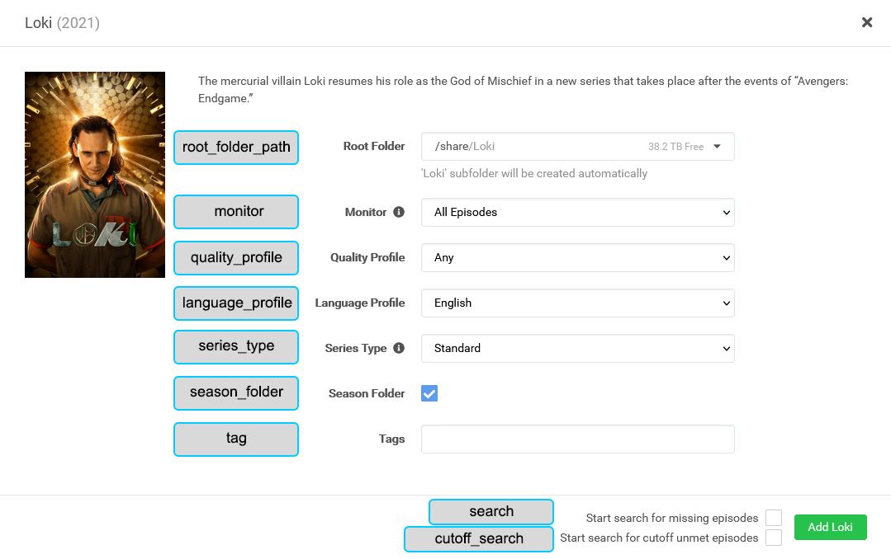

---
search:
  boost: 3
hide:
  - toc
---
# Sonarr Attributes

Configuring [Sonarr](https://sonarr.tv/) is optional but will allow you to send shows to a Sonarr instance when they're found missing while updating a library's collections.

???+ warning
    
    Sonarr V2 may work, but it is not supported please upgrade to V3 if you can.

Items in your List Exclusions will be ignored by Kometa.

A `sonarr` mapping can be either in the root of the config file as global mapping for all libraries, or you can specify the `sonarr` mapping individually per library.

At the library level, only those settings which are different to the global settings need to be specified; there is an example of this at the end of the page.

Below is a `sonarr` mapping example and the full set of attributes:

```yaml title="config.yml Sonarr sample"
sonarr:
  url: http://192.168.1.12:32789
  token: 98ab76cd54ef32gh10
  add_missing: false
  add_existing: false
  upgrade_existing: false
  monitor_existing: false
  root_folder_path: S:/Shows
  monitor: all
  quality_profile: HD-1080p
  language_profile: English
  series_type: standard
  season_folder: true
  tag: kometa
  search: false
  cutoff_search: false
  sonarr_path: /media
  plex_path: /mnt/unionfs/TV
```

???+ tip "Collection-Level Overrides"

     All of the below attributes (apart from `plex_path` and `sonarr_path`) can be set globally and then overriden at the Collection level, see [Sonarr Settings](../files/arr.md#sonarr-definition-settings) for examples of how to do this.

<div class="annotate" markdown>

| Attribute          | Description                                                                                      | Allowed Values (default in **bold**)                                                                                                                                                                                                                                                                                                                                                                                                                   |                   Required                   |
|:-------------------|:-------------------------------------------------------------------------------------------------|:-------------------------------------------------------------------------------------------------------------------------------------------------------------------------------------------------------------------------------------------------------------------------------------------------------------------------------------------------------------------------------------------------------------------------------------------------------|:--------------------------------------------:|
| `url`              | Sonarr server URL.                                                                               | Any valid URL, including URL base if set.<br><strong>Example:</strong> `http://192.168.1.12:32788`                                                                                                                                                                                                                                                                                                                                                     |  :fontawesome-solid-circle-check:{ .green }  |
| `token`            | Sonarr API token.                                                                                | Any valid token or leave **blank**                                                                                                                                                                                                                                                                                                                                                                                                                     |  :fontawesome-solid-circle-check:{ .green }  |
| `add_missing`      | Add missing shows from collections.                                                              | `true` or **`false`**                                                                                                                                                                                                                                                                                                                                                                                                                                  |   :fontawesome-solid-circle-xmark:{ .red }   |
| `add_existing`     | Add existing shows from collections.                                                             | `true` or **`false`**                                                                                                                                                                                                                                                                                                                                                                                                                                  |   :fontawesome-solid-circle-xmark:{ .red }   |
| `upgrade_existing` | Upgrade existing shows to match collection quality profile.                                      | `true` or **`false`**                                                                                                                                                                                                                                                                                                                                                                                                                                  |   :fontawesome-solid-circle-xmark:{ .red }   |
| `monitor_existing` | Apply monitor settings to existing shows.                                                        | `true` or **`false`**                                                                                                                                                                                                                                                                                                                                                                                                                                  |   :fontawesome-solid-circle-xmark:{ .red }   |
| `ignore_cache`     | Ignore Kometa's cache when adding to Sonarr.                                                     | `true` or **`false`**                                                                                                                                                                                                                                                                                                                                                                                                                                  |   :fontawesome-solid-circle-xmark:{ .red }   |
| `root_folder_path` | Default root folder path for new shows.                                                          | Folder path or leave **blank**                                                                                                                                                                                                                                                                                                                                                                                                                         |  :fontawesome-solid-circle-check:{ .green }  |
| `monitor`          | Monitor setting to apply when adding shows.                                                      | **`all`**, `future`, `missing`, `existing`, `pilot`, `first`, `latest`, `none`<br><br>Option descriptions:<br>`all`: All episodes except specials<br>`future`: Episodes that have not aired yet<br>`missing`: Episodes without files or not aired yet<br>`existing`: Episodes with files or not aired yet<br>`pilot`: Only the first episode<br>`first`: All episodes of the first season<br>`latest`: Latest season and future<br>`none`: No episodes | :fontawesome-solid-circle-xmark:{ .red }     |
| `quality_profile`  | Quality profile for new shows.                                                                   | Name of Sonarr profile or leave **blank**                                                                                                                                                                                                                                                                                                                                                                                                              |  :fontawesome-solid-circle-check:{ .green }  |
| `language_profile` | Language profile for new shows.                                                                  | Name of Sonarr profile or leave **blank**<br>Default is the first listed profile                                                                                                                                                                                                                                                                                                                                                                       |   :fontawesome-solid-circle-xmark:{ .red }   |
| `series_type`      | Series type when adding new shows.                                                               | **`standard`**, `daily`, `anime`                                                                                                                                                                                                                                                                                                                                                                                                                       |   :fontawesome-solid-circle-xmark:{ .red }   |
| `season_folder`    | Whether to use season folders.                                                                   | **`true`** or `false`                                                                                                                                                                                                                                                                                                                                                                                                                                  |   :fontawesome-solid-circle-xmark:{ .red }   |
| `tag`              | Default tags for new shows.                                                                      | List (1) or comma-separated values, or leave **blank**                                                                                                                                                                                                                                                                                                                                                                                                 |   :fontawesome-solid-circle-xmark:{ .red }   |
| `search`           | Start search for missing episodes when adding shows.                                             | `true` or **`false`**                                                                                                                                                                                                                                                                                                                                                                                                                                  |   :fontawesome-solid-circle-xmark:{ .red }   |
| `cutoff_search`    | Start search for unmet cutoff episodes.                                                          | `true` or **`false`**                                                                                                                                                                                                                                                                                                                                                                                                                                  |   :fontawesome-solid-circle-xmark:{ .red }   |
| `plex_path`        | When using `add_existing` or `sonarr_add_all` Convert this part of the path to `sonarr_path`.    | Path string or leave **blank**                                                                                                                                                                                                                                                                                                                                                                                                                         |   :fontawesome-solid-circle-xmark:{ .red }   |
| `sonarr_path`      | When using `add_existing` or `sonarr_add_all` Convert the `plex_path` part of the path to this.  | Path string or leave **blank**                                                                                                                                                                                                                                                                                                                                                                                                                         |   :fontawesome-solid-circle-xmark:{ .red }   |

</div>

1.  Lists in YAML are represented by using the hyphen (-) and space. They are ordered and can be embedded inside a map using indentation.
  
    ```{ .yaml .no-copy }
    asset_directory:
      - config/movie assets
      - config/tv assets
    ```

    The first item in the list is `config/movie assets` and the second is `config/tv assets`.

## What are `plex_path` and `sonarr_path` and when do I use them?

First:

1. if you are not using `add_existing` or `sonarr_add_all` to add shows that are **already in Plex** to Sonarr, you can ignore these settings and leave them blank.
2. If you *are* using those, and both Sonarr and Plex see your shows at the same paths, then you can leave them blank.

For example, if both Sonarr and Plex see Bad Monkey at:
```
/mnt/unionfs/media/shows/Bad Monkey (2024)
```
Then you can leave these blank.

The only time you need to set them to anything is if:
1. you are using `add_existing` or `sonarr_add_all` to add shows that are **already in Plex** to Sonarr.
2. Sonarr and Plex see the same show at different paths. 

For example, if Sonarr sees Bad Monkey at:
```
/my-show-library/Bad Monkey (2024)
```
and Plex sees that very same show at:
```
/data/shows/Bad Monkey (2024)
```
[this will almost certainly be due to docker volume mappings, but might also be caused by Sonarr and Plex being on different machines.]

Then you would set these:
```
plex_path: /data/shows/
sonarr_path: /my-show-library/
```
You are filling in the unique part of the paths for each app to enable Kometa to translate the location from Plex when it adds the show to Sonarr.

Note that if you replace `/my-show-library/` in the Sonarr path with `/data/shows/` you get the Plex path and vice versa.

???+ tip
    
    The `token` can be found by going to `Sonarr > Settings > General > Security > API Key`.

    The `quality_profile` and `language_profile` must be the exact name of the desired quality profile, including all spaces and capitalization.

* You can set most attributes per collection by using the [Sonarr Settings](../files/arr.md#sonarr-definition-settings) in the collection definition.



Based on that UI, the settings would be [settings not based on things in this image are shown as `#`; url and token are 
of course required they are not shown here to focus on the settings that are shown above]:

```YAML
sonarr:
  url: #
  token: #
  add_missing: #
  add_existing: #
  upgrade_existing: #
  monitor_existing: #
  root_folder_path: /share
  monitor: all
  quality_profile: Any
  language_profile: English
  series_type: standard
  season_folder: true
  tag: 
  search: false
  cutoff_search: false
  sonarr_path: #
  plex_path: #
```

# Other examples:

Specifying a second Sonarr instance for a specific library:

In this example we have two Sonarr instances, standard and 4K, with five libraries that override various details. Also, shows are being added to the "Library05" library 
outside Sonarr via a custom script and I want those new shows added to Sonarr for tracking.

```
libraries:
  Library01:     # this library uses the default sonarr config
    collection_files:
      - file: config/TV.yml

  Library02:     # this library overrides sonarr root path and profile
    collection_files:
      - file: config/TV.yml
    sonarr:
      root_folder_path: /data/media/shows/tony
      quality_profile: Better

  Library03:      # this library overrides sonarr quality profile
    collection_files:
      - file: config/TV.yml
    sonarr:
      quality_profile: Best

  Library04:      # this library uses the 4K sonarr instance
    collection_files:
      - file: config/TV.yml
    sonarr:
      url: https://sonarr-4k.bing.bang
      token: SOME_OTHER_TOKEN
      root_folder_path: /data/media/shows/geezer
      quality_profile: Bestest
      
  Library05:      # shows get added by a custom script so they should get added to sonarr-4k
    collection_files:
      - file: config/TV.yml
    sonarr:
      url: https://sonarr-4k.bing.bang
      token: SOME_OTHER_TOKEN
      root_folder_path: /data/media/shows/bill
      quality_profile: Bestest
      add_existing: true
      sonarr_path: /data/media/shows/bill
      plex_path: /mnt/unionfs/shows/bill

...
sonarr:
  url: https://sonarr.bing.bang
  token: SOME_TOKEN
  add_missing: false
  add_existing: false
  upgrade_existing: false
  monitor_existing: false
  root_folder_path: /data/media/shows/ozzy
  monitor: all
  quality_profile: Good
  language_profile: English
  series_type: standard
  season_folder: true
  tag:
  search: false
  cutoff_search: false
  sonarr_path:
  plex_path:
...
```
