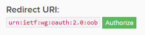

---
search:
  boost: 3
hide:
  - toc
---
# Trakt Attributes

Configuring [Trakt.tv](https://trakt.tv/) is optional but is required for Trakt based collections to function. 

The `trakt` attribute is found at the root of the config file.  Some of these are filled in by you, others are filled in by Trakt:

Kometa will keep these credentials up-to-date; they expire in 24 hours and will need to be renewed.

???+ warning

    Your config file needs to be writable by Kometa, since the `authentication` attribute gets updated when the credentials are renewed.

    If the config file is not writable, the Trakt renewal will eventually fail.


```yaml title="config.yml Trakt sample"
trakt:
  client_id: 1a2b3c4d5e6f7g8h9i
  client_secret: 1a12b23c34d45e56f6
  pin:
  force_refresh: false
  authorization:
    access_token: 4cc355t0k3nh3r3
    token_type: Bearer
    expires_in: 1928374655
    refresh_token: r3fr35ht0k3nh3r3
    scope: public 
    created_at: 137946258
```

| Attribute       | Description                       | Allowed Values (default in **bold**) |                  Required                  |
|:----------------|:----------------------------------|:-------------------------------------|:------------------------------------------:|
| `client_id`     | Trakt application client ID.      | Any valid ID or leave **blank**      | :fontawesome-solid-circle-check:{ .green } |
| `client_secret` | Trakt application client secret.  | Any valid secret or leave **blank**  | :fontawesome-solid-circle-check:{ .green } |
| `pin`           | Trakt PIN.                        | PIN string or leave **blank**        |  :fontawesome-solid-circle-xmark:{ .red }  |
| `force_refresh` | Refresh credentials on every run. | 'true' or 'false'                    |  :fontawesome-solid-circle-xmark:{ .red }  |


*All other attributes will be filled in by Kometa as part of the authentication process*

### Important Note on "Authentication Process":

The Trakt authentication process is interactive; Kometa will display a URL in the console output and then wait for you to visit that URL in order to grant access and then paste in some additional information.  In order for this to happen you need to run Kometa in an interactive mode, which can be fussy in some contexts (e.g., running Kometa in a Docker container on a NAS).  For this reason, it is far simpler to use the form down below to perform these steps; it does all the same steps, but takes them out of the Kometa script execution.  The form will produce a complete authentication block as shown above ready for you to copy-paste into your `config.yml`.

## Trakt Authentication

You can complete the trakt authentication interactively during the config run, or you can complete it outside of Kometa and paste in the resulting `traskt` attribute.

### Authenticating during the Kometa run

To connect to Trakt.tv you must create a Trakt application and supply Kometa the `client_id`,`client_secret`, and `pin` provided, please do the following:

1. [Click here to create a Trakt API application.](https://trakt.tv/oauth/applications/new)
2. Enter a `Name` for the application.
3. Enter `urn:ietf:wg:oauth:2.0:oob` for `Redirect uri`.
4. Click the `SAVE APP` button.
5. Record the `Client ID` and `Client Secret` as `client_id` and `client_secret` in your Configuration File.
6. Click the Green Authorize Button next to the Redirect URI.

    

7. Record the `PIN` as `pin` in your Configuration File.

???+ warning

    Run Kometa shortly after obtaining your PIN; the PIN may expire at some point.

### Authenticating outside the Kometa run


