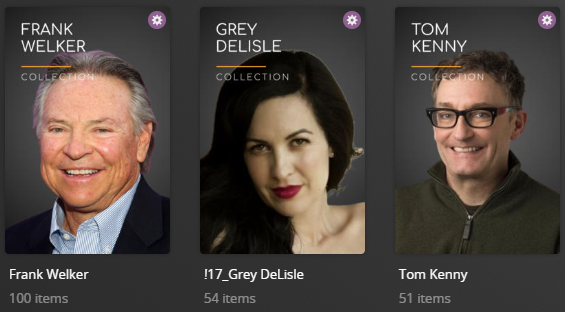

# Actor Default Metadata File

The `- pmm: actor` Metadata File is used to dynamically create collections based on the most popular actors/actresses in your library.

Example Collections Created:


The below YAML in your config.yml will create the actor collections:
```yaml
libraries:
  Movies:
    metadata_path:
      - pmm: actor
```

## Rainier Style
Below is a screnshot of the alternative `Rainier` style which can be set via template variables




## Template Variables
Template Variables can be used to manipulate the actor file from the default settings which are provided. 

Note that the `templates_variables:` section only needs to be used if you do NOT want to use the default settings.

Below are the available variables which can be used to customize the actor file.


| Variable           | Usage                                                                          | Default Value  |                                                                             Values                                                                             |
|:-------------------|:-------------------------------------------------------------------------------|----------------|:--------------------------------------------------------------------------------------------------------------------------------------------------------------:|
| style              | Controls the visual theme of the collections created                           | `bw`           |                                                 `bw` - Black and white theme or<br/>`rainier` - Rainier theme                                                  |
| sort_by            | Controls the sort method for the collections                                   | `release.desc` |                                                  Any sort method in the [Sorts Options Table](#sort-options)                                                   |
| collection_section | Controls the sort order of these collections against other default collections | `17`           |                                                                           Any number                                                                           |
| collection_mode    | Controls the collection mode of these collections                              | `default`      | `default` - Library default<br/>`hide` - Hide Collection<br/>`hide_items`- Hide Items in this Collection<br/>`show_items` - Show this Collection and its Items |
| use_separator      | Controls whether a separator is created                                        | `true`         |                                                                       `true` or `false`                                                                        |
| sep_style          | Sets the theme of the separator                                                | `orig`         |                                                    `orig`, `blue`, `gray`, `green`, `purple`, `red`, `stb`                                                     |
| item_radarr_tag    | Radarr Tag for existing items                                                  |                |                                                         list of tag(s) to be applied to existing items                                                         |
| item_sonarr_tag    | Sonarr Tag for existing items                                                  |                |                                                        list of tag(s) to be applied to existing items                                                          |

The below shows an example config.yml with all of the template_variables set away from their defaults:

```yaml
libraries:
  Movies:
    metadata_path:
      - pmm: actor
        template_variables:
          style: rainier
          sort_by: title.asc
          collection_section: 12
          collection_mode: show_items
          use_separator: false
          sep_style: purple
```

