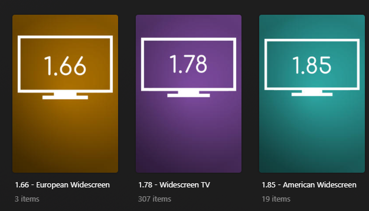

# Aspect Ratio Collections

The `aspect` Default Collection File is used to create collections with items that are based on their aspect ratio.



## Requirements & Recommendations

Supported Library Types: Movie, Show

## Collections Section 125

| Collection                     | Key         | Description                                                                    |
|:-------------------------------|:------------|:-------------------------------------------------------------------------------|
| `Aspect Ratio  Collections`    | `separator` | [Separator Collection](../separators.md) to denote the Section of Collections. |
| `1.33 - Academy Aperture`      | `1.33`      | Collection of Movies/Shows with a 1.33 aspect ratio                            |
| `1.65 - Early Widescreen`      | `1.65`      | Collection of Movies/Shows with a 1.65 aspect ratio                            |
| `1.66 - European Widescreen`   | `1.66`      | Collection of Movies/Shows with a 1.66 aspect ratio                            |
| `1.78 - Widescreen TV`         | `1.78`      | Collection of Movies/Shows with a 1.78 aspect ratio                            |
| `1.85 - American Widescreen`   | `1.85`      | Collection of Movies/Shows with a 1.85 aspect ratio                            |
| `2.2 - 70mm Frame`             | `2.2`       | Collection of Movies/Shows with a 2.2 aspect ratio                             |
| `2.35 - Anamorphic Projection` | `2.35`      | Collection of Movies/Shows with a 2.35 aspect ratio                            |
| `2.77 - Cinerama`              | `2.77`      | Collection of Movies/Shows with a 2.77 aspect ratio                            |

## Config

The below YAML in your config.yml will create the collections:

```yaml
libraries:
  Movies:
    collection_files:
      - default: aspect
  TV Shows:
    collection_files:
      - default: aspect
```

## Template Variables

Template Variables can be used to manipulate the file in various ways to slightly change how it works without having to 
make your own local copy.

Note that the `template_variables:` section only needs to be used if you do want to actually change how the defaults 
work. Any value not specified will use its default value if it has one if not it's just ignored.

??? abstract "Variable Lists (click to expand)"

    * **File-Specific Template Variables** are variables available specifically for this Kometa Defaults file.

    * **Shared Template Variables** are additional variables shared across the Kometa Defaults.

    * **Shared Separator Variables** are additional variables available since this Default contains a 
    [Separator](../separators.md).

    === "File-Specific Template Variables"

        | Variable                        | Description & Values                                                                                                                                                                                                                                                                             |
        |:--------------------------------|:-------------------------------------------------------------------------------------------------------------------------------------------------------------------------------------------------------------------------------------------------------------------------------------------------|
        | `limit`                         | **Description:** Changes the Builder Limit for all collections in a Defaults file.<br>**Values:** Number Greater than 0                                                                                                                                                                          |
        | `limit_<<key>>`<sup>1</sup>     | **Description:** Changes the Builder Limit of the specified key's collection.<br>**Default:** `limit`<br>**Values:** Number Greater than 0                                                                                                                                                       |
        | `sort_by`                       | **Description:** Changes the Smart Filter Sort for all collections in a Defaults file.<br>**Default:** `release.desc`<br>**Values:** [Any `smart_filter` Sort Option](../../files/builders/smart.md#sort-options)                                                                                |
        | `sort_by_<<key>>`<sup>1</sup>   | **Description:** Changes the Smart Filter Sort of the specified key's collection.<br>**Default:** `sort_by`<br>**Values:** [Any `smart_filter` Sort Option](../../files/builders/smart.md#sort-options)                                                                                          |
        | `sync_mode`                     | **Description:** Changes the Sync Mode for all collections in a Defaults file.<br>**Default:** `sync`<br>**Values:**<table class="clearTable"><tr><td>`sync`</td><td>Add and Remove Items based on Builders</td></tr><tr><td>`append`</td><td>Only Add Items based on Builders</td></tr></table> |
        | `sync_mode_<<key>>`<sup>1</sup> | **Description:** Changes the Sync Mode of the specified key's collection.<br>**Default:** `sync_mode`<br>**Values:**<table class="clearTable"><tr><td>`sync`</td><td>Add and Remove Items based on Builders</td></tr><tr><td>`append`</td><td>Only Add Items based on Builders</td></tr></table> |
        | `exclude`                       | **Description:** Exclude these Media Outlets from creating a Dynamic Collection.<br>**Values:** List of Media Outlet Keys                                                                                                                                                                        |
        | `name_format`                   | **Description:** Changes the title format of the Dynamic Collections.<br>**Default:** `Based on a <<key_name>>`<br>**Values:** Any string with `<<key_name>>` in it.                                                                                                                             |
        | `summary_format`                | **Description:** Changes the summary format of the Dynamic Collections.<br>**Default:** `<<library_translationU>>s based on or inspired by <<translated_key_name>>s.`<br>**Values:** Any string.                                                                                                 |

        1. Each default collection has a `key` that when calling to effect a specific collection you must replace 
        `<<key>>` with when calling.

    === "Shared Template Variables"

        
    
    === "Shared Separator Variables"

        
    
???+ example "Example Template Variable Amendments"

    The below is an example config.yml extract with some Template Variables added in to change how the file works.

    Click the :fontawesome-solid-circle-plus: icon to learn more
    
    ```yaml
    libraries:
      Movies:
        collection_files:
          - default: aspect
            template_variables:
              use_1.65: false #(1)!
              sep_style: plum #(2)!
    ```

    1.  Do not create a "1.65 - Early Widescreen" collection
    2.  Use the plum [Separator Style](../separators.md#separator-styles)
