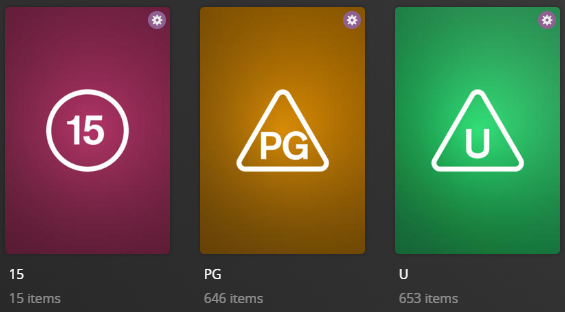

# UK Content Rating Collections

The `content_rating_uk` Default Collection File is used to dynamically create collections based on the content ratings available in your library.

If you do not use the UK-based rating system within Plex, this file will attempt to match the ratings in your library to the respective rating system.



## Requirements & Recommendations

Supported Library Types: Movie, Show

Recommendation: Set the Certification Country within your library's advanced settings to "United Kingdom"

## Collections Section 110

| Collection                                                    | Key                                       | Description                                                                             |
|:--------------------------------------------------------------|:------------------------------------------|:----------------------------------------------------------------------------------------|
| `Ratings Collections`                                         | `separator`                               | [Separator Collection](../separators.md) to denote the Section of Collections.          |
| `<<Content Rating>> Movies/Shows`<br>**Example:** `15 Movies` | `<<Content Rating>>`<br>**Example:** `15` | Collection of Movies/Shows that have this Content Rating.                               |
| `Not Rated Movies/Shows`                                      | `other`                                   | Collection of Movies/Shows that are Unrated, Not Rated or any other uncommon Ratings.   |

## Config

The below YAML in your config.yml will create the collections:

```yaml
libraries:
  Movies:
    collection_files:
      - pmm: content_rating_uk
  TV Shows:
    collection_files:
      - pmm: content_rating_uk
```

## Template Variable Default Values

Template Variables can be used to manipulate the file in various ways to slightly change how it works without having to make your own local copy.

This file contains a [Separator](../separators.md) so all [Shared Separator Variables](../separators.md#shared-separator-variables) are available as well.

| Variable                      | Description & Values                                                                                                                                                                                                                                                    |
|:------------------------------|:------------------------------------------------------------------------------------------------------------------------------------------------------------------------------------------------------------------------------------------------------------------------|
| `limit`                       | **Description:** Changes the Builder Limit for all collections in a Defaults file.<br>**Values:** Number Greater than 0                                                                                                                                                 |
| `limit_<<key>>`<sup>1</sup>   | **Description:** Changes the Builder Limit of the specified key's collection.<br>**Default:** `limit`<br>**Values:** Number Greater than 0                                                                                                                              |
| `sort_by`                     | **Description:** Changes the Smart Filter Sort for all collections in a Defaults file.<br>**Default:** `release.desc`<br>**Values:** [Any `smart_filter` Sort Option](../../builders/smart.md#sort-options)                                                             |
| `sort_by_<<key>>`<sup>1</sup> | **Description:** Changes the Smart Filter Sort of the specified key's collection.<br>**Default:** `sort_by`<br>**Values:** [Any `smart_filter` Sort Option](../../builders/smart.md#sort-options)                                                                       |
| `include`                     | **Description:** Overrides the [default include list](#default-include).<br>**Values:** List of Content Ratings found in your library                                                                                                                                   |
| `exclude`                     | **Description:** Exclude these Content Ratings from creating a Dynamic Collection.<br>**Values:** List of Content Ratings found in your library                                                                                                                         |
| `addons`                      | **Description:** Overrides the [default addons dictionary](#default-addons). Defines how multiple keys can be combined under a parent key. The parent key doesn't have to already exist in Plex<br>**Values:** Dictionary List of Content Ratings found in your library |
| `append_include`              | **Description:** Appends to the [default include list](#default-include).<br>**Values:** List of Content Ratings found in your library                                                                                                                                  |
| `remove_include`              | **Description:** Removes from the [default include list](#default-include).<br>**Values:** List of Content Ratings found in your library                                                                                                                                |
| `append_addons`               | **Description:** Appends to the [default addons dictionary](#default-addons).<br>**Values:** Dictionary List of Content Ratings found in your library                                                                                                                   |
| `remove_addons`               | **Description:** Removes from the [default addons dictionary](#default-addons).<br>**Values:** Dictionary List of Content Ratings found in your library                                                                                                                 |
| `name_format`                 | **Description:** Changes the title format of the Dynamic Collections.<br>**Default:** `<<key_name>> <<library_translationU>>s`<br>**Values:** Any string with `<<key_name>>` in it.                                                                                     |
| `summary_format`              | **Description:** Changes the summary format of the Dynamic Collections.<br>**Default:** `<<library_translationU>>s that are rated <<key_name>>.`<br>**Values:** Any string.                                                                                             |

1. Each default collection has a `key` that when calling to effect a specific collection you must replace `<<key>>` with when calling.



### Example Template Variable Amendments

The below is an example config.yml extract with some Template Variables added in to change how the file works.

???+ tip

    Anywhere you see this icon:
   
    > :fontawesome-solid-circle-plus:
   
    That's a tooltip, you can press them to get more information.

```yaml
libraries:
  Movies:
    collection_files:
      - pmm: content_rating_cs
        template_variables:
          sep_style: stb #(1)!
          use_other: false #(2)!
          append_addons:
            15: #(3)!
              - de/15 #(4)!
          sort_by: title.asc
```

1.  Use the stb [Separator Style](../separators.md#separator-styles)
2.  Do not create a "Not Rated Movies/Shows" collection
3.  Defines a collection which will be called "15", this does not need to already exist in your library
4.  Adds the "de/15" content rating to the "15" addon list, "de/18" must exist in your library if the "15" content rating does not

## Default values

These are lists provided for reference to show what values will be in use if you do no customization.  If you want to customize these values, use the methods described above.  These do not show how to change a name or a list.

### Default `include`

```yaml
include:
  - U
  - PG
  - 12
  - 12A
  - 15
  - 18
  - R18
```

### Default `addons`

```yaml
    addons:
      U:
        - gb/U
        - gb/0+
        - G
        - TV-Y
        - TV-G
        - E
        - gb/E
        - 1
        - 2
        - 3
        - 4
        - 5
        - 6
        - "01"
        - "02"
        - "03"
        - "04"
        - "05"
        - "06"
        - G - All Ages
      PG:
        - gb/PG
        - gb/9+
        - TV-PG
        - TV-Y7
        - TV-Y7-FV
        - PG
        - 7
        - 8
        - 9
        - 10
        - 11
        - "07"
        - "08"
        - "09"
        - PG - Children
      12:
        - gb/12
        - 12
        - PG-13 - Teens 13 or older
      12A:
        - gb/12A
        - 12+
        - PG-13
        - TV-13
        - 12
        - PG-13 - Teens 13 or older
      15:
        - gb/15
        - gb/14+
        - TV-14
        - 13
        - 14
        - 15
        - PG-13 - Teens 13 or older
      18:
        - gb/18
        - MA-17
        - TVMA
        - TV-MA
        - R
        - 16
        - 17
        - 18
        - R - 17+ (violence & profanity)
        - R+ - Mild Nudity
      R18:
        - gb/R18
        - gb/X
        - X
        - NC-17
        - Rx - Hentai
```