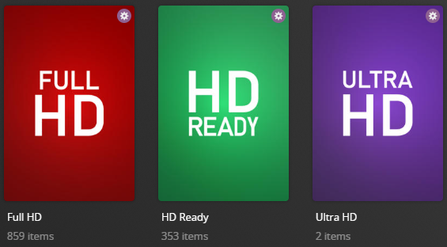

---
hide:
  - toc
---


| `<<Resolution>> Movies/Shows`<br>**Example:** `1080p Movies` | `<<Number>>`<br>**Example:** `1080` | Collection of Movies/Shows that have this Resolution. |

## Standards Style

Below is a screenshot of the alternative Standards (`standards`) style which can be set via the `style` template variable.

Standards Style takes the base resolutions ("4K" and "720p") and turns them into the commonly-known standards name ("Ultra HD" and "HD Ready").




    ```yaml
    libraries:
      Movies:
        collection_files:
          - default: resolution
            template_variables:
              sep_style: green #(1)!
              exclude:
                - sd #(2)!
              sort_by: title.asc
    ```

    1. Use the green [Separator Style](../separators.md#separator-styles)
    2. Do not use the "sd" resolution as part of the "480p Movies/Shows" Collections


    

    




    === "Resolution Collections"

        The Resolution collections use the [dynamic collections](../../../files/dynamic) system based on the resolution of the items in your libraries.
        
        They use a default list of resolutions to create the collections, and some default addons to group resolutions together.


    === "Default `include`"
    
        
        include: 
    
        ```

    === "Default `addons`"
    
        
        addons: 
    
        ```
