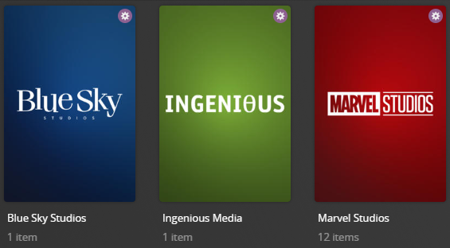

# Studio Collections

The `studio` Default Collection File is used to dynamically create collections based on the studios available in your 
library.

This file also merges similarly named studios (such as "20th Century Fox" and "20th Century Animation") into one ("20th 
Century Studios")



## Requirements & Recommendations

Supported Library Types: Movie, Show

## Collections Section 070

| Collection                                           | Key                                                  | Description                                                                    |
|:-----------------------------------------------------|:-----------------------------------------------------|:-------------------------------------------------------------------------------|
| `Studio Collections`                                 | `separator`                                          | [Separator Collection](../separators.md) to denote the Section of Collections. |
| `<<Studio>>`<br>**Example:** `Blumhouse Productions` | `<<Studio>>`<br>**Example:** `Blumhouse Productions` | Collection of Movies/Shows that have this Studio.                              |

## Config

The below YAML in your config.yml will create the collections:

```yaml
libraries:
  Movies:
    collection_files:
      - default: studio
  TV Shows:
    collection_files:
      - default: studio
```

## Template Variables

Template Variables can be used to manipulate the file in various ways to slightly change how it works without having to 
make your own local copy.

Note that the `template_variables:` section only needs to be used if you do want to actually change how the defaults 
work. Any value not specified will use its default value if it has one if not it's just ignored.

??? abstract "Variable Lists (click to expand)"

    * **File-Specific Template Variables** are variables available specifically for this Kometa Defaults file.

    * **Shared Template Variables** are additional variables shared across the Kometa Defaults.

    * **Shared Separator Variables** are additional variables available since this Default contains a 
    [Separator](../separators.md).

    === "File-Specific Template Variables"

        | Variable                      | Description & Values                                                                                                                                                                                                                                    |
        |:------------------------------|:--------------------------------------------------------------------------------------------------------------------------------------------------------------------------------------------------------------------------------------------------------|
        | `limit`                       | **Description:** Changes the Builder Limit for all collections in a Defaults file.<br>**Values:** Number Greater than 0                                                                                                                                 |
        | `limit_<<key>>`<sup>1</sup>   | **Description:** Changes the Builder Limit of the specified key's collection.<br>**Default:** `limit`<br>**Values:** Number Greater than 0                                                                                                              |
        | `sort_by`                     | **Description:** Changes the Smart Filter Sort for all collections in a Defaults file.<br>**Default:** `release.desc`<br>**Values:** [Any `smart_filter` Sort Option](../../files/builders/smart.md#sort-options)                                       |
        | `sort_by_<<key>>`<sup>1</sup> | **Description:** Changes the Smart Filter Sort of the specified key's collection.<br>**Default:** `sort_by`<br>**Values:** [Any `smart_filter` Sort Option](../../files/builders/smart.md#sort-options)                                                 |
        | `include`                     | **Description:** Overrides the [default include list](#include).<br>**Values:** List of Studios found in your library                                                                                                                                   |
        | `append_include`              | **Description:** Appends to the [default include list](#include).<br>**Values:** List of Studios found in your library                                                                                                                                  |
        | `remove_include`              | **Description:** Removes from the [default include list](#include).<br>**Values:** List of Studios found in your library                                                                                                                                |
        | `exclude`                     | **Description:** Exclude these Studios from creating a Dynamic Collection.<br>**Values:** List of Studios found in your library                                                                                                                         |
        | `addons`                      | **Description:** Overrides the [default addons dictionary](#addons). Defines how multiple keys can be combined under a parent key. The parent key doesn't have to already exist in Plex<br>**Values:** Dictionary List of Studios found in your library |
        | `append_addons`               | **Description:** Appends to the [default addons dictionary](#addons).<br>**Values:** Dictionary List of Studios found in your library                                                                                                                   |
        | `remove_addons`               | **Description:** Removes from the [default addons dictionary](#addons).<br>**Values:** Dictionary List of Studios found in your library                                                                                                                 |
        | `name_format`                 | **Description:** Changes the title format of the Dynamic Collections.<br>**Default:** `<<key_name>> <<library_translationU>>s`<br>**Values:** Any string with `<<key_name>>` in it.                                                                     |
        | `summary_format`              | **Description:** Changes the summary format of the Dynamic Collections.<br>**Default:** `<<library_translationU>>s that have the resolution <<key_name>>.`<br>**Values:** Any string.                                                                   |

        1. Each default collection has a `key` that when calling to effect a specific collection you must replace 
        `<<key>>` with when calling.

    === "Shared Template Variables"

        

    === "Shared Separator Variables"

        
    
???+ example "Example Template Variable Amendments"

    The below is an example config.yml extract with some Template Variables added in to change how the file works.

    Click the :fontawesome-solid-circle-plus: icon to learn more
    
    ```yaml
    libraries:
      Movies:
        collection_files:
          - default: studio
            template_variables:
              append_include:
                - Big Bull Productions #(1)!
              sort_by: title.asc
              collection_mode: show_items #(2)!
              sep_style: gray #(3)!
    ```

    1.  add "Big Bull Productions" to the list of items that should be included in the Collection list
    2.  Show these collections and their items within the "Library" tab
    3.  Use the gray [Separator Style](../separators.md#separator-styles)

## Default Values

These are lists provided for reference to show what values will be in use if you do no customization.  **These do not 
show how to change a name or a list.**

If you want to customize these values, use the methods described above.

??? example "Default `include` (click to expand) <a class="headerlink" href="#include" title="Permanent link">¶</a>"

    <div id="include" />

    ```{ .dtd .no-copy }
    ###############################################################################
    ################################## IMPORTANT ##################################
    #####################  THIS DATA IS PROVIDED FOR REFERENCE ####################
    ##  DO NOT COPY/PASTE THIS INTO YOUR CONFIG FILE, IT WILL ONLY CAUSE ERRORS ###
    #############  SEE ABOVE FOR HOW TO MODIFY OR AUGMENT THESE VALUES ############
    ###############################################################################
    include: 
    ```

??? example "Default `addons` (click to expand) <a class="headerlink" href="#addons" title="Permanent link">¶</a>"

    <div id="addons" />

    ```{ .dtd .no-copy }
    ###############################################################################
    ################################## IMPORTANT ##################################
    #####################  THIS DATA IS PROVIDED FOR REFERENCE ####################
    ##  DO NOT COPY/PASTE THIS INTO YOUR CONFIG FILE, IT WILL ONLY CAUSE ERRORS ###
    #############  SEE ABOVE FOR HOW TO MODIFY OR AUGMENT THESE VALUES ############
    ###############################################################################
    addons: 
    ```
