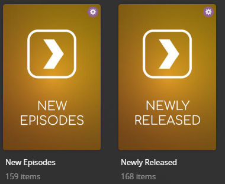

# Basic Charts Collections

The `basic` Default Collection File is used to create collections based on recently released media in your library.



## Requirements & Recommendations

Supported Library Types: Movie, Show

## Collections Section 010

| Collection       | Key        | Description                                                    |
|:-----------------|:-----------|:---------------------------------------------------------------|
| `Newly Released` | `released` | Collection of Movies or TV Shows released in the last 90 days. |
| `New Episodes`   | `episodes` | Collection of Episodes released in the last 7 days.            |

## Config

The below YAML in your config.yml will create the collections:

```yaml
libraries:
  Movies:
    collection_files:
      - default: basic
  TV Shows:
    collection_files:
      - default: basic
```

## Template Variables

Template Variables can be used to manipulate the file in various ways to slightly change how it works without having to 
make your own local copy.

Note that the `template_variables:` section only needs to be used if you do want to actually change how the defaults 
work. Any value not specified will use its default value if it has one if not it's just ignored.

??? abstract "Variable Lists (click to expand)"

    * **File-Specific Template Variables** are variables available specifically for this Kometa Defaults file.

    * **Shared Template Variables** are additional variables shared across the Kometa Defaults.

    === "File-Specific Template Variables"

        | Variable                          | Description & Values                                                                                                                                                                                                                            |
        |:----------------------------------|:------------------------------------------------------------------------------------------------------------------------------------------------------------------------------------------------------------------------------------------------|
        | `limit`                           | **Description:** Changes the Smart Filter Limit for all collections in a Defaults file.<br>**Values:** Number greater than 0                                                                                                                    |
        | `limit_<<key>>`<sup>1</sup>       | **Description:** Changes the Smart Filter Limit of the specified key's collection.<br>**Default:** `limit`<br>**Values:** Number greater than 0                                                                                                 |
        | `sort_by`                         | **Description:** Changes the Smart Filter Sort for all collections in a Defaults file.<br>**Default:** `release.desc`<br>**Values:** [Any `smart_filter` Sort Option](../../files/builders/smart.md#sort-options)                               |
        | `sort_by_<<key>>`<sup>1</sup>     | **Description:** Changes the Smart Filter Sort of the specified key's collection.<br>**Default:** `sort_by`<br>**Values:** [Any `smart_filter` Sort Option](../../files/builders/smart.md#sort-options)                                         |
        | `in_the_last_<<key>>`<sup>1</sup> | **Description:** Changes how far back the Smart Filter looks.<table class="clearTable"><tr><td>**Default:**</td></tr><tr><td>`released`</td><td>`90`</td></tr><tr><td>`episodes`</td><td>`7`</td></tr></table>**Values:** Number greater than 0 |

        1. Each default collection has a `key` that when calling to effect a specific collection you must replace 
        `<<key>>` with when calling.

    === "Shared Template Variables"

        
    
???+ example "Example Template Variable Amendments"

    The below is an example config.yml extract with some Template Variables added in to change how the file works.

    Click the :fontawesome-solid-circle-plus: icon to learn more
    
    ```yaml
    libraries:
      Movies:
        collection_files:
          - default: basic
            template_variables:
              in_the_last_episodes: 14 #(1)!
              visible_library_released: true #(2)!
              visible_home_released: true #(3)!
              visible_shared_released: true #(4)!
    ```

    1.  Change the Smart Filter to look at episodes in the last 14 days.
    2.  Pin the "Newly Released" collection to the Recommended tab of the library
    3.  Pin the "Newly Released" collection to the home screen of the server owner
    4.  Pin the "Newly Released" collection to the home screen of other users of the server
