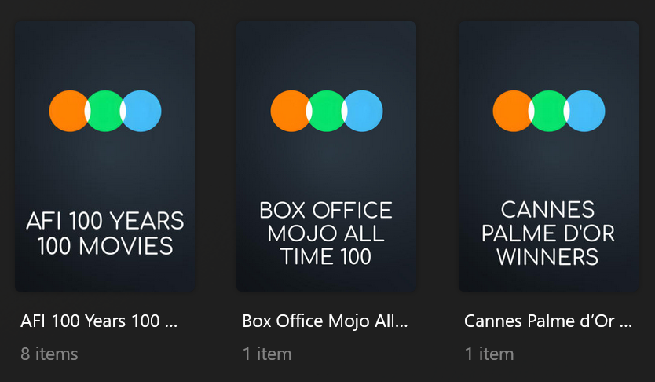

# Letterboxd Charts Collections

The `letterboxd` Default Collection File is used to create collections based on lists from Letterboxd.



## Requirements & Recommendations

Supported Library Types: Movie

Recommendations: Users might consider increasing the value set for the template variable `cache_builders:` as several lists are in excess of 1,000 items and are not updated daily. 

The collections `IMDb Top 250 (Letterboxd)`, `Oscar Best Picture Winners`, and `Cannes Palme d'Or Winners` are turned off by default as these collections already exist within other defaults. Refer to the examples below for turning the collections on within the Letterboxd defaults using template variables.

## Collections Section 020

| Collection                       | Key                 | Description                                                                   |
|:---------------------------------|:--------------------|:------------------------------------------------------------------------------|
| `Letterboxd Top 250`             | `top_250`           | Collection of the Top 250 films on Letterboxd.                                |
| `Box Office Mojo All Time 100`   | `boxofficemojo_100` | Collection of Box Office Mojo's all-time top 100 films.                       |
| `AFI 100 Years 100 Movies`       | `afi_100`           | Collection of AFI's 100 Years...100 Movies.                                   |
| `Sight & Sound Greatest Films`   | `sight_sound`       | Collection of Sight and Sound's Greatest Films of All Time.                   |
| `1,001 To See Before You Die`    | `1001_movies`       | Collection of 1,001 Movies You Must See Before You Die.                       |
| `Edgar Wright's 1,000 Favorites` | `edgarwright`       | Collection of Edgar Wright's 1,000 Favorite Movies.                           |
| `Roger Ebert's Great Movies`     | `rogerebert`        | Collection of films from Roger Ebert's "Great Movies" essays.                 |
| `Top 250 Women-Directed`         | `women_directors`   | Collection of the Top 250 Women-Directed films on Letterboxd.                 |
| `Top 100 Black-Directed`         | `black_directors`   | Collection of the Top 100 Black-Directed films on Letterboxd.                 |
| `Top 250 Most Fans`              | `most_fans`         | Collection of the Top 250 films with the most fans on Letterboxd.             |
| `Top 250 Documentaries`          | `documentaries`     | Collection of the Top 250 documentary films on Letterboxd.                    |
| `Top 100 Animation`              | `animation`         | Collection of the Top 100 animated films on Letterboxd.                       |
| `Top 250 Horror`                 | `horror`            | Collection of the Top 250 horror films on Letterboxd.                         |
| `IMDb Top 250 (Letterboxd)`      | `imdb_top_250`      | Collection of the Top 250 Movies on IMDb, from Letterboxd.                    |
| `Oscar Best Picture Winners`     | `oscars`            | Collection of films that have won the Academy Award for Best Picture.         |
| `Cannes Palme d'Or Winners`      | `cannes`            | Collection of films that have won the Palme d'Or at the Cannes Film Festival. |

## Config

The below YAML in your config.yml will create the collections:

```yaml
libraries:
  Movies:
    collection_files:
      - default: letterboxd
```

## Template Variables

Template Variables can be used to manipulate the file in various ways to slightly change how it works without having to 
make your own local copy.

Note that the `template_variables:` section only needs to be used if you do want to actually change how the defaults 
work. Any value not specified will use its default value if it has one if not it's just ignored.

??? abstract "Variable Lists (click to expand)"

    * **File-Specific Template Variables** are variables available specifically for this Kometa Defaults file.

    * **Shared Template Variables** are additional variables shared across the Kometa Defaults.

    === "File-Specific Template Variables"

        | Variable                               | Description & Values                                                                                                                                                                                                                                                                                                                                                                                                                                                                                                                      |
        |:---------------------------------------|:------------------------------------------------------------------------------------------------------------------------------------------------------------------------------------------------------------------------------------------------------------------------------------------------------------------------------------------------------------------------------------------------------------------------------------------------------------------------------------------------------------------------------------------|
        | `sync_mode`                            | **Description:** Changes the Sync Mode for all collections in a Defaults file.<br>**Default:** `sync`<br>**Values:**<table class="clearTable"><tr><td>`sync`</td><td>Add and Remove Items based on Builders</td></tr><tr><td>`append`</td><td>Only Add Items based on Builders</td></tr></table>                                                                                                                                                                                                                                          |
        | `sync_mode_<<key>>`<sup>1</sup>        | **Description:** Changes the Sync Mode of the specified key's collection.<br>**Default:** `sync_mode`<br>**Values:**<table class="clearTable"><tr><td>`sync`</td><td>Add and Remove Items based on Builders</td></tr><tr><td>`append`</td><td>Only Add Items based on Builders</td></tr></table>                                                                                                                                                                                                                                          |
        | `collection_order`                     | **Description:** Changes the Collection Order for all collections in a Defaults file.<br>**Default:** `custom`<br>**Values:**<table class="clearTable"><tr><td>`release`</td><td>Order Collection by Release Dates</td></tr><tr><td>`alpha`</td><td>Order Collection Alphabetically</td></tr><tr><td>`custom`</td><td>Order Collection Via the Builder Order</td></tr><tr><td>[Any `plex_search` Sort Option](../../files/builders/plex.md#sort-options)</td><td>Order Collection by any `plex_search` Sort Option</td></tr></table>      |
        | `collection_order_<<key>>`<sup>1</sup> | **Description:** Changes the Collection Order of the specified key's collection.<br>**Default:** `collection_order`<br>**Values:**<table class="clearTable"><tr><td>`release`</td><td>Order Collection by Release Dates</td></tr><tr><td>`alpha`</td><td>Order Collection Alphabetically</td></tr><tr><td>`custom`</td><td>Order Collection Via the Builder Order</td></tr><tr><td>[Any `plex_search` Sort Option](../../files/builders/plex.md#sort-options)</td><td>Order Collection by any `plex_search` Sort Option</td></tr></table> |

        1. Each default collection has a `key` that when calling to effect a specific collection you must replace 
        `<<key>>` with when calling.

    === "Shared Template Variables"

        
    
???+ example "Example Template Variable Amendments"

    The below is an example config.yml extract with some Template Variables added in to change how the file works.

    Click the :fontawesome-solid-circle-plus: icon to learn more
    
    ```yaml
    libraries:
      Movies:
        collection_files:
          - default: letterboxd
            template_variables:
              use_imdb_top_250: true #(1)!
              use_oscars: true #(2)!
              use_cannes: true #(3)!
              visible_library_top_250: true #(4)!
              visible_home_top_250: true #(5)!
              visible_shared_top_250: true #(6)!
    ```

    1.  Create the "IMDb Top 250 (Letterboxd)" collection
    2.  Create the "Oscar Best Picture Winners" collection
    3.  Create the "Cannes Palme d'Or Winners" collection
    4.  Pin the "Letterboxd Top 250" collection to the Recommended tab of the library
    5.  Pin the "Letterboxd Top 250" collection to the home screen of the server owner
    6.  Pin the "Letterboxd Top 250" collection to the home screen of other users of the server

