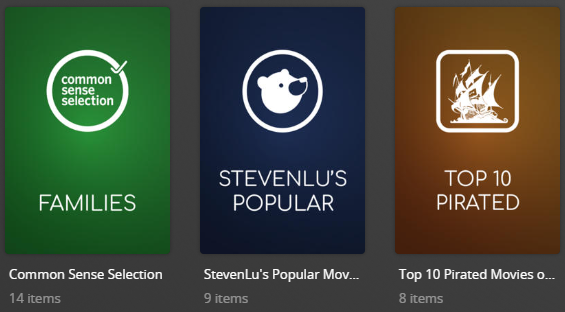

# Other Chart Default Metadata File

The `- pmm: chart/other` Metadata File is used to dynamically create collections based on other Charts.

Example Collections Created:



The below YAML in your config.yml will create the collections:
```yaml
libraries:
  Movies:
    metadata_path:
      - pmm: chart/other
```

## Template Variables
Template Variables can be used to manipulate the file from the default settings which are provided. 

Note that the `templates_variables:` section only needs to be used if you do NOT want to use the default settings.

As this file is more complex than others, a key system is used to control each collection that is created by the file. Each key refers to one chart and is used to control multiple template variables.

Below are the keys and what they refer to:

| Key         | Chart                     |
|:------------|:--------------------------|
| anidb       | AniDB Popular             |
| commonsense | Common Sense Selection    |
| stevenlu    | StevenLu's Popular Movies |
| pirated     | Top 10 Pirated Movies     |

Below are the available variables which can be used to customize the file. Note that any use of `key` within the variable should be replaced with the `key` from the above table (i.e. `use_commonsense` instead of `use_key`, `order_anidb` instead of `order_key`)


| Variable               | Usage                                                                          | Default Value      |                                                                             Values                                                                             |
|:-----------------------|:-------------------------------------------------------------------------------|--------------------|:--------------------------------------------------------------------------------------------------------------------------------------------------------------:|
| use_key                | Turn the collection on/off                                                     | `true`             |                                                                       `true` or `false`                                                                        |
| order_key              | Determine collection order in its section                                      | Alphabetical Order |                              Any number (i.e. `01` for `order_commonsense` to put commonsense first in the list of other charts)                               |
| summary_key            | Determines summary of collection                                               |                    |                                                                        Any summary text                                                                        |
| collection_order_key   | Determines collection order of the collection                                  |                    |                                                                                                                                                                |
| visible_library_key    | Set visible_library for the collection                                         | `false`            |                                                                       `true` or `false`                                                                        |
| visible_home_key       | Set visible_home for the collection                                            | `false`            |                                                                       `true` or `false`                                                                        |
| visible_shared_key     | Set visible_shared for the collection                                          | `false`            |                                                                       `true` or `false`                                                                        |
| sonarr_add_missing_key | Adds missing from the collection to sonarr                                     | `false`            |                                                                       `true` or `false`                                                                        |
| sonarr_folder_key      | Sonarr Folder to add to                                                        |                    |                                                                 Folder to add missing items to                                                                 |
| sonarr_tag_key         | Sonarr Tag for added missing                                                   |                    |                                                                 Tag(s) to add to missing items                                                                 |
| item_sonarr_tag_key    | Sonarr Tag for existing items                                                  | `false`            |                                                                Tag(s) to add to existing items                                                                 |
| radarr_add_missing_key | Adds missing from the collection to radarr                                     |                    |                                                                       `true` or `false`                                                                        |
| radarr_folder_key      | Radarr Folder to add to                                                        |                    |                                                                 Folder to add missing items to                                                                 |
| radarr_tag_key         | Radarr Tag for added missing                                                   |                    |                                                                 Tag(s) to add to missing items                                                                 |
| item_radarr_tag_key    | Radarr Tag for existing items                                                  |                    |                                                                Tag(s) to add to existing items                                                                 |
| collection_section     | Controls the sort order of these collections against other default collections | `01`               |                                                                           Any number                                                                           |
| collection_mode        | Controls the collection mode of these collections                              | `default`          | `default` - Library default<br/>`hide` - Hide Collection<br/>`hide_items`- Hide Items in this Collection<br/>`show_items` - Show this Collection and its Items |

The below shows an example config.yml with all the template_variables set away from their defaults:

```yaml
libraries:
  Movies:
    metadata_path:
      - pmm: other
        template_variables:
          use_commonsense: false
          order_commonsense: 01
          summary_commonsense: "Common Sense Selection"
          visible_library_commonsense: true
          visible_home_commonsense: true
          visible_shared_commonsense: true
          item_sonarr_tag_commonsense: New Episodes
          item_radarr_tag_season: Newly commonsense
          collection_section: 09
          collection_mode: show_items
```
