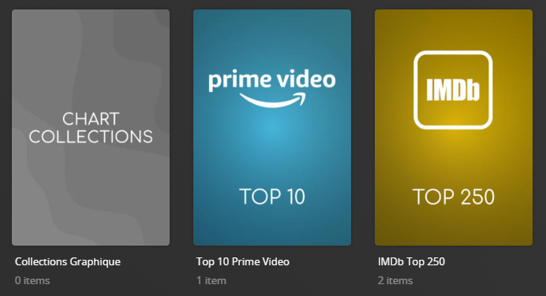

# Chart Separator Collections

The `separator_chart` Default Metadata File is used to create a seperator collection for Charts.



## Requirements & Recommendations

Supported Library Types: Movie, Show

## Collections Section 01

| Collection          | Key         | Description                                                                 |
|:--------------------|:------------|:----------------------------------------------------------------------------|
| `Chart Collections` | `separator` | [Separator Collection](../separators) to denote the Section of Collections. |

## Config

The below YAML in your config.yml will create the collections:

```yaml
libraries:
  Movies:
    metadata_path:
      - pmm: separator_chart
  TV Shows:
    metadata_path:
      - pmm: separator_chart
```

## Template Variables

Template Variables can be used to manipulate the file in various ways to slightly change how it works without having to make your own local copy.

Note that the `template_variables:` section only needs to be used if you do want to actually change how the defaults work. Any value not specified is its default value if it has one if not it's just ignored.

**[Shared Collection Variables](../collection_variables) are NOT available to this default file.**

This file contains only a [Separator](../separators) so all [Shared Separator Variables](../separators.md#shared-separator-variables) are available.

The below is an example config.yml extract with some Template Variables added in to change how the file works.

```yaml
libraries:
  Movies:
    metadata_path:
      - pmm: separator_chart
        template_variables:
          use_separator: false
          sep_style: purple
```
