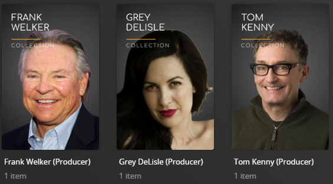

# Producer Default Metadata File

The `producer` Metadata File is used to dynamically create collections based on the most popular producers in your library.

Example Collections Created:


The below YAML in your config.yml will create the producer collections:
```yaml
libraries:
  Movies:
    metadata_path:
      - pmm: producer
```

## Rainier Style
Below is a screenshot of the alternative `Rainier` style which can be set via template variables




## Template Variables
Template Variables can be used to manipulate the producer file from the default settings which are provided. 

Note that the `templates_variables:` section only needs to be used if you do NOT want to use the default settings.

All [Shared Variables](../variables) are available as well as the additional Variables below which can be used to customize the file.


| Variable      | Description & Values                                                                                                                                                                                                                                                                                                                                                                                                                                                                                                                                                                       |
|:--------------|:-------------------------------------------------------------------------------------------------------------------------------------------------------------------------------------------------------------------------------------------------------------------------------------------------------------------------------------------------------------------------------------------------------------------------------------------------------------------------------------------------------------------------------------------------------------------------------------------|
| `style `      | **Description:** Controls the visual theme of the collections created<br>**Values:**`bw` - Black and white theme or</br>`rainier` - Rainier theme                                                                                                                                                                                                                                                                                                                                                                                                                                          |
| `sort_by`     | **Description:** Controls the sort method for the collections<br>**Values:** Any sort method in the [Sorts Options Table](#sort-options)                                                                                                                                                                                                                                                                                                                                                                                                                                                   |
| `data`        | **Description:** Changes the following values of the collection builder<br>**Values:**<br><table class="clearTable"><tr><th>Attribute</th><th>Description & Values</th></tr><tr><td><code>depth</code></td><td>Controls the depth within the casting credits to search for common actors</br><strong>Values:</strong> Number greater than 0</td><td><strong>Default:</strong> 5</td></tr><tr><td><code>limit</code></td><td>Controls the maximum number of collections to create</br><strong>Values:</strong> Number greater than 0</td><td><strong>Default:</strong> 25</td></tr></table> |


The below is an example config.yml extract with some template_variables changed from their defaults.

```yaml
libraries:
  Movies:
    metadata_path:
      - pmm: producer
        template_variables:
          data:
            depth: 10
            limit: 20
          style: rainier
          sort_by: title.asc
          collection_section: 12
          collection_mode: show_items
          use_separator: false
          sep_style: purple
```