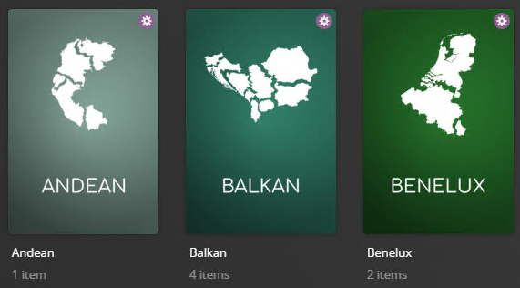
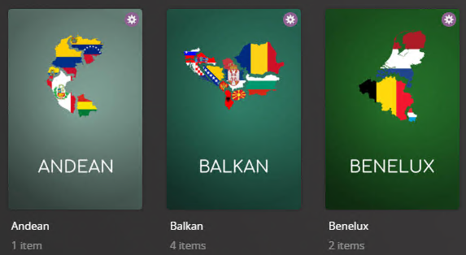

# Region Collections

The `region` Default Metadata File is used to dynamically create collections based on the countries within your library. The collection aims to be inclusive, with all 230 countries incorporated into 39 countries or collections of countries. Some care has been taken to ensure all countries are included, and the groupings won't fit well with everyone's collections.  Western and Southern Europe, Oceania, and North America could be useful groupings for those libraries with more of an Asian focus, for instance. Please see the comments in the yml below where a decision point might be seen as controversial. You are welcome to edit this to fit your own audience's needs.

**This file has a Show Library [Counterpart](../show/region).**



## Requirements & Recommendations

Supported Library Types: Movie

## Collections Section 081

| Collection                            | Key                                     | Description                                                                 |
|:--------------------------------------|:----------------------------------------|:----------------------------------------------------------------------------|
| `Region Collections`                  | `separator`                             | [Separator Collection](../separators) to denote the Section of Collections. |
| `<<Region>>`<br>**Example:** `Nordic` | `<<Region>>`<br>**Example:** `Nordic`   | Collection of Movies that have been tagged with countries in this region.   |
| `Other Regions`                       | `other`                                 | Collection of Movies that are in other uncommon Regions.                    |

## Config

The below YAML in your config.yml will create the collections:

```yaml
libraries:
  Movies:
    metadata_path:
      - pmm: region
```

## Color Style

Below is a screenshot of the alternative Color (`color`) style which can be set via the `style` template variable.



## Template Variables

Template Variables can be used to manipulate the file in various ways to slightly change how it works without having to make your own local copy.

Note that the `template_variables:` section only needs to be used if you do want to actually change how the defaults work. Any value not specified is its default value if it has one if not it's just ignored.

All [Shared Collection Variables](../collection_variables) are available as well as the additional Variables below which can be used to customize the file.

This file contains a [Separator](../separators) so all [Shared Separator Variables](../separators.md#shared-separator-variables) are available as well.

| Variable                      | Description & Values                                                                                                                                                                                                                                              |
|:------------------------------|:------------------------------------------------------------------------------------------------------------------------------------------------------------------------------------------------------------------------------------------------------------------|
| `style`                       | **Description:** Controls the visual theme of the collections created<table class="clearTable"><tr><th>Values:</th></tr><tr><td><code>white</code></td><td>White Theme</td></tr><tr><td><code>color</code></td><td>Color Theme</td></tr></table>                  |
| `limit`                       | **Description:** Changes the Builder Limit for all collections in a Defaults file.<br>**Values:** Number Greater then 0                                                                                                                                           |
| `limit_<<key>>`<sup>1</sup>   | **Description:** Changes the Builder Limit of the specified key's collection.<br>**Default:** `limit`<br>**Values:** Number Greater then 0                                                                                                                        |
| `sort_by`                     | **Description:** Changes the Smart Filter Sort for all collections in a Defaults file.<br>**Default:** `release.desc`<br>**Values:** [Any `smart_filter` Sort Option](../../metadata/builders/smart.md#sort-options)                                              |
| `sort_by_<<key>>`<sup>1</sup> | **Description:** Changes the Smart Filter Sort of the specified key's collection.<br>**Default:** `sort_by`<br>**Values:** [Any `smart_filter` Sort Option](../../metadata/builders/smart.md#sort-options)                                                        |
| `include`                     | **Description:** Overrides the [default include list](#default-include).<br>**Values:** List of Countries found in your library                                                                                                                                   |
| `exclude`                     | **Description:** Exclude these Countries from creating a Dynamic Collection.<br>**Values:** List of Countries found in your library                                                                                                                               |
| `addons`                      | **Description:** Overrides the [default addons dictionary](#default-addons). Defines how multiple keys can be combined under a parent key. The parent key doesn't have to already exist in Plex<br>**Values:** Dictionary List of Countries found in your library |
| `append_include`              | **Description:** Appends to the [default include list](#default-include).<br>**Values:** List of Countries found in your library                                                                                                                                  |
| `remove_include`              | **Description:** Removes from the [default include list](#default-include).<br>**Values:** List of Countries found in your library                                                                                                                                |
| `append_addons`               | **Description:** Appends to the [default addons dictionary](#default-addons).<br>**Values:** Dictionary List of Countries found in your library                                                                                                                   |
| `remove_addons`               | **Description:** Removes from the [default addons dictionary](#default-addons).<br>**Values:** Dictionary List of Countries found in your library                                                                                                                 |
| `name_format`                 | **Description:** Changes the title format of the Dynamic Collections.<br>**Default:** `<<key_name>>`<br>**Values:** Any string with `<<key_name>>` in it.                                                                                                         |
| `summary_format`              | **Description:** Changes the summary format of the Dynamic Collections.<br>**Default:** `<<library_translationU>>s filmed in <<key_name>>.`<br>**Values:** Any string.                                                                                            |

1. Each default collection has a `key` that when calling to effect a specific collection you must replace `<<key>>` with when calling.

The below is an example config.yml extract with some Template Variables added in to change how the file works.

```yaml
libraries:
  Movies:
    metadata_path:
      - pmm: region
        template_variables:
          use_other: false
          use_separator: false
          style: color
          sep_style: purple
          exclude:
            - French
          sort_by: title.asc
```

## Default values

The following yaml is provided for reference to show what values will be in use if you do no customization.  If you want to customize these values, use the methods described above.  These do not show how to change a name or a list.

### Default `include`

```yaml
    include:
      - Northern Africa
      - Eastern Africa
      - Middle Africa
      - Southern Africa
      - Western Africa
      - Caribbean
      - Central America
      - South America
      - North America
      - Antarctica
      - Central Asia
      - Eastern Asia
      - South-Eastern Asia
      - Southern Asia
      - Western Asia
      - Eastern Europe
      - Northern Europe
      - Southern Europe
      - Western Europe
      - Australia and New Zealand
      - Melanesia
      - Micronesia
      - Polynesia
```

### Default `addons`

```yaml
    addons:
      Northern Africa:
        - Algeria
        - Egypt
        - Libya
        - Morocco
        - Sudan
        - Tunisia
        - Western Sahara
      Eastern Africa:
        - British Indian Ocean Territory
        - Burundi
        - Comoros
        - Djibouti
        - Eritrea
        - Ethiopia
        - French Southern Territories
        - Kenya
        - Madagascar
        - Malawi
        - Mauritius
        - Mayotte
        - Mozambique
        - Réunion
        - Rwanda
        - Seychelles
        - Somalia
        - South Sudan
        - Uganda
        - United Republic of Tanzania
        - Tanzania # United Republic of Tanzania
        - Zambia
        - Zimbabwe
      Middle Africa:
        - Angola
        - Cameroon
        - Central African Republic
        - Chad
        - Republic of the Congo
        - Congo # Republic of the Congo
        - Democratic Republic of the Congo
        - Zaire # Democratic Republic of the Congo
        - Equatorial Guinea
        - Gabon
        - Sao Tome and Principe
        - São Tomé and Príncipe # Sao Tome and Principe
      Southern Africa:
        - Botswana
        - Eswatini
        - Swaziland # Eswatini
        - Lesotho
        - Namibia
        - South Africa
      Western Africa:
        - Benin
        - Burkina Faso
        - Cabo Verde
        - Cape Verde # Cabo Verde
        - Côte d'Ivoire
        - Côte d’Ivoire # Côte d'Ivoire
        - Ivory Coast # Côte d'Ivoire
        - Gambia
        - Ghana
        - Guinea
        - Guinea-Bissau
        - Liberia
        - Mali
        - Mauritania
        - Niger
        - Nigeria
        - Saint Helena, Ascension and Tristan da Cunha
        - Saint Helena # Saint Helena, Ascension and Tristan da Cunha
        - St. Helena # Saint Helena, Ascension and Tristan da Cunha
        - Ascension # Saint Helena, Ascension and Tristan da Cunha
        - Tristan da Cunha # Saint Helena, Ascension and Tristan da Cunha
        - Senegal
        - Sierra Leone
        - Togo
      Caribbean:
        - Anguilla
        - Antigua and Barbuda
        - Antigua # Antigua and Barbuda
        - Barbuda # Antigua and Barbuda
        - Aruba
        - Bahamas
        - Barbados
        - Bonaire, Sint Eustatius and Saba
        - Bonaire # Bonaire, Sint Eustatius and Saba
        - Sint Eustatius # Bonaire, Sint Eustatius and Saba
        - Saba # Bonaire, Sint Eustatius and Saba
        - Netherlands Antilles
        - British Virgin Islands
        - Cayman Islands
        - Cuba
        - Curaçao
        - Dominica
        - Dominican Republic
        - Grenada
        - Guadeloupe
        - Haiti
        - Jamaica
        - Martinique
        - Montserrat
        - Puerto Rico
        - Saint Barthélemy
        - Saint Kitts and Nevis
        - St. Kitts and Nevis # Saint Kitts and Nevis
        - Saint Lucia
        - St. Lucia # Saint Lucia
        - Saint Martin
        - Saint Vincent and the Grenadines
        - Saint Vincent and Grenadines # Saint Vincent and the Grenadines
        - St. Vincent and the Grenadines # Saint Vincent and the Grenadines
        - St. Vincent and Grenadines # Saint Vincent and the Grenadines
        - Sint Maarten
        - Trinidad and Tobago
        - Turks and Caicos Islands
        - U.S. Virgin Islands
        - United States Virgin Islands # U.S. Virgin Islands
      Central America:
        - Belize
        - Costa Rica
        - El Salvador
        - Guatemala
        - Honduras
        - Mexico
        - Nicaragua
        - Panama
      South America:
        - Argentina
        - Plurinational State of Bolivia
        - Bolivia # Plurinational State of Bolivia
        - Bouvet Island
        - Brazil
        - Chile
        - Colombia
        - Ecuador
        - Falkland Islands
        - Malvinas # Falkland Islands
        - French Guiana
        - Guyana
        - Paraguay
        - Peru
        - South Georgia and the South Sandwich Islands
        - South Georgia and South Sandwich Islands # South Georgia and the South Sandwich Islands
        - South Georgia # South Georgia and the South Sandwich Islands
        - South Sandwich Islands # South Georgia and the South Sandwich Islands
        - Suriname
        - Uruguay
        - Bolivarian Republic of Venezuela
        - Venezuela # Bolivarian Republic of Venezuela
      North America:
        - Bermuda
        - Canada
        - Greenland
        - Saint Pierre and Miquelon
        - St. Pierre and Miquelon # Saint Pierre and Miquelon
        - United States of America
        - United States # United States of America
      Antarctica:
        - Antarctica
      Central Asia:
        - Kazakhstan
        - Kyrgyzstan
        - Tajikistan
        - Turkmenistan
        - Uzbekistan
      Eastern Asia:
        - China
        - Hong Kong
        - Hong Kong SAR China # Hong Kong
        - Macao
        - Macau # Macao
        - Macau SAR China # Macao
        - Democratic People's Republic of Korea
        - North Korea # Democratic People's Republic of Korea
        - Japan
        - Mongolia
        - Republic of Korea
        - South Korea # Republic of Korea
        - Korea # Republic of Korea
        - Taiwan
        - Taiwan, Province of China # Taiwan
      South-Eastern Asia:
        - Brunei
        - Brunei Darussalam # Brunei
        - Cambodia
        - Indonesia
        - Lao People's Democratic Republic
        - Lao # Lao People's Democratic Republic
        - Laos # Lao People's Democratic Republic
        - Malaysia
        - Myanmar
        - Burma # Myanmar
        - Philippines
        - Singapore
        - Thailand
        - Timor-Leste
        - East Timor # Timor-Leste
        - Vietnam
        - Viet Nam # Vietnam
      Southern Asia:
        - Afghanistan
        - Bangladesh
        - Bhutan
        - India
        - Islamic Republic of Iran
        - Iran # Islamic Republic of Iran
        - Maldives
        - Nepal
        - Pakistan
        - Sri Lanka
      Western Asia:
        - Armenia
        - Azerbaijan
        - Bahrain
        - Cyprus
        - Georgia
        - Iraq
        - Israel
        - Jordan
        - Kuwait
        - Lebanon
        - Oman
        - Qatar
        - Saudi Arabia
        - State of Palestine
        - Palestine # State of Palestine
        - Syrian Arab Republic
        - Syria # Syrian Arab Republic
        - Türkiye
        - Turkey # Türkiye
        - United Arab Emirates
        - Yemen
      Eastern Europe:
        - Belarus
        - Bulgaria
        - Czech Republic
        - Czechia # Czech Republic
        - Czechoslovakia
        - Hungary
        - Poland
        - Republic of Moldova
        - Moldova # Republic of Moldova
        - Romania
        - Russian Federation
        - Russia # Russian Federation
        - Soviet Union
        - Slovakia
        - Ukraine
      Northern Europe:
        - Åland Islands
        - Guernsey
        - Jersey
        - Sark
        - Denmark
        - Estonia
        - Faroe Islands
        - Finland
        - Iceland
        - Ireland
        - Northern Ireland
        - Isle of Man
        - Latvia
        - Lithuania
        - Norway
        - Svalbard and Jan Mayen Islands
        - Svalbard and Jan Mayen # Svalbard and Jan Mayen Islands
        - Sweden
        - United Kingdom
      Southern Europe:
        - Albania
        - Andorra
        - Bosnia and Herzegovina
        - Croatia
        - Gibraltar
        - Greece
        - Kosovo
        - Holy See
        - Vatican City # Holy See
        - Italy
        - Malta
        - Montenegro
        - North Macedonia
        - Macedonia # North Macedonia
        - Republic of North Macedonia # North Macedonia
        - Portugal
        - San Marino
        - Serbia
        - Serbia and Montenegro
        - Slovenia
        - Spain
        - Yugoslavia
      Western Europe:
        - Austria
        - Belgium
        - France
        - French Republic # France
        - Germany
        - East Germany
        - Liechtenstein
        - Luxembourg
        - Monaco
        - Netherlands
        - Switzerland
      Australia and New Zealand:
        - Australia
        - Christmas Island
        - Cocos (Keeling) Islands
        - Heard Island and McDonald Islands
        - Heard and McDonald Islands # Heard Island and McDonald Islands
        - New Zealand
        - Norfolk Island
      Melanesia:
        - Fiji
        - New Caledonia
        - Papua New Guinea
        - New Guinea # Papua New Guinea
        - Solomon Islands
        - Vanuatu
      Micronesia:
        - Guam
        - Kiribati
        - Marshall Islands
        - Federated States of Micronesia
        - Micronesia # Federated States of Micronesia
        - Nauru
        - Northern Mariana Islands
        - Palau
        - United States Minor Outlying Islands
        - U.S. Outlying Islands # United States Minor Outlying Islands
      Polynesia:
        - American Samoa
        - Cook Islands
        - French Polynesia
        - Niue
        - Pitcairn
        - Pitcairn Islands # Pitcairn
        - Samoa
        - Tokelau
        - Tonga
        - Tuvalu
        - Wallis and Futuna Islands
        - Wallis and Futuna # Wallis and Futuna Islands
```
