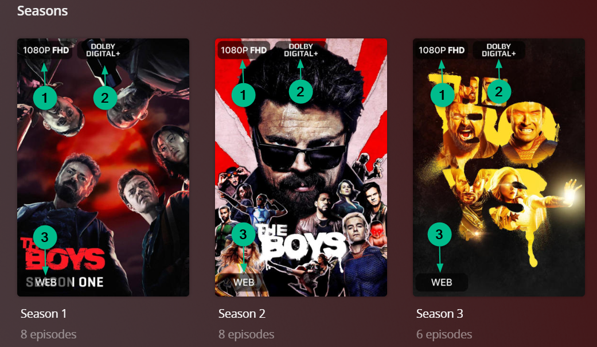
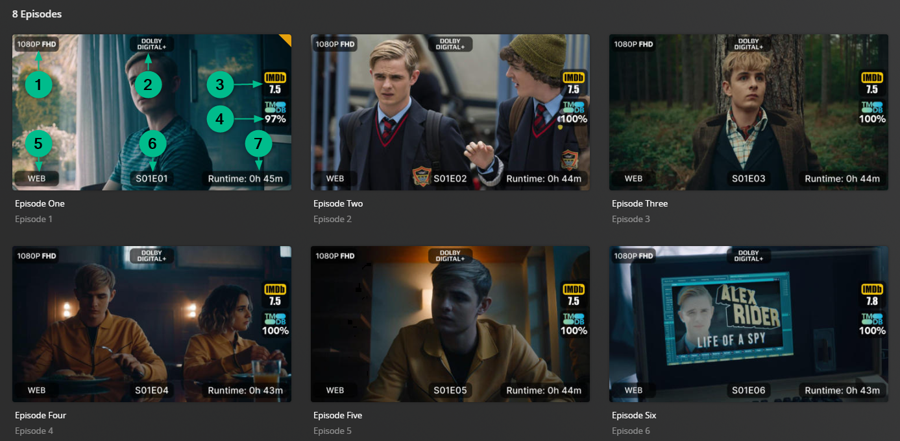

# Overlay Defaults

There are many Default Overlay Files built into Kometa itself which offer an easy-to-use and customizable set of 
Overlays that the user can achieve without having to worry about creating the files that makes the overlays possible.

This is the simplest way to create Overlays using Kometa.



## Configurations

To run a default Kometa Overlay file you can simply add it to your `overlay_files` using `default` like so:

```yaml
libraries:
  Movies:
    overlay_files:
      - default: ribbon
      - default: ratings
```

### Example Poster Overlays


<details>
  <summary>Click to expand sample config.yml Movies overlays section:</summary>

**Note: This uses fonts not packaged with Kometa. See [bullmoose20's Configs](https://github.com/Kometa-Team/Community-Configs/tree/master/bullmoose20)**

```yaml
libraries:
  Movies:
    remove_overlays: false
    overlay_files:
      - default: resolution                                                    # 1, 4
      - default: audio_codec                                                   # 2
      - default: mediastinger                                                  # 3
      - default: ratings                                                       # 5, 6, 7
        template_variables:
          rating1: user                                                    # 5 as this is user and mass_user_rating_update: mdb_tomatoes
          rating1_image: rt_tomato                                         # 5 as this is user and mass_user_rating_update: mdb_tomatoes
          rating1_font: config/custom_fonts/Adlib.ttf                      # 5 local font accessible to Kometa
          rating1_font_size: 63                                            # 5 adjusted font size to fit rating
  
          rating2: critic                                                  # 6 as this is critic and mass_critic_rating_update: imdb
          rating2_image: imdb                                              # 6 as this is critic and mass_critic_rating_update: imdb
          rating2_font: config/custom_fonts/Impact.ttf                     # 6 local font accessible to Kometa
          rating2_font_size: 70                                            # 6 adjusted font size to fit rating
  
          rating3: audience                                                # 7 as this is audience and mass_audience_rating_update: tmdb
          rating3_image: tmdb                                              # 7 as this is audience and mass_audience_rating_update: tmdb
          rating3_font: config/custom_fonts/Avenir_95_Black.ttf            # 7 local font accessible to Kometa
          rating3_font_size: 70                                            # 7 adjusted font size to fit rating
  
          horizontal_position: right                                       # the set of ratings is on the right of the poster
      - default: streaming                                                     # 8
      - default: video_format                                                  # 9
      - default: language_count                                                # 10
      - default: ribbon                                                        # 11, 12 Bottom right sash is used by more than one overlay so a weight for priority can be applied 
    operations:
      mass_user_rating_update: mdb_tomatoes                              # 5 This operation will update the user rating in plex with Rotten Tomatoes ratings information gathered through mdblist.com (mdblist config required)
      mass_critic_rating_update: imdb                                    # 6 This operation will update the critic rating in plex with IMDb ratings information
      mass_audience_rating_update: tmdb                                  # 7 This operation will update the audience rating in plex with TMDb ratings information
```
</details>

### Example TV Shows - Show Overlays


<details>
  <summary>Click to expand sample config.yml TV Shows overlays section for the Show Poster:</summary>

**Note: This uses fonts not packaged with Kometa. See [bullmoose20's Configs](https://github.com/Kometa-Team/Community-Configs/tree/master/bullmoose20)**

```yaml
libraries:
  TV Shows:
    remove_overlays: false
    overlay_files:
      - default: resolution                                                    # 1
      - default: audio_codec                                                   # 2
      - default: mediastinger                                                  # 3
      - default: ratings                                                       # 4, 5, 6
        template_variables:           
          rating1: user                                                    # 4 as this is user and mass_user_rating_update: mdb_tomatoes
          rating1_image: rt_tomato                                         # 4 as this is user and mass_user_rating_update: mdb_tomatoes
          rating1_font: config/custom_fonts/Adlib.ttf                      # 4 local font accessible to Kometa
          rating1_font_size: 63                                            # 4 adjusted font size to fit rating
  
          rating2: critic                                                  # 5 as this is critic and mass_critic_rating_update: imdb
          rating2_image: imdb                                              # 5 as this is critic and mass_critic_rating_update: imdb
          rating2_font: config/custom_fonts/Impact.ttf                     # 5 local font accessible to Kometa
          rating2_font_size: 70                                            # 5 adjusted font size to fit rating
  
          rating3: audience                                                # 6 as this is audience and mass_audience_rating_update: tmdb
          rating3_image: tmdb                                              # 6 as this is audience and mass_audience_rating_update: tmdb
          rating3_font: config/custom_fonts/Avenir_95_Black.ttf            # 6 local font accessible to Kometa
          rating3_font_size: 70                                            # 6 adjusted font size to fit rating
  
          horizontal_position: right                                       # the set of ratings is on the right of the poster
      - default: streaming                                                     # 7
      - default: video_format                                                  # 8
      - default: ribbon                                                        # 10, 11 Bottom right sash is used by more than one overlay so a weight for priority can be applied 
    operations:
      mass_user_rating_update: mdb_tomatoes                              # 4 This operation will update the user rating in plex with Rotten Tomatoes ratings information gathered through mdblist.com (mdblist config required)
      mass_critic_rating_update: imdb                                    # 5 This operation will update the critic rating in plex with IMDb ratings information
      mass_audience_rating_update: tmdb                                  # 6 This operation will update the audience rating in plex with TMDb ratings information
```
</details>

### Example TV Shows - Season Overlays


<details>
  <summary>Click to expand sample config.yml TV Shows overlays section for the Season Poster:</summary>
  
```yaml
libraries:
  TV Shows:
    remove_overlays: false
    overlay_files:
      - default: resolution                                                    # 1
        template_variables:
          builder_level: season
      - default: audio_codec                                                   # 2
        template_variables:
          builder_level: season
      - default: video_format                                                  # 3
        template_variables:
          builder_level: season
```
</details>

### Example TV Shows - Episode Overlays


<details>
  <summary>Click to expand sample config.yml TV Shows overlays section for the Episode Poster:</summary>
  
**Note: This uses fonts not packaged with Kometa. See [bullmoose20's Configs](https://github.com/Kometa-Team/Community-Configs/tree/master/bullmoose20)**

```yaml
libraries:
  TV Shows:
    remove_overlays: false
    overlay_files:
      - default: resolution                                                    # 1
        template_variables:
          builder_level: episode
      - default: audio_codec                                                   # 2
        template_variables:
          builder_level: episode
      - default: ratings                                                       # 3, 4
        template_variables:
  
          rating1: critic                                                  # 3 as this is critic and mass_critic_rating_update: imdb
          rating1_image: imdb                                              # 3 as this is critic and mass_critic_rating_update: imdb
          rating1_font: config/custom_fonts/Impact.ttf                     # 3 local font accessible to Kometa
          rating1_font_size: 70                                            # 3 adjusted font size to fit rating
  
          rating2: audience                                                # 4 as this is audience and mass_audience_rating_update: tmdb
          rating2_image: tmdb                                              # 4 as this is audience and mass_audience_rating_update: tmdb
          rating2_font: config/custom_fonts/Avenir_95_Black.ttf            # 4 local font accessible to Kometa
          rating2_font_size: 70                                            # 4 adjusted font size to fit rating
  
          horizontal_position: right                                       # the set of ratings is on the right of the poster
          builder_level: episode
      - default: video_format                                                  # 5
        template_variables:
          builder_level: episode
      - default: episode_info                                                  # 6
        template_variables:
          builder_level: episode
      - default: runtimes                                                      # 7
        template_variables:
          builder_level: episode

    operations:
      mass_episode_critic_rating_update: imdb                            # 3 This operation will update the episodes critic rating in plex with IMDb ratings information
      mass_episode_audience_rating_update: tmdb                          # 4 This operation will update the episodes audience rating in plex with TMDb ratings information
```
</details>

## Rating Overlays

By default, for Movies in Plex, the `Ratings Source` dropdown (`#3`) below, can come from Rotten Tomatoes (and includes 
Critic Ratings and Audience Ratings) or IMDb (Audience Ratings). This only changes the tiny icons displayed and where 
Plex will retrieve the ratings from upon initial scan and import of the media metadata.

**Kometa can insert up to three ratings of your choice into the three spots regardless of what you choose in the 
`Advanced` tab of that Plex library**


Plex has three available spots in the Plex DB to store ratings and thus Kometa can be used to insert ratings sources of 
your choice into those spots. They are known as the User Rating (`#1`), Critic Rating (`#2`), and Audience Rating (`#3`). 

**Note that the little icons cannot be changed and that the numbers next to the little icons are reflected in the poster 
ratings overlay**


To be able to insert the ratings you want, Kometa operations need to be defined. In this example below, User ratings 
(`#1`) are being filled with Rotten Tomatoes Critics Ratings. Critic ratings (`#2`) are filled with IMDb, and Audience 
ratings (`#3`) are filled with TMDb.

**mass_*_rating_update** sources can be found here: [operations](../config/operations.md)


Finally, to show the ratings on the poster, the following was added to the `overlay_files` section in the `config.yml` 
file to post Rotten Tomatoes Critics Ratings in (`#1`), IMDb ratings in (`#2`), and TMDb ratings in (`#3`)


## Customizing Configs

Configs can be customized using the `template_variables` attribute when calling the file. These `template_variables` 
will be given to every template call in the file which allows them to affect how that file runs.

This example changes the ratings overlay to work on episodes.

```yaml
libraries:
  TV Shows:
    overlay_files:
      - default: ratings
        template_variables:
          builder_level: episode
```

Each file has a page on the wiki showing the available `template_variables` for each file. For example the default 
`default: ratings` has a page [here](overlays/ratings.md).

**In addition to the defined `template_variables` almost all default Overlay files have access to the 
[Shared Variables](collection_variables.md).**

### Examples


