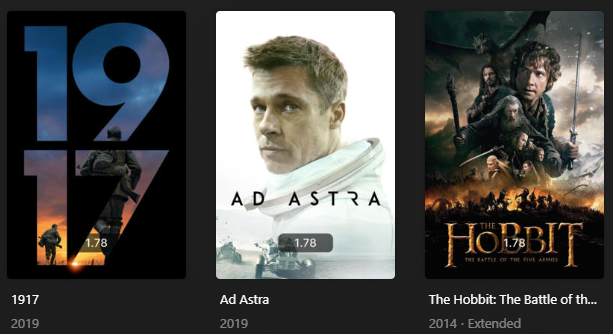

# Aspect Overlay

The `aspect` Default Overlay File is used to create an overlay on a show/movie detailing its aspect ratio.



## Requirements & Recommendations

Supported Overlay Level: Movie, Show

## Supported Status

| Aspect | Key    | Weight |
|:-------|:-------|:-------|
| 1.33   | `1.33` | `80`   |
| 1.65   | `1.65` | `70`   |
| 1.66   | `1.66` | `60`   |
| 1.78   | `1.78` | `50`   |
| 1.85   | `1.85` | `40`   |
| 2.2    | `2.2`  | `30`   |
| 2.35   | `2.35` | `20`   |
| 2.77   | `2.77` | `10`   |

## Config

The below YAML in your config.yml will create the overlays:

```yaml
libraries:
  Movies:
    overlay_files:
      - default: aspect
  TV Shows:
    overlay_files:
      - default: aspect
      - default: aspect
        template_variables:
          builder_level: episode
      - default: aspect
        template_variables:
          builder_level: season
```

## Template Variables

Template Variables can be used to manipulate the file in various ways to slightly change how it works without having to 
make your own local copy.

Note that the `template_variables:` section only needs to be used if you do want to actually change how the defaults 
work. Any value not specified will use its default value if it has one if not it's just ignored.

??? abstract "Variable Lists (click to expand)"

    * **File-Specific Template Variables** are variables available specifically for this Kometa Defaults file.

    * **Overlay Template Variables** are additional variables shared across the Kometa Overlay Defaults.

    * **Overlay Text Template Variables** are additional variables shared across the Kometa Text Overlay Defaults.

    ??? example "Default Template Variable Values (click to expand)"

        | Variable            | Default     |
        |:--------------------|:------------|
        | `horizontal_offset` | `150`       |
        | `horizontal_align`  | `center`    |
        | `vertical_offset`   | `0`         |
        | `vertical_align`    | `bottom`    |
        | `back_color`        | `#00000099` |
        | `back_radius`       | `30`        |
        | `back_width`        | `305`       |
        | `back_height`       | `105`       |

    === "File-Specific Template Variables"

        | Variable                     | Description & Values                                                                                                                                                                                                                                                                                                                                                                                                                                                                  |
        |:-----------------------------|:--------------------------------------------------------------------------------------------------------------------------------------------------------------------------------------------------------------------------------------------------------------------------------------------------------------------------------------------------------------------------------------------------------------------------------------------------------------------------------------|
        | `text_<<key>>`<sup>1</sup>   | **Description:** Choose the text for the Overlay.<br>**Default:** <table class="clearTable"><tr><th>Key</th><th>Default</th></tr><tr><td>`1.33`</td><td>`1.33`</td></tr><tr><td>`1.65`</td><td>`1.65`</td></tr><tr><td>`1.66`</td><td>`1.66`</td></tr><tr><td>`1.78`</td><td>`1.78`</td></tr><tr><td>`1.85`</td><td>`1.85`</td></tr><tr><td>`2.2`</td><td>`2.2`</td></tr><tr><td>`2.35`</td><td>`2.35`</td></tr><tr><td>`2.77`</td><td>`2.77`</td></tr></table>**Values:** Any String |
        | `weight_<<key>>`<sup>1</sup> | **Description:** Controls the weight of the Overlay. Higher numbers have priority.<br>**Values:** Any Number                                                                                                                                                                                                                                                                                                                                                                          |

        1. Each default overlay has a `key` that when calling to effect a specific overlay you must replace `<<key>>` 
        with when calling.

    === "Overlay Template Variables"

        

    === "Overlay Text Template Variables"

        
    
???+ example "Example Template Variable Amendments"

    The below is an example config.yml extract with some Template Variables added in to change how the file works.
    
    ```yaml
    libraries:
      Movies:
        overlay_files:
          - default: aspect
            template_variables:
              text_1.33: "4:9"
              text_1.77: "16:9"
      TV Shows:
        overlay_files:
          - default: aspect
            template_variables:
              text_1.33: "4:9"
              text_1.77: "16:9"
          - default: aspect
            template_variables:
              overlay_level: episode
              text_1.33: "4:9"
              text_1.77: "16:9"
          - default: aspect
            template_variables:
              overlay_level: season
              text_1.33: "4:9"
              text_1.77: "16:9"
    ```
