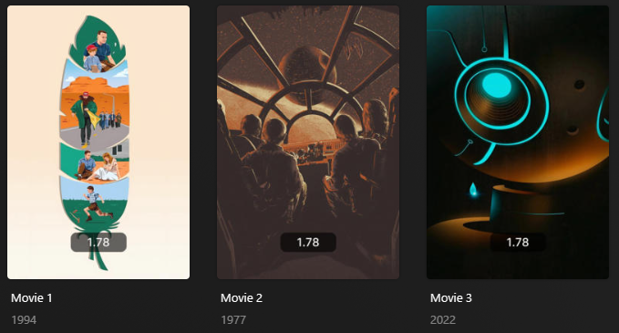

# Aspect Overlay

The `aspect` Default Overlay File is used to create an overlay on a show/movie detailing its aspect ratio.



## Requirements & Recommendations

Supported Overlay Level: Movie, Show

## Supported Status

| Aspect | Key    | Weight |
|:-------|:-------|:-------|
| 1.33   | `1.33` | `80`   |
| 1.65   | `1.65` | `70`   |
| 1.66   | `1.66` | `60`   |
| 1.78   | `1.78` | `50`   |
| 1.85   | `1.85` | `40`   |
| 2.2    | `2.2`  | `30`   |
| 2.35   | `2.35` | `20`   |
| 2.77   | `2.77` | `10`   |

## Config

The below YAML in your config.yml will create the overlays:

```yaml
libraries:
  Movies:
    overlay_files:
      - pmm: aspect
  TV Shows:
    overlay_files:
      - pmm: aspect
      - pmm: aspect
        template_variables:
          builder_level: episode
      - pmm: aspect
        template_variables:
          builder_level: season
```

## Template Variables

Template Variables can be used to manipulate the file in various ways to slightly change how it works without having to make your own local copy.

Note that the `template_variables:` section only needs to be used if you do want to actually change how the defaults work. Any value not specified will use its default value if it has one if not it's just ignored.

??? info "Click to expand"

    === "File-Specific Template Variables"

        The below template variables are available specifically for this PMM Defaults file.

        Be sure to also check out the "Overlay Template Variables" tab for additional variables.

        | Variable(                     )| Default / Values( / Values                                                                                                                                                                                                                                                                                                                                                                                                                                                                      )|
        |:-----------------------------|:--------------------------------------------------------------------------------------------------------------------------------------------------------------------------------------------------------------------------------------------------------------------------------------------------------------------------------------------------------------------------------------------------------------------------------------------------------------------------------------|
        | `horizontal_offset`          | `150`                                                                                                                                                                                                                                                                                                                                                                                                                                                                                 |
        | `horizontal_align`           | `center`                                                                                                                                                                                                                                                                                                                                                                                                                                                                              |
        | `vertical_offset`            | `0`                                                                                                                                                                                                                                                                                                                                                                                                                                                                                   |
        | `vertical_align`             | `bottom`                                                                                                                                                                                                                                                                                                                                                                                                                                                                              |
        | `back_color`                 | `#00000099`                                                                                                                                                                                                                                                                                                                                                                                                                                                                           |
        | `back_radius`                | `30`                                                                                                                                                                                                                                                                                                                                                                                                                                                                                  |
        | `back_width`                 | `305`                                                                                                                                                                                                                                                                                                                                                                                                                                                                                 |
        | `back_height`                | `105`                                                                                                                                                                                                                                                                                                                                                                                                                                                                                 ||
        | `text_<<key>>`<sup>1</sup>   | **Description:** Choose the text for the Overlay.<br>**Default:** <table class="clearTable"><tr><th>Key</th><th>Default</th></tr><tr><td>`1.33`</td><td>`1.33`</td></tr><tr><td>`1.65`</td><td>`1.65`</td></tr><tr><td>`1.66`</td><td>`1.66`</td></tr><tr><td>`1.78`</td><td>`1.78`</td></tr><tr><td>`1.85`</td><td>`1.85`</td></tr><tr><td>`2.2`</td><td>`2.2`</td></tr><tr><td>`2.35`</td><td>`2.35`</td></tr><tr><td>`2.77`</td><td>`2.77`</td></tr></table>**Values:** Any String |
        | `weight_<<key>>`<sup>1</sup> | **Description:** Controls the weight of the Overlay. Higher numbers have priority.<br>**Values:** Any Number                                                                                                                                                                                                                                                                                                                                                                          |

    === "Overlay Template Variables"

        

        


    ### Example Template Variable Amendments

    The below is an example config.yml extract with some Template Variables added in to change how the file works.

    ```yaml
    libraries:
      Movies:
        overlay_files:
          - pmm: aspect
            template_variables:
              text_1.33: "4:9"
              text_1.77: "16:9"
      TV Shows:
        overlay_files:
          - pmm: aspect
            template_variables:
              text_1.33: "4:9"
              text_1.77: "16:9"
          - pmm: aspect
            template_variables:
              overlay_level: episode
              text_1.33: "4:9"
              text_1.77: "16:9"
          - pmm: aspect
            template_variables:
              overlay_level: season
              text_1.33: "4:9"
              text_1.77: "16:9"
    ```