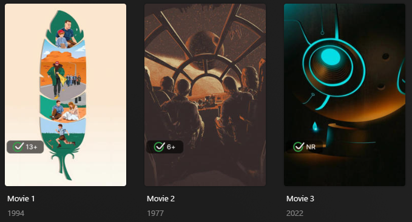

# Common Sense Age Rating Overlay

The `commonsense` Default Overlay File is used to create an overlay based on the Common Sense Age Rating on each item 
within your library.



## Requirements & Recommendations

Supported library types: Movie & Show

Requirements: Use the [Mass Content Rating Update Library 
Operation](../../config/operations.md#mass-content-rating-update) with either `mdb_commonsense` or `mdb_commonsense0` to 
update Plex to the Common Sense Rating.

## Supported Common Sense Age Rating

| Rating | Key  |
|:-------|:-----|
| 1+     | `1`  |
| 2+     | `2`  |
| 3+     | `3`  |
| 4+     | `4`  |
| 5+     | `5`  |
| 6+     | `6`  |
| 7+     | `7`  |
| 8+     | `8`  |
| 9+     | `9`  |
| 10+    | `10` |
| 11+    | `11` |
| 12+    | `12` |
| 13+    | `13` |
| 14+    | `14` |
| 15+    | `15` |
| 16+    | `16` |
| 17+    | `17` |
| 18+    | `18` |
| NR     | `nr` |

## Config

The below YAML in your config.yml will create the overlays:

```yaml
libraries:
  Movies:
    overlay_files:
      - default: commonsense
  TV Shows:
    overlay_files:
      - default: commonsense
      - default: commonsense
        template_variables:
          builder_level: season
      - default: commonsense
        template_variables:
          builder_level: episode
```

## Template Variables

Template Variables can be used to manipulate the file in various ways to slightly change how it works without having to 
make your own local copy.

Note that the `template_variables:` section only needs to be used if you do want to actually change how the defaults 
work. Any value not specified will use its default value if it has one if not it's just ignored.

??? abstract "Variable Lists (click to expand)"

    * **File-Specific Template Variables** are variables available specifically for this Kometa Defaults file.

    * **Overlay Template Variables** are additional variables shared across the Kometa Overlay Defaults.

    ??? example "Default Template Variable Values (click to expand)"

        | Variable            | Default     |
        |:--------------------|:------------|
        | `horizontal_offset` | `15`        |
        | `horizontal_align`  | `left`      |
        | `vertical_offset`   | `270`       |
        | `vertical_align`    | `bottom`    |
        | `back_color`        | `#00000099` |
        | `back_radius`       | `30`        |
        | `back_width`        | `305`       |
        | `back_height`       | `105`       |

    === "File-Specific Template Variables"

        | Variable         | Description & Values                                                                                                                        |
        |:-----------------|:--------------------------------------------------------------------------------------------------------------------------------------------|
        | `addon_offset`   | **Description:** Text Addon Image Offset from the text.<br>**Default:** `15`<br>**Values:** Any number greater than 0                       |
        | `addon_position` | **Description:** Text Addon Image Alignment in relation to the text.<br>**Default:** `left`<br>**Values:** `left`, `right`, `top`, `bottom` |
        | `pre_text`       | **Description:** Choose the text before the key for the Overlay.<br>**Values:** Any String                                                  |
        | `post_text`      | **Description:** Choose the text after the key for the Overlay.<br>**Default:** `+`<br>**Values:** Any String                               |
        | `pre_nr_text`    | **Description:** Choose the text before the `nr` key for the Overlay.<br>**Values:** Any String                                             |
        | `post_nr_text`   | **Description:** Choose the text after the `nr` key for the Overlay.<br>**Values:** Any String                                              |
        | `builder_level`  | **Description:** Choose the Overlay Level.<br>**Values:** `season` or `episode`                                                             |

    === "Overlay Template Variables"

        
    
???+ example "Example Template Variable Amendments"

    The below is an example config.yml extract with some Template Variables added in to change how the file works.
    
    ```yaml
    libraries:
      Movies:
        overlay_files:
          - default: commonsense
            template_variables:
              pre_text: "CS"
    ```
