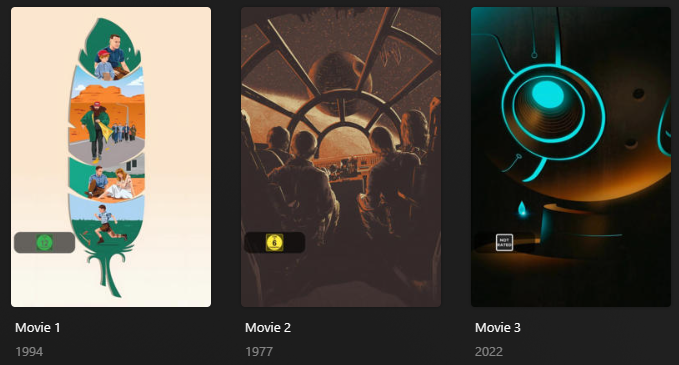

# Content Rating DE Overlay

The `content_rating_de` Default Overlay File is used to create an overlay based on the FSK Rating on each item within your library.



## Requirements & Recommendations

Supported library types: Movie & Show

Requirements: Use the [Mass Content Rating Update Library Operation](../../config/operations.md#mass-content-rating-update) with either `mdb` or `omdb` to update Plex to the BBFC Rating.

## Supported Content Rating DE

| Rating | Key    |
|:-------|:-------|
| 0      | `0`    |
| 6      | `6`    |
| 12     | `12`   |
| 16     | `16`   |
| 18     | `18`   |
| BPJM   | `bpjm` |
| NR     | `nr`   |

## Config

The below YAML in your config.yml will create the overlays:

```yaml
libraries:
  Movies:
    overlay_files:
      - pmm: content_rating_de
  TV Shows:
    overlay_files:
      - pmm: content_rating_de
      - pmm: content_rating_de
        template_variables:
          builder_level: season
      - pmm: content_rating_de
        template_variables:
          builder_level: episode
```

## Template Variable Default Values

Template Variables can be used to manipulate the file in various ways to slightly change how it works without having to make your own local copy.

| Variable            | Default / Values |
|:--------------------|:-----------------|
| `color`             | ``               |
| `horizontal_offset` | `15`             |
| `horizontal_align`  | `left`           |
| `vertical_offset`   | `270`            |
| `vertical_align`    | `bottom`         |

| Variable          | Description & Values                                                                                                                                                |
|:------------------|:--------------------------------------------------------------------------------------------------------------------------------------------------------------------|
| `color`           | **Description:** Color version of the content rating images<br>**Default:**`` Set to `false` if you want b&w version.                                               |
| `back_color`      | **Description:** Choose the back color in RGBA for the overlay lozenge.<br>**Default:**`#00000099`                                                                  |
| `back_radius`     | **Description:** Choose the back radius for the overlay lozenge.<br>**Default:**`30`                                                                                |
| `back_width`      | **Description:** Choose the back width for the overlay lozenge.<br>**Default:**`305`                                                                                |
| `back_height`     | **Description:** Choose the back height for the overlay lozenge.<br>**Default:**`105`                                                                               |
| `addon_offset`    | **Description:** Text Addon Image Offset from the text.<br>**Default:** `15`<br>**Values:** Any number greater than 0                                               |
| `addon_position`  | **Description:** Text Addon Image Alignment in relation to the text.<br>**Default:** `left`<br>**Values:** `left`, `right`, `top`, `bottom`                         |
| `builder_level`   | **Description:** Choose the Overlay Level.<br>**Values:** `season` or `episode`                                                                                     |



## Example Template Variable Amendments

The below is an example config.yml extract with some Template Variables added in to change how the file works.

```yaml
libraries:
  Movies:
    overlay_files:
      - pmm: content_rating_de
        template_variables:
          color: false
```
