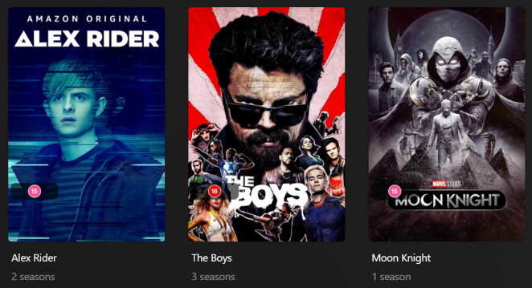

# Content Rating UK Overlay

The `content_rating_uk` Default Overlay File is used to create an overlay based on the BBFC Age Rating on each item within your library.



## Requirements & Recommendations

Supported library types: Movie & Show

Requirements: Use the [Mass Content Rating Update Library Operation](../../config/operations.md#mass-content-rating-update) with either `mdb` or `omdb` to update Plex to the BBFC Rating.

## Supported Content Rating UK

| Rating | Key   |
|:-------|:------|
| U      | `u`   |
| PG     | `pg`  |
| 12     | `12`  |
| 12a    | `12a` |
| 15     | `15`  |
| 18     | `18`  |
| R18    | `r18` |
| NR     | `nr`  |

## Config

The below YAML in your config.yml will create the overlays:

```yaml
libraries:
  Movies:
    overlay_path:
      - pmm: content_rating_uk
  TV Shows:
    overlay_path:
      - pmm: content_rating_uk
      - pmm: content_rating_uk
        template_variables:
          builder_level: season
      - pmm: content_rating_uk
        template_variables:
          builder_level: episode
```

## Template Variables

Template Variables can be used to manipulate the file in various ways to slightly change how it works without having to make your own local copy.

Note that the `template_variables:` section only needs to be used if you do want to actually change how the defaults work. Any value not specified is its default value if it has one if not it's just ignored.

All [Shared Overlay Variables](../overlay_variables) are available with the default values below as well as the additional Variables below which can be used to customize the file.

| Variable            | Default  |
|:--------------------|:---------|
| `color`             | ``       |
| `horizontal_offset` | `15`     |
| `horizontal_align`  | `left`   |
| `vertical_offset`   | `270`    |
| `vertical_align`    | `bottom` |

| Variable          | Description & Values                                                                                                                                                |
|:------------------|:--------------------------------------------------------------------------------------------------------------------------------------------------------------------|
| `color`           | **Description:** Color version of the content rating images<br>**Default:**`` Set to `false` if you want b&w version.                                               |
| `back_color`      | **Description:** Choose the back color in RGBA for the overlay lozenge.<br>**Default:**`#00000099`                                                                  |
| `back_radius`     | **Description:** Choose the back radius for the overlay lozenge.<br>**Default:**`30`                                                                                |
| `back_width`      | **Description:** Choose the back width for the overlay lozenge.<br>**Default:**`305`                                                                                |
| `back_height`     | **Description:** Choose the back height for the overlay lozenge.<br>**Default:**`105`                                                                               |
| `font`            | **Description:** Choose the font for the Overlay.<br>**Default:** `fonts/Inter-Medium.ttf`<br>**Values:** Path to font file                                         |
| `font_style`      | **Description:** Font style for Variable Fonts.<br>**Values:** Variable Font Style                                                                                  |
| `font_size`       | **Description:** Choose the font size for the Overlay.<br>**Default:** `55`<br>**Values:** Any number greater than 0                                                |
| `font_color`      | **Description:** Choose the font color for the Overlay.<br>**Default:** `#FFFFFF`<br>**Values:** Color Hex Code in format `#RGB`, `#RGBA`, `#RRGGBB` or `#RRGGBBAA` |
| `stroke_width`    | **Description:** Font Stroke Width for the Text Overlay.<br>**Values:** Any number greater than 0                                                                   |
| `stroke_color`    | **Description:** Font Stroke Color for the Text Overlay.<br>**Values:** Color Hex Code in format `#RGB`, `#RGBA`, `#RRGGBB` or `#RRGGBBAA`                          |
| `addon_offset`    | **Description:** Text Addon Image Offset from the text.<br>**Default:** `15`<br>**Values:** Any number greater than 0                                               |
| `addon_position`  | **Description:** Text Addon Image Alignment in relation to the text.<br>**Default:** `left`<br>**Values:** `left`, `right`, `top`, `bottom`                         |
| `builder_level`   | **Description:** Choose the Overlay Level.<br>**Values:** `season` or `episode`                                                                                     |

The below is an example config.yml extract with some Template Variables added in to change how the file works.

```yaml
libraries:
  Movies:
    overlay_path:
      - pmm: content_rating_uk
        template_variables:
          color: false
```
