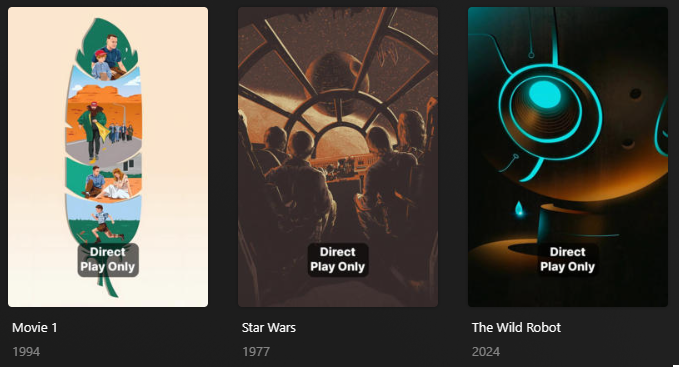

# Direct Play Overlay

The `direct_play` Default Overlay File is used to create an overlay to indicate items that cannot be transcoded and instead only support Direct Play (i.e. if you use Tautulli to kill 4K transcoding)



## Requirements & Recommendations

Supported library types: Movie & Show

## Config

The below YAML in your config.yml will create the overlays:

```yaml
libraries:
  Movies:
    overlay_path:
      - pmm: direct_play
  TV Shows:
    overlay_path:
      - pmm: direct_play
```

## Template Variables

Template Variables can be used to manipulate the file in various ways to slightly change how it works without having to make your own local copy.

Note that the `template_variables:` section only needs to be used if you do want to actually change how the defaults work. Any value not specified is its default value if it has one if not it's just ignored.

All [Shared Overlay Variables](../overlay_variables) are available with the default values below as well as the additional Variables below which can be used to customize the file.

| Variable            | Default     |
|:--------------------|:------------|
| `horizontal_offset` | `0`         |
| `horizontal_align`  | `center`    |
| `vertical_offset`   | `150`       |
| `vertical_align`    | `bottom`    |
| `back_color`        | `#00000099` |
| `back_radius`       | `30`        |
| `back_width`        | `305`       |
| `back_height`       | `170`       |

| Variable        | Description & Values                                                                                                                                                |
|:----------------|:--------------------------------------------------------------------------------------------------------------------------------------------------------------------|
| `overlay_level` | **Description:** Choose the Overlay Level.<br>**Values:** `season` or `episode`                                                                                     |

The below is an example config.yml extract with some Template Variables added in to change how the file works.

```yaml
libraries:
  Movies:
    overlay_path:
      - pmm: direct_play
        template_variables:
          overlay_level: episode
```
