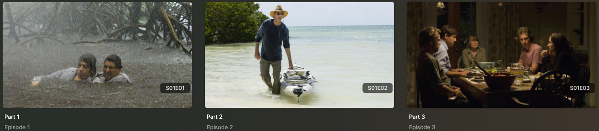

# Episode Info Overlay

The `episode_info` Default Overlay File is used to create an overlay on the episode title card on the episode numbering within a given series in your library.



## Requirements & Recommendations

Supported library types: Show

## Config

The below YAML in your config.yml will create the overlays:

```yaml
libraries:
  TV Shows:
    overlay_files:
      - pmm: episode_info
```

## Template Variable Default Values

Template Variables can be used to manipulate the file in various ways to slightly change how it works without having to make your own local copy.

| Variable              | Default / Values |
|:----------------------|:-----------------|
| `horizontal_offset`   | `15`             |
| `horizontal_align`    | `left`           |
| `vertical_offset`     | `270`            |
| `vertical_align`      | `bottom`         |
| `back_color`          | `#00000099`      |
| `back_radius`         | `30`             |
| `back_width`          | `305`            |
| `back_height`         | `105`            |





## Example Template Variable Amendments

The below is an example config.yml extract with some Template Variables added in to change how the file works.

```yaml
libraries:
  TV Shows:
    overlay_files:
      - pmm: episode_info
        template_variables:
          font_color: "#FFFFFF99"
```
