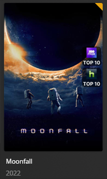

# FlixPatrol Top Overlays

The `flixpatrol` Default Overlay File is used to create an overlay based on the Top Lists from FlixPatrol on items within your library.

**This file works with Movie and TV Libraries.**



## Supported Services

| Service     |     Key     | Weight |
|:------------|:-----------:|:------:|
| Netflix     |  `netflix`  |  `60`  |
| Disney+     |  `disney`   |  `50`  |
| HBO         |    `hbo`    |  `40`  |
| Hulu        |   `hulu`    |  `30`  |
| Paramount+  | `paramount` |  `20`  |
| Prime Video |   `prime`   |  `10`  |

## Config

The below YAML in your config.yml will create the overlays:

```yaml
libraries:
  Movies:
    overlay_path:
      - pmm: flixpatrol
  TV Shows:
    overlay_path:
      - pmm: flixpatrol
```

## Template Variables

Template Variables can be used to manipulate the file in various ways to slightly change how it works without having to make your own local copy.

Note that the `templates_variables:` section only needs to be used if you do want to actually change how the defaults work. Any value not specified is its default value if it has one if not it's just ignored.

All [Shared Overlay Variables](variables) except `horizontal_offset`, `horizontal_align`, `vertical_offset`, and `vertical_align` are available with the default values below as well as the additional Variables below which can be used to customize the file.
 
| Variable            |      Default      |
|:--------------------|:-----------------:|
| `horizontal_offset` |       `30`        |
| `horizontal_align`  |  `left`/`right`   |
| `vertical_offset`   | `465`/`670`/`875` |
| `vertical_align`    |       `top`       |
| `back_color`        |    `#00000099`    |
| `back_radius`       |       `30`        |
| `back_width`        |       `160`       |
| `back_height`       |       `160`       |
| `back_padding`      |       `15`        |

| Variable              | Description & Values                                                                                                                                                                                                              |
|:----------------------|:----------------------------------------------------------------------------------------------------------------------------------------------------------------------------------------------------------------------------------|
| `position`            | **Description:** Changes the position of the Overlays.<br>**Default:** `right`<br>**Values:** `right`, `left`, or List of Coordinates                                                                                             |
| `style`               | **Description:** Changes the style of the Logo Image.<br>**Default:** `round`<br>**Values:** `round` or `square`                                                                                                                  |
| `pre_text`            | **Description:** Changes the text before the number.<br>**Default:** `TOP`<br>**Values:** Any String                                                                                                                              |
| `limit`               | **Description:** Changes the Builder Limit for all overlays in a Defaults file.<br>**Default:** `10`<br>**Values:** Any Number greater then 0                                                                                     |
| `limit_<<key>>`       | **Description:** Changes the Builder Limit of the specified key's overlay.<br>**Default:** `limit`<br>**Values:** Any Number greater then 0                                                                                       |
| `location`            | **Description:** Changes the Builder Location for all overlays in a Defaults file.<br>**Default:** `world`<br>**Values:** [`location` Attribute Options](../../metadata/builders/flixpatrol.md#top-platform-attributes)           |
| `location_<<key>>`    | **Description:** Changes the Builder Location of the specified key's overlay.<br>**Default:** `location`<br>**Values:** [`location` Attribute Options](../../metadata/builders/flixpatrol.md#top-platform-attributes)             |
| `time_window`         | **Description:** Changes the Builder Time Window for all overlays in a Defaults file.<br>**Default:** `last_week`<br>**Values:** [`time_window` Attribute Options](../../metadata/builders/flixpatrol.md#top-platform-attributes) |
| `time_window_<<key>>` | **Description:** Changes the Builder Time Window of the specified key's overlay.<br>**Default:** `time_window`<br>**Values:** [`time_window` Attribute Options](../../metadata/builders/flixpatrol.md#top-platform-attributes)    |
| `weight_<<key>>`      | **Description:** Controls the weight of the Overlay. Higher numbers have priority.<br>**Values:** Any Number                                                                                                                      |
| `font`                | **Description:** Choose the font for the Overlay.<br>**Default:** `fonts/Inter-Medium.ttf`<br>**Values:** Path to font file                                                                                                       |
| `font_style`          | **Description:** Font style for Variable Fonts.<br>**Values:** Variable Font Style                                                                                                                                                |
| `font_size`           | **Description:** Choose the font size for the Overlay.<br>**Default:** `50`<br>**Values:** Any Number greater then 0                                                                                                              |
| `font_color`          | **Description:** Choose the font color for the Overlay.<br>**Default:** `#FFFFFF`<br>**Values:** Color Hex Code in format `#RGB`, `#RGBA`, `#RRGGBB` or `#RRGGBBAA`                                                               |
| `stroke_width`        | **Description:** Font Stroke Width for the Text Overlay.<br>**Values:** Any Number greater then 0                                                                                                                                 |
| `stroke_color`        | **Description:** Font Stroke Color for the Text Overlay.<br>**Values:** Color Hex Code in format `#RGB`, `#RGBA`, `#RRGGBB` or `#RRGGBBAA`                                                                                        |
| `addon_offset`        | **Description:** Text Addon Image Offset from the text.<br>**Default:** `30`<br>**Values:** Any Number greater then 0                                                                                                             |
| `addon_position`      | **Description:** Text Addon Image Alignment in relation to the text.<br>**Default:** `top`<br>**Values:** `left`, `right`, `top`, `bottom`                                                                                        |

The below is an example config.yml extract with some Template Variables added in to change how the file works.

```yaml
libraries:
  Movies:
    overlay_path:
      - pmm: flixpatrol
        template_variables:
          location: united_states
```
