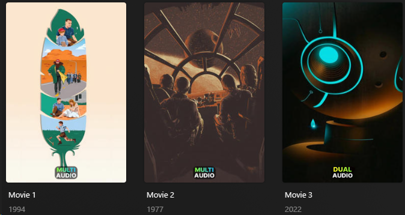

# Audio/Subtitle Language Count Overlay

The `language_count` Default Overlay File is used to create an overlay based on the number of audio/subtitle languages available on each item within your library.

**This file works with Movie and Show Libraries.**

**Designed for [TRaSH Guides](https://trash-guides.info/) filename naming scheme.**



## Supported Audio/Subtitle Languages

| Audio/Subtitle Languages |   Key   | Weight |
|:-------------------------|:-------:|:------:|
| Dual                     | `dual`  |  `20`  |
| Multi                    | `multi` |  `10`  |

## Config

The below YAML in your config.yml will create the overlays:

```yaml
libraries:
  Movies:
    overlay_path:
      - pmm: language_count
  TV Shows:
    overlay_path:
      - pmm: language_count
      - pmm: language_count
        template_variables:
          overlay_level: season
      - pmm: language_count
        template_variables:
          overlay_level: episode
```

## Template Variables

Template Variables can be used to manipulate the file in various ways to slightly change how it works without having to make your own local copy.

Note that the `templates_variables:` section only needs to be used if you do want to actually change how the defaults work. Any value not specified is its default value if it has one if not it's just ignored.

All [Shared Overlay Variables](../overlay_variables) are available with the default values below as well as the additional Variables below which can be used to customize the file.

| Variable            |   Default   |
|:--------------------|:-----------:|
| `horizontal_offset` |     `0`     |
| `horizontal_align`  |  `center`   |
| `vertical_offset`   |    `30`     |
| `vertical_align`    |  `bottom`   |
| `back_color`        | `#00000099` |
| `back_radius`       |    `30`     |
| `back_width`        |    `188`    |
| `back_height`       |    `105`    |

| Variable                     | Description & Values                                                                                                                                                                                                                                                                                                          |
|:-----------------------------|:------------------------------------------------------------------------------------------------------------------------------------------------------------------------------------------------------------------------------------------------------------------------------------------------------------------------------|
| `use_subtitles`              | **Description:** Controls if the overlay is based on subtitle language instead of audio language.<br>**Values:** `true` to look at subtitle language instead of audio language                                                                                                                                                |
| `minimum`                    | **Description:** Choose the minimum for the `multi` Overlay.<br>**Default:** `2` <br>**Values:** Any Number                                                                                                                                                                                                                   |
| `overlay_level`              | **Description:** Choose the Overlay Level.<br>**Values:** `season` or `episode`                                                                                                                                                                                                                                               |
| `weight_<<key>>`<sup>1</sup> | **Description:** Controls the weight of the Overlay. Higher numbers have priority.<br>**Values:** Any Number                                                                                                                                                                                                                  |

1. Each default overlay has a `key` that when calling to effect a specific collection you must replace `<<key>>` with when calling.

The below is an example config.yml extract with some Template Variables added in to change how the file works.

```yaml
libraries:
  Movies:
    overlay_path:
      - pmm: language_count
        template_variables:
          use_subtitles: true
```
