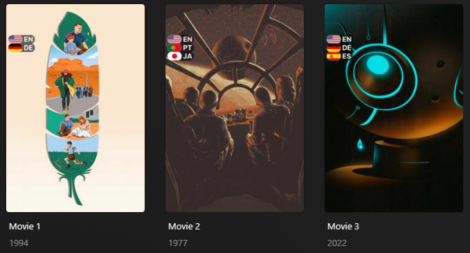
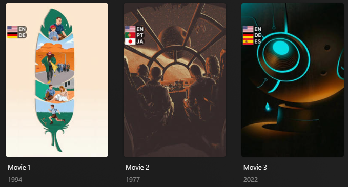

---
hide:
  - toc
---
{%
    include-markdown "./../../templates/defaults/base/overlays/header.md"
    replace='{
        "OVERLAY_NAME": "Audio/Subtitle Language Flag", 
        "CODE_NAME": "languages",
        "OVERLAY_LEVEL": "Movie, Show, Season, Episode",
        "DESCRIPTION": "an overlay of a flag and [ISO 639-1 Code](https://en.wikipedia.org/wiki/List_of_ISO_639-1_codes) based on the 
audio/subtitle languages available on each item within your library"
    }'
    replace-tags='{"rec-sub": "Recommendations: Designed for [TRaSH Guides](https://trash-guides.info/) filename naming scheme."}'
%}
| English           | `en`  | `610` | `us` | :fontawesome-solid-circle-check:{ .green } |
| German            | `de`  | `600` | `de` | :fontawesome-solid-circle-check:{ .green } |
| French            | `fr`  | `590` | `fr` | :fontawesome-solid-circle-check:{ .green } |
| Spanish           | `es`  | `580` | `es` | :fontawesome-solid-circle-check:{ .green } |
| Portuguese        | `pt`  | `570` | `pt` | :fontawesome-solid-circle-check:{ .green } |
| Japanese          | `ja`  | `560` | `jp` | :fontawesome-solid-circle-check:{ .green } |
| Korean            | `ko`  | `550` | `kr` |  :fontawesome-solid-circle-xmark:{ .red }  |
| Chinese           | `zh`  | `540` | `cn` |  :fontawesome-solid-circle-xmark:{ .red }  |
| Danish            | `da`  | `530` | `dk` |  :fontawesome-solid-circle-xmark:{ .red }  |
| Russian           | `ru`  | `520` | `ru` |  :fontawesome-solid-circle-xmark:{ .red }  |
| Italian           | `it`  | `510` | `it` |  :fontawesome-solid-circle-xmark:{ .red }  |
| Hindi             | `hi`  | `500` | `in` |  :fontawesome-solid-circle-xmark:{ .red }  |
| Telugu            | `te`  | `490` | `in` |  :fontawesome-solid-circle-xmark:{ .red }  |
| Farsi             | `fa`  | `480` | `ir` |  :fontawesome-solid-circle-xmark:{ .red }  |
| Thai              | `th`  | `470` | `th` |  :fontawesome-solid-circle-xmark:{ .red }  |
| Dutch             | `nl`  | `460` | `nl` |  :fontawesome-solid-circle-xmark:{ .red }  |
| Norwegian         | `no`  | `450` | `no` |  :fontawesome-solid-circle-xmark:{ .red }  |
| Icelandic         | `is`  | `440` | `is` |  :fontawesome-solid-circle-xmark:{ .red }  |
| Swedish           | `sv`  | `430` | `se` |  :fontawesome-solid-circle-xmark:{ .red }  |
| Turkish           | `tr`  | `420` | `tr` |  :fontawesome-solid-circle-xmark:{ .red }  |
| Polish            | `pl`  | `410` | `pl` |  :fontawesome-solid-circle-xmark:{ .red }  |
| Czech             | `cs`  | `400` | `cz` |  :fontawesome-solid-circle-xmark:{ .red }  |
| Ukrainian         | `uk`  | `390` | `ua` |  :fontawesome-solid-circle-xmark:{ .red }  |
| Hungarian         | `hu`  | `380` | `hu` |  :fontawesome-solid-circle-xmark:{ .red }  |
| Arabic            | `ar`  | `370` | `eg` |  :fontawesome-solid-circle-xmark:{ .red }  |
| Bulgarian         | `bg`  | `360` | `bg` |  :fontawesome-solid-circle-xmark:{ .red }  |
| Bengali           | `bn`  | `350` | `bd` |  :fontawesome-solid-circle-xmark:{ .red }  |
| Bosnian           | `bs`  | `340` | `ba` |  :fontawesome-solid-circle-xmark:{ .red }  |
| Catalan           | `ca`  | `330` | `es` |  :fontawesome-solid-circle-xmark:{ .red }  |
| Welsh             | `cy`  | `320` | `uk` |  :fontawesome-solid-circle-xmark:{ .red }  |
| Greek             | `el`  | `310` | `gr` |  :fontawesome-solid-circle-xmark:{ .red }  |
| Estonian          | `et`  | `300` | `ee` |  :fontawesome-solid-circle-xmark:{ .red }  |
| Basque            | `eu`  | `290` | `es` |  :fontawesome-solid-circle-xmark:{ .red }  |
| Finnish           | `fi`  | `280` | `fi` |  :fontawesome-solid-circle-xmark:{ .red }  |
| Tagalog           | `tl`  | `270` | `ph` |  :fontawesome-solid-circle-xmark:{ .red }  |
| Filipino          | `fil` | `265` | `ph` |  :fontawesome-solid-circle-xmark:{ .red }  |
| Galician          | `gl`  | `260` | `es` |  :fontawesome-solid-circle-xmark:{ .red }  |
| Hebrew            | `he`  | `250` | `il` |  :fontawesome-solid-circle-xmark:{ .red }  |
| Croatian          | `hr`  | `240` | `hr` |  :fontawesome-solid-circle-xmark:{ .red }  |
| Indonesian        | `id`  | `230` | `id` |  :fontawesome-solid-circle-xmark:{ .red }  |
| Georgian          | `ka`  | `220` | `ge` |  :fontawesome-solid-circle-xmark:{ .red }  |
| Kazakh            | `kk`  | `210` | `kz` |  :fontawesome-solid-circle-xmark:{ .red }  |
| Kannada           | `kn`  | `200` | `in` |  :fontawesome-solid-circle-xmark:{ .red }  |
| Latin             | `la`  | `190` | `it` |  :fontawesome-solid-circle-xmark:{ .red }  |
| Lithuanian        | `lt`  | `180` | `lt` |  :fontawesome-solid-circle-xmark:{ .red }  |
| Latvian           | `lv`  | `170` | `lv` |  :fontawesome-solid-circle-xmark:{ .red }  |
| Macedonian        | `mk`  | `160` | `mk` |  :fontawesome-solid-circle-xmark:{ .red }  |
| Malayalam         | `ml`  | `150` | `in` |  :fontawesome-solid-circle-xmark:{ .red }  |
| Marathi           | `mr`  | `140` | `in` |  :fontawesome-solid-circle-xmark:{ .red }  |
| Malay             | `ms`  | `130` | `my` |  :fontawesome-solid-circle-xmark:{ .red }  |
| Norwegian Nokmål  | `nb`  | `120` | `no` |  :fontawesome-solid-circle-xmark:{ .red }  |
| Norwegian Nynorsk | `nn`  | `110` | `no` |  :fontawesome-solid-circle-xmark:{ .red }  |
| Punjabi           | `pa`  | `100` | `in` |  :fontawesome-solid-circle-xmark:{ .red }  |
| Romanian          | `ro`  | `90`  | `ro` |  :fontawesome-solid-circle-xmark:{ .red }  |
| Slovak            | `sk`  | `80`  | `sk` |  :fontawesome-solid-circle-xmark:{ .red }  |
| Slovenian         | `sl`  | `70`  | `si` |  :fontawesome-solid-circle-xmark:{ .red }  |
| Albanian          | `sq`  | `60`  | `al` |  :fontawesome-solid-circle-xmark:{ .red }  |
| Serbian           | `sr`  | `50`  | `rs` |  :fontawesome-solid-circle-xmark:{ .red }  |
| Somali            | `so`  | `45`  | `so` |  :fontawesome-solid-circle-xmark:{ .red }  |
| Swahili           | `sw`  | `40`  | `tz` |  :fontawesome-solid-circle-xmark:{ .red }  |
| Tamil             | `ta`  | `30`  | `in` |  :fontawesome-solid-circle-xmark:{ .red }  |
| Urdu              | `ur`  | `20`  | `pk` |  :fontawesome-solid-circle-xmark:{ .red }  |
| Vietnamese        | `vi`  | `15`  | `vn` |  :fontawesome-solid-circle-xmark:{ .red }  |
| Bambara           | `bm`  | `12`  | `ml` |  :fontawesome-solid-circle-xmark:{ .red }  |
| Lingala           | `ln`  | `11`  | `cd` |  :fontawesome-solid-circle-xmark:{ .red }  |
| Wolof             | `wo`  | `10`  | `sn` |  :fontawesome-solid-circle-xmark:{ .red }  |
| Mayan             | `myn` | `8`   | `mx` |  :fontawesome-solid-circle-xmark:{ .red }  |
| Inuktitut         | `iu`  | `7`   | `ca` |  :fontawesome-solid-circle-xmark:{ .red }  |
| Romani            | `rom` | `6`   | `ro` |  :fontawesome-solid-circle-xmark:{ .red }  |
| Amharic           | `am`  | `5`   | `et` |  :fontawesome-solid-circle-xmark:{ .red }  |
| Sundanese         | `su`  | `4`   | `id` |  :fontawesome-solid-circle-xmark:{ .red }  |
| Zulu              | `zu`  | `3`   | `za` |  :fontawesome-solid-circle-xmark:{ .red }  |
| Luxembourgish     | `lb`  | `2`   | `lu` |  :fontawesome-solid-circle-xmark:{ .red }  |
| Mossi             | `mos` | `1`   | `bf` |  :fontawesome-solid-circle-xmark:{ .red }  |
| Lingala           | `ln`  | `11`  | `cd` |  :fontawesome-solid-circle-xmark:{ .red }  |
| Bambara           | `bm`  | `12`  | `ml` |  :fontawesome-solid-circle-xmark:{ .red }  |
| Afrikaans         | `af`  | `13`  | `af` |  :fontawesome-solid-circle-xmark:{ .red }  |
| Mongolian         | `mn`  | `14`  | `mn` |  :fontawesome-solid-circle-xmark:{ .red }  |
| Khmer             | `kh`  | `16`  | `kh` |  :fontawesome-solid-circle-xmark:{ .red }  |
| Limburgish        | `li`  | `17`  | `be` |  :fontawesome-solid-circle-xmark:{ .red }  |
| Irish             | `ga`  | `18`  | `ie` |  :fontawesome-solid-circle-xmark:{ .red }  |
| Aymara            | `ay`  | `19`  | `bo` |  :fontawesome-solid-circle-xmark:{ .red }  |
| Lao               | `lo`  | `9`   | `la` |  :fontawesome-solid-circle-xmark:{ .red }  |

===  "Round Style (Default)"

    Below is a screenshot of the default Round (`round`) style which can be set via the `style` Template Variable.
    
    

===  "Square Style"

    Below is a screenshot of the alternative Square (`square`) style which can be set via the `style` Template Variable.
    
    

===  "Half Style"

    Below is a screenshot of the alternative Half (`half`) style which can be set via the `style` Template Variable.
    
    


    ```yaml
    libraries:
      Movies:
        overlay_files:
          - default: languages
            template_variables:
              languages: #(1)!
                - en
                - ja
              use_subtitles: true #(2)!
              style: square #(3)!
    ```
    
    1.  Overrides which languages the overlay will apply for
    2.  Display flags based on subtitle languages rather than audio languages
    3.  Sets the flag images to have squared corners

{% 
    include-markdown "./../../templates/defaults/base/overlays/variables_header.md"
    include-tags='all|back|back_align|font'
    replace='{
        "HORIZONTAL_OFFSET": "`15`/`206`/`397`/`588`/`779`",
        "HORIZONTAL_ALIGN": "`left`/`right`/`center`",
        "VERTICAL_OFFSET": "`15`/`76`/`137`/`198`/`259`",
        "VERTICAL_ALIGN": "`top`/`bottom`/`center`",
        "BACK_COLOR": "`#00000099`",
        "BACK_RADIUS": "`26`/`0`",
        "BACK_WIDTH": "`190`",
        "BACK_HEIGHT": "`105`",
        "BACK_ALIGN": "`left`/`right`",
        "FONT": "`fonts/Inter-Bold.ttf`",
        "FONT_SIZE": "`50`"
    }'
%}
    

    




    === "Audio/Subtitle Language Flag Overlays"
    
        The Audio/Subtitle Language Flag overlays use the [`plex_search` Builder](../../../files/builders/plex#plex-search) on either audio or subtitle tracks names.
