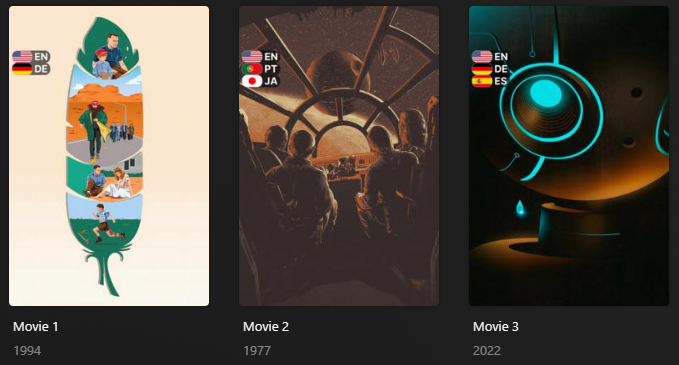
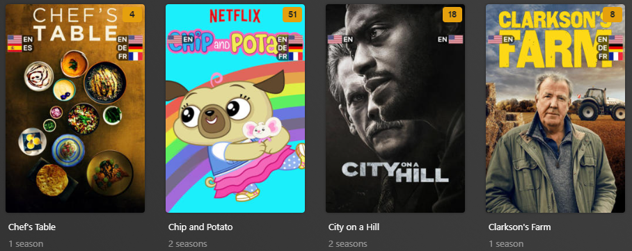

# Audio/Subtitle Language Flags Overlay

The `languages` Default Overlay File is used to create an overlay of a flag and [ISO 639-1 
Code](https://en.wikipedia.org/wiki/List_of_ISO_639-1_codes) based on the audio/subtitle languages available on each 
item within your library.



## Requirements & Recommendations

Supported library types: Movie & Show

## Supported Audio/Subtitle Language Flags

| Audio/Subtitle Languages | Key   | Weight | Default Flag |                Default Use                 |
|:-------------------------|:------|:-------|:-------------|:------------------------------------------:|
| English                  | `en`  | `610`  | `us`         | :fontawesome-solid-circle-check:{ .green } |
| German                   | `de`  | `600`  | `de`         | :fontawesome-solid-circle-check:{ .green } |
| French                   | `fr`  | `590`  | `fr`         | :fontawesome-solid-circle-check:{ .green } |
| Spanish                  | `es`  | `580`  | `es`         | :fontawesome-solid-circle-check:{ .green } |
| Portuguese               | `pt`  | `570`  | `pt`         | :fontawesome-solid-circle-check:{ .green } |
| Japanese                 | `ja`  | `560`  | `jp`         | :fontawesome-solid-circle-check:{ .green } |
| Korean                   | `ko`  | `550`  | `kr`         |  :fontawesome-solid-circle-xmark:{ .red }  |
| Chinese                  | `zh`  | `540`  | `cn`         |  :fontawesome-solid-circle-xmark:{ .red }  |
| Danish                   | `da`  | `530`  | `dk`         |  :fontawesome-solid-circle-xmark:{ .red }  |
| Russian                  | `ru`  | `520`  | `ru`         |  :fontawesome-solid-circle-xmark:{ .red }  |
| Italian                  | `it`  | `510`  | `it`         |  :fontawesome-solid-circle-xmark:{ .red }  |
| Hindi                    | `hi`  | `500`  | `in`         |  :fontawesome-solid-circle-xmark:{ .red }  |
| Telugu                   | `te`  | `490`  | `in`         |  :fontawesome-solid-circle-xmark:{ .red }  |
| Farsi                    | `fa`  | `480`  | `ir`         |  :fontawesome-solid-circle-xmark:{ .red }  |
| Thai                     | `th`  | `470`  | `th`         |  :fontawesome-solid-circle-xmark:{ .red }  |
| Dutch                    | `nl`  | `460`  | `nl`         |  :fontawesome-solid-circle-xmark:{ .red }  |
| Norwegian                | `no`  | `450`  | `no`         |  :fontawesome-solid-circle-xmark:{ .red }  |
| Icelandic                | `is`  | `440`  | `is`         |  :fontawesome-solid-circle-xmark:{ .red }  |
| Swedish                  | `sv`  | `430`  | `se`         |  :fontawesome-solid-circle-xmark:{ .red }  |
| Turkish                  | `tr`  | `420`  | `tr`         |  :fontawesome-solid-circle-xmark:{ .red }  |
| Polish                   | `pl`  | `410`  | `pl`         |  :fontawesome-solid-circle-xmark:{ .red }  |
| Czech                    | `cs`  | `400`  | `cz`         |  :fontawesome-solid-circle-xmark:{ .red }  |
| Ukrainian                | `uk`  | `390`  | `ua`         |  :fontawesome-solid-circle-xmark:{ .red }  |
| Hungarian                | `hu`  | `380`  | `hu`         |  :fontawesome-solid-circle-xmark:{ .red }  |
| Arabic                   | `ar`  | `370`  | `eg`         |  :fontawesome-solid-circle-xmark:{ .red }  |
| Bulgarian                | `bg`  | `360`  | `bg`         |  :fontawesome-solid-circle-xmark:{ .red }  |
| Bengali                  | `bn`  | `350`  | `bd`         |  :fontawesome-solid-circle-xmark:{ .red }  |
| Bosnian                  | `bs`  | `340`  | `ba`         |  :fontawesome-solid-circle-xmark:{ .red }  |
| Catalan                  | `ca`  | `330`  | `es`         |  :fontawesome-solid-circle-xmark:{ .red }  |
| Welsh                    | `cy`  | `320`  | `uk`         |  :fontawesome-solid-circle-xmark:{ .red }  |
| Greek                    | `el`  | `310`  | `gr`         |  :fontawesome-solid-circle-xmark:{ .red }  |
| Estonian                 | `et`  | `300`  | `ee`         |  :fontawesome-solid-circle-xmark:{ .red }  |
| Basque                   | `eu`  | `290`  | `es`         |  :fontawesome-solid-circle-xmark:{ .red }  |
| Finnish                  | `fi`  | `280`  | `fi`         |  :fontawesome-solid-circle-xmark:{ .red }  |
| Tagalog                  | `tl`  | `270`  | `ph`         |  :fontawesome-solid-circle-xmark:{ .red }  |
| Filipino                 | `fil` | `265`  | `ph`         |  :fontawesome-solid-circle-xmark:{ .red }  |
| Galician                 | `gl`  | `260`  | `es`         |  :fontawesome-solid-circle-xmark:{ .red }  |
| Hebrew                   | `he`  | `250`  | `il`         |  :fontawesome-solid-circle-xmark:{ .red }  |
| Croatian                 | `hr`  | `240`  | `hr`         |  :fontawesome-solid-circle-xmark:{ .red }  |
| Indonesian               | `id`  | `230`  | `id`         |  :fontawesome-solid-circle-xmark:{ .red }  |
| Georgian                 | `ka`  | `220`  | `ge`         |  :fontawesome-solid-circle-xmark:{ .red }  |
| Kazakh                   | `kk`  | `210`  | `kz`         |  :fontawesome-solid-circle-xmark:{ .red }  |
| Kannada                  | `kn`  | `200`  | `in`         |  :fontawesome-solid-circle-xmark:{ .red }  |
| Latin                    | `la`  | `190`  | `it`         |  :fontawesome-solid-circle-xmark:{ .red }  |
| Lithuanian               | `lt`  | `180`  | `lt`         |  :fontawesome-solid-circle-xmark:{ .red }  |
| Latvian                  | `lv`  | `170`  | `lv`         |  :fontawesome-solid-circle-xmark:{ .red }  |
| Macedonian               | `mk`  | `160`  | `mk`         |  :fontawesome-solid-circle-xmark:{ .red }  |
| Malayalam                | `ml`  | `150`  | `in`         |  :fontawesome-solid-circle-xmark:{ .red }  |
| Marathi                  | `mr`  | `140`  | `in`         |  :fontawesome-solid-circle-xmark:{ .red }  |
| Malay                    | `ms`  | `130`  | `my`         |  :fontawesome-solid-circle-xmark:{ .red }  |
| Norwegian Nokmål         | `nb`  | `120`  | `no`         |  :fontawesome-solid-circle-xmark:{ .red }  |
| Norwegian Nynorsk        | `nn`  | `110`  | `no`         |  :fontawesome-solid-circle-xmark:{ .red }  |
| Punjabi                  | `pa`  | `100`  | `in`         |  :fontawesome-solid-circle-xmark:{ .red }  |
| Romanian                 | `ro`  | `90`   | `ro`         |  :fontawesome-solid-circle-xmark:{ .red }  |
| Slovak                   | `sk`  | `80`   | `sk`         |  :fontawesome-solid-circle-xmark:{ .red }  |
| Slovenian                | `sl`  | `70`   | `si`         |  :fontawesome-solid-circle-xmark:{ .red }  |
| Albanian                 | `sq`  | `60`   | `al`         |  :fontawesome-solid-circle-xmark:{ .red }  |
| Serbian                  | `sr`  | `50`   | `rs`         |  :fontawesome-solid-circle-xmark:{ .red }  |
| Somali                   | `so`  | `45`   | `so`         |  :fontawesome-solid-circle-xmark:{ .red }  |
| Swahili                  | `sw`  | `40`   | `tz`         |  :fontawesome-solid-circle-xmark:{ .red }  |
| Tamil                    | `ta`  | `30`   | `in`         |  :fontawesome-solid-circle-xmark:{ .red }  |
| Urdu                     | `ur`  | `20`   | `pk`         |  :fontawesome-solid-circle-xmark:{ .red }  |
| Vietnamese               | `vi`  | `15`   | `vn`         |  :fontawesome-solid-circle-xmark:{ .red }  |
| Bambara                  | `bm`  | `12`   | `ml`         |  :fontawesome-solid-circle-xmark:{ .red }  |
| Lingala                  | `ln`  | `11`   | `cd`         |  :fontawesome-solid-circle-xmark:{ .red }  |
| Wolof                    | `wo`  | `10`   | `sn`         |  :fontawesome-solid-circle-xmark:{ .red }  |
| Mayan                    | `myn` | `8`    | `mx`         |  :fontawesome-solid-circle-xmark:{ .red }  |
| Inuktitut                | `iu`  | `7`    | `ca`         |  :fontawesome-solid-circle-xmark:{ .red }  |
| Romani                   | `rom` | `6`    | `ro`         |  :fontawesome-solid-circle-xmark:{ .red }  |
| Amharic                  | `am`  | `5`    | `et`         |  :fontawesome-solid-circle-xmark:{ .red }  |
| Sundanese                | `su`  | `4`    | `id`         |  :fontawesome-solid-circle-xmark:{ .red }  |
| Zulu                     | `zu`  | `3`    | `za`         |  :fontawesome-solid-circle-xmark:{ .red }  |
| Luxembourgish            | `lb`  | `2`    | `lu`         |  :fontawesome-solid-circle-xmark:{ .red }  |
| Mossi                    | `mos` | `1`    | `bf`         |  :fontawesome-solid-circle-xmark:{ .red }  |

??? tip "Square Style (click to expand)"

    Below is a screenshot of the alternative Square (`square`) style which can be set via the `style` template variable.
    
    

??? tip "Half Style (click to expand)"

    Below is a screenshot of the alternative Half (`half`) style which can be set via the `style` template variable.
    
    

## Config

The below YAML in your config.yml will create the overlays:

```yaml
libraries:
  Movies:
    overlay_files:
      - default: languages
  TV Shows:
    overlay_files:
      - default: languages
      - default: languages
        template_variables:
          builder_level: season
      - default: languages
        template_variables:
          builder_level: episode
```

## Template Variables

Template Variables can be used to manipulate the file in various ways to slightly change how it works without having to 
make your own local copy.

Note that the `template_variables:` section only needs to be used if you do want to actually change how the defaults 
work. Any value not specified will use its default value if it has one if not it's just ignored.

??? abstract "Variable Lists (click to expand)"

    * **File-Specific Template Variables** are variables available specifically for this Kometa Defaults file.

    * **Overlay Template Variables** are additional variables shared across the Kometa Overlay Defaults.

    * **Overlay Text Template Variables** are additional variables shared across the Kometa Text Overlay Defaults.

    ??? example "Default Template Variable Values (click to expand)"

        | Variable            | Default                      |
        |:--------------------|:-----------------------------|
        | `horizontal_offset` | `15`/`206`/`397`/`588`/`779` |
        | `horizontal_align`  | `left`/`right`/`center`      |
        | `vertical_offset`   | `15`/`76`/`137`/`198`/`259`  |
        | `vertical_align`    | `top`/`bottom`/`center`      |
        | `back_color`        | `#00000099`                  |
        | `back_radius`       | `26`/` `                     |
        | `back_width`        | `190`                        |
        | `back_height`       | `105`                        |
        | `back_align`        | `left`/`right`               |
        | `font`              | `fonts/Inter-Bold.ttf`       |
        | `font_size`         | `50`                         |
        
    === "File-Specific Template Variables"

        | Variable                      | Description & Values                                                                                                                                                                                                                                                                                                          |
        |:------------------------------|:------------------------------------------------------------------------------------------------------------------------------------------------------------------------------------------------------------------------------------------------------------------------------------------------------------------------------|
        | `languages`                   | **Description:** Controls which Languages will be active.<br>**Default:** `["en", "de", "fr", "es", "pt", "ja"]` <br>**Values:** List of [ISO 639-1 Codes](https://en.wikipedia.org/wiki/List_of_ISO_639-1_codes) for the Languages desired                                                                                   |
        | `use_subtitles`               | **Description:** Controls if the overlay is based on subtitle language instead of audio language.<br>**Values:** `true` to look at subtitle language instead of audio language                                                                                                                                                |
        | `builder_level`               | **Description:** Choose the Overlay Level.<br>**Values:** `season` or `episode`                                                                                                                                                                                                                                               |
        | `horizontal_position`         | **Description:** Choose the horizontal position for the flag group.<br>**Default:** `left`<br>**Values:** `left`, `left2`, `center`, `center_left`, `center_right`, `right` or `right2`                                                                                                                                       |
        | `vertical_position`           | **Description:** Choose the vertical position for the flag group.<br>**Default:** `top`<br>**Values:** `top`, `top2`, `top3`, `center`, `center_top`, `center_bottom`, `bottom`, `bottom2` or `bottom3`                                                                                                                       |
        | `overlay_limit`               | **Description:** Choose the number of overlay this queue displays.<br>**Default:** `3`<br>**Values:** `1`, `2`, `3`, `4`, or `5`                                                                                                                                                                                              |
        | `group_alignment`             | **Description:** Choose the display alignment for the flag group.<br>**Default:** `vertical`<br>**Values:** `horizontal`, or `vertical`                                                                                                                                                                                       |
        | `style`                       | **Description:** Controls the visual theme of the overlays created.<table class="clearTable"><tr><th>Values:</th></tr><tr><td><code>round</code></td><td>Round Theme</td></tr><tr><td><code>square</code></td><td>Square Theme</td></tr><tr><td><code>half</code></td><td>Square Flag with Round Background</td></tr></table> |
        | `flag_alignment`              | **Description:** Controls the flag alignment in the backdrop.<br>**Default:** `left`<br>**Values:** `left` or `right`                                                                                                                                                                                                         |
        | `offset`                      | **Description:** Controls the offset between the flag and the text.<br>**Default:** `10`<br>**Values:** Any Integer 0 or greater                                                                                                                                                                                              |
        | `use_lowercase`               | **Description:** Controls if the overlay display is in lowercase.<br>**Values:** `true` to use lowercase text                                                                                                                                                                                                                 |
        | `position`                    | **Description:** Use the Custom Given Queue instead of the the provided Queues.<br>**Values:** List of Coordinates                                                                                                                                                                                                            |
        | `country_<<key>>`<sup>1</sup> | **Description:** Controls the country image for the Overlay.<br>**Default:** Listed in the [Table](#supported-audiosubtitle-language-flags) above<br>**Values:** [ISO 3166-1 Country Code](https://en.wikipedia.org/wiki/List_of_ISO_3166_country_codes) for the flag desired                                                 |
        | `weight_<<key>>`<sup>1</sup>  | **Description:** Controls the weight of the Overlay. Higher numbers have priority.<br>**Values:** Any Number                                                                                                                                                                                                                  |

        1. Each default overlay has a `key` that when calling to effect a specific overlay you must replace `<<key>>` 
        with when calling.

    === "Overlay Template Variables"

        

    === "Overlay Text Template Variables"

        
    
???+ example "Example Template Variable Amendments"

    The below is an example config.yml extract with some Template Variables added in to change how the file works.
    
    ```yaml
    libraries:
      Movies:
        overlay_files:
          - default: languages
            template_variables:
              languages:
                - en
                - ja
              use_subtitles: true
              style: square
    ```
