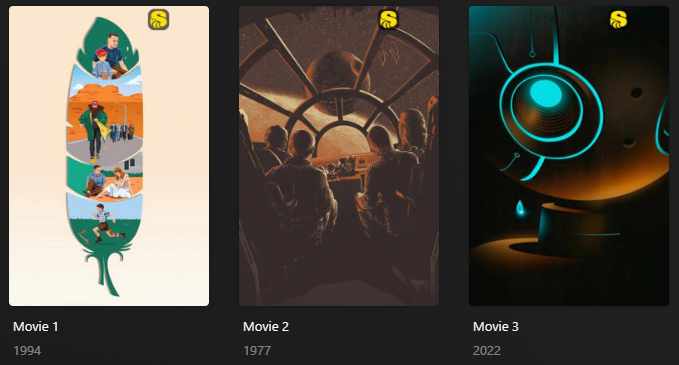

# MediaStinger Overlay

The `mediastinger` Default Overlay File is used to create an overlay based on if there's an after/during credit scene on
each movie within your library.



## Requirements & Recommendations

Supported Overlay Level: Movie

## Config

The below YAML in your config.yml will create the overlays:

```yaml
libraries:
  Movies:
    overlay_files:
      - default: mediastinger
```

## Template Variables

Template Variables can be used to manipulate the file in various ways to slightly change how it works without having to 
make your own local copy.

Note that the `template_variables:` section only needs to be used if you do want to actually change how the defaults 
work. Any value not specified will use its default value if it has one if not it's just ignored.

??? abstract "Variable Lists (click to expand)"

    * **Overlay Template Variables** are additional variables shared across the Kometa Overlay Defaults.

    ??? example "Default Template Variable Values (click to expand)"

        | Variable            | Default     |
        |:--------------------|:------------|
        | `horizontal_offset` | `200`       |
        | `horizontal_align`  | `right`     |
        | `vertical_offset`   | `15`        |
        | `vertical_align`    | `top`       |
        | `back_color`        | `#00000099` |
        | `back_radius`       | `30`        |
        | `back_width`        | `105`       |
        | `back_height`       | `105`       |

    === "Overlay Template Variables"

        
    
???+ example "Example Template Variable Amendments"

    The below is an example config.yml extract with some Template Variables added in to change how the file works.
    
    ```yaml
    libraries:
      Movies:
        overlay_files:
          - default: mediastinger
            template_variables:
              font_color: "#FFFFFF99"
    ```
