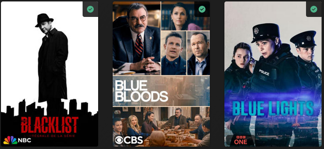

# Network Overlay

The `network` Default Overlay File is used to create an overlay based on the show network on each item within your library.



## Requirements & Recommendations

Supported library types: Show

## Config

The below YAML in your config.yml will create the overlays:

```yaml
libraries:
  TV Shows:
    overlay_path:
      - pmm: network
      - pmm: network
        template_variables:
          builder_level: season
      - pmm: network
        template_variables:
          builder_level: episode
```

## Template Variable Default Values

Template Variables can be used to manipulate the file in various ways to slightly change how it works without having to make your own local copy.

| Variable            | Default / Values |
|:--------------------|:-----------------|
| `horizontal_offset` | `15`             |
| `horizontal_align`  | `left`           |
| `vertical_offset`   | `510`            |
| `vertical_align`    | `bottom`         |
| `back_color`        | `#00000099`      |
| `back_radius`       | `30`             |
| `back_width`        | `305`            |
| `back_height`       | `105`            |




## Example Template Variable Amendments

The below is an example config.yml extract with some Template Variables added in to change how the file works.

```yaml
libraries:
  TV Shows:
    overlay_path:
      - pmm: network
        template_variables:
          vertical_offset: 390
      - pmm: network
        template_variables:
          vertical_offset: 390
          builder_level: season
      - pmm: network
        template_variables:
          vertical_offset: 390
          builder_level: episode
```
