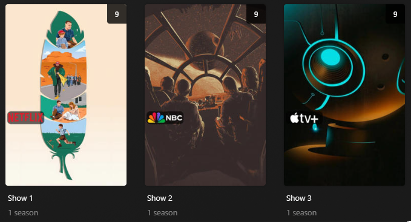

# Network Overlay

The `network` Default Overlay File is used to create an overlay based on the show network on each item within your 
library.



## Requirements & Recommendations

Supported library types: Show

### White Style

Below is a screenshot of the alternative White (`white`) style which can be set via the `style` template variable.


## Config

The below YAML in your config.yml will create the overlays:

```yaml
libraries:
  TV Shows:
    overlay_files:
      - default: network
      - default: network
        template_variables:
          builder_level: season
      - default: network
        template_variables:
          builder_level: episode
```

## Template Variables

Template Variables can be used to manipulate the file in various ways to slightly change how it works without having to 
make your own local copy.

Note that the `template_variables:` section only needs to be used if you do want to actually change how the defaults 
work. Any value not specified will use its default value if it has one if not it's just ignored.

??? abstract "Variable Lists (click to expand)"

    * **File-Specific Template Variables** are variables available specifically for this Kometa Defaults file.

    * **Overlay Template Variables** are additional variables shared across the Kometa Overlay Defaults.

    ??? example "Default Template Variable Values (click to expand)"

        | Variable            | Default     |
        |:--------------------|:------------|
        | `horizontal_offset` | `15`        |
        | `horizontal_align`  | `left`      |
        | `vertical_offset`   | `510`       |
        | `vertical_align`    | `bottom`    |
        | `back_color`        | `#00000099` |
        | `back_radius`       | `30`        |
        | `back_width`        | `305`       |
        | `back_height`       | `105`       |
        
    === "File-Specific Template Variables"

        | Variable | Description & Values                                                                                              |
        |:---------|:------------------------------------------------------------------------------------------------------------------|
        | `style`  | **Description:** Choose between the default color version or the **white** one.<br>**Values:** `color` or `white` |

    === "Overlay Template Variables"

        
    
???+ example "Example Template Variable Amendments"

    The below is an example config.yml extract with some Template Variables added in to change how the file works.
    
    ```yaml
    libraries:
      TV Shows:
        overlay_files:
          - default: network
            template_variables:
              style: white
              vertical_offset: 390
          - default: network
            template_variables:
              vertical_offset: 390
              builder_level: season
          - default: network
            template_variables:
              vertical_offset: 390
              builder_level: episode
    ```
