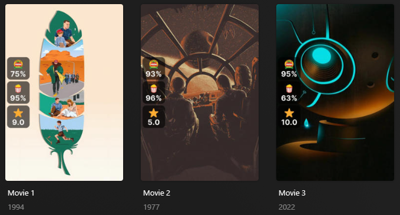

# Ratings Overlays

The `ratings` Default Overlay File is used to create an overlay based on the Critic Rating, Audience Rating, and User Rating in Plex for each item within your library.

This file only updates the overlays based on the data in Plex. Use the [Mass * Rating Update Library Operation](../../config/operations.md#mass--rating-update) and the [Mass Episode * Rating Update Library Operation](../../config/operations.md#mass-episode--rating-update) to update Plex to the Ratings you want on the Overlay.

**This file works with Movie and Show Libraries.**

**If no template variables are set this file will do nothing.**



## Config

The below YAML in your config.yml will create the overlays:

```yaml
  Movies:
    overlay_path:
      - pmm: ratings
        template_variables:
          rating1: critic
          rating2: audience
          rating3: user
          rating1_image: imdb
          rating2_image: rt_popcorn
          rating3_image: tmdb
    operations:
      mass_critic_rating_update: imdb
      mass_audience_rating_update: mdb_tomatoesaudience
      mass_user_rating_update: tmdb
  TV Shows:
    overlay_path:
      - pmm: ratings
        template_variables:
          rating1: critic
          rating2: audience
          rating3: user
          rating1_image: imdb
          rating2_image: rt_popcorn
          rating3_image: tmdb
      - pmm: ratings
        template_variables:
          overlay_level: episode
          rating1: critic
          rating2: audience
          rating1_image: imdb
          rating2_image: tmdb
    operations:
      mass_critic_rating_update: imdb
      mass_audience_rating_update: mdb_tomatoesaudience
      mass_user_rating_update: tmdb
      mass_episode_critic_rating_update: imdb
      mass_episode_audience_rating_update: tmdb
```

## Template Variables

Template Variables can be used to manipulate the file in various ways to slightly change how it works without having to make your own local copy.

Note that the `template_variables:` section only needs to be used if you do want to actually change how the defaults work. Any value not specified is its default value if it has one if not it's just ignored.

All [Shared Overlay Variables](../overlay_variables) are available with the default values below as well as the additional Variables below which can be used to customize the file.

All [Shared Overlay Variables](../overlay_variables) can be appended by `rating1_`, `rating2_`, or `rating3_` to change that attribute on each rating individually.

| Variable            | Default     |
|:--------------------|:------------|
| `horizontal_offset` | `200`       |
| `horizontal_align`  | `right`     |
| `vertical_offset`   | `15`        |
| `vertical_align`    | `top`       |
| `back_color`        | `#00000099` |
| `back_radius`       | `30`        |
| `back_width`        | `105`       |
| `back_height`       | `105`       |
| `back_padding`      | `15`        |
| `back_radius`       | `30`        |
| `back_height`       | `105`       |

| Variable                     | Description & Values                                                                                                                                                                            |
|:-----------------------------|:------------------------------------------------------------------------------------------------------------------------------------------------------------------------------------------------|
| `rating1`                    | **Description:** Choose the rating to display in rating1.<br>**Values:** `critic`, `audience`, or `user`                                                                                        |
| `rating1_image`              | **Description:** Choose the rating image to display in rating1.<br>**Values:** `anidb`, `imdb`, `letterboxd`, `tmdb`, `metacritic`, `rt_popcorn`, `rt_tomato`, `trakt`, `mal`, `mdb`, or `star` |
| `rating2`                    | **Description:** Choose the rating to display in rating2.<br>**Values:** `critic`, `audience`, or `user`                                                                                        |
| `rating2_image`              | **Description:** Choose the rating image to display in rating2.<br>**Values:** `anidb`, `imdb`, `letterboxd`, `tmdb`, `metacritic`, `rt_popcorn`, `rt_tomato`, `trakt`, `mal`, `mdb`, or `star` |
| `rating3`                    | **Description:** Choose the rating to display in rating3.<br>**Values:** `critic`, `audience`, or `user`                                                                                        |
| `rating3_image`              | **Description:** Choose the rating image to display in rating3.<br>**Values:** `anidb`, `imdb`, `letterboxd`, `tmdb`, `metacritic`, `rt_popcorn`, `rt_tomato`, `trakt`, `mal`, `mdb`, or `star` |
| `horizontal_position`        | **Description:** Choose the horizontal position for the rating group.<br>**Default:** `left`<br>**Values:** `left`, `right`, or `center`                                                        |
| `vertical_position`          | **Description:** Choose the vertical position for the rating group.<br>**Default:** `center`<br>**Values:** `top`, `bottom`, or `center`                                                        |
| `rating_alignment`           | **Description:** Choose the display alignment for the rating group.<br>**Default:** `vertical`<br>**Values:** `horizontal`, or `vertical`                                                       |
| `minimum_rating`             | **Description:** Minimum Rating to display<br>**Default:** 0.0<br>**Values:** Any Number                                                                                                        |
| `fresh_rating`               | **Description:** Determines when ratings are considered Fresh<br>**Default:** 6.0<br>**Values:** Any Number                                                                                     |
| `maximum_rating`             | **Description:** Maximum Rating to display<br>**Default:** 10.0<br>**Values:** Any Number                                                                                                       |
| `font`<sup>1</sup>           | **Description:** Choose the font for the Overlay.<br>**Default:** `fonts/Inter-Bold.ttf`<br>**Values:** Path to font file                                                                       |
| `font_style`<sup>1</sup>     | **Description:** Font style for Variable Fonts.<br>**Values:** Variable Font Style                                                                                                              |
| `font_size`<sup>1</sup>      | **Description:** Choose the font size for the Overlay.<br>**Default:** `63`<br>**Values:** Any Number greater then 0                                                                            |
| `font_color`<sup>1</sup>     | **Description:** Choose the font color for the Overlay.<br>**Default:** `#FFFFFF`<br>**Values:** Color Hex Code in format `#RGB`, `#RGBA`, `#RRGGBB` or `#RRGGBBAA`                             |
| `stroke_width`<sup>1</sup>   | **Description:** Font Stroke Width for the Text Overlay.<br>**Values:** Any Number greater then 0                                                                                               |
| `stroke_color`<sup>1</sup>   | **Description:** Font Stroke Color for the Text Overlay.<br>**Values:** Color Hex Code in format `#RGB`, `#RGBA`, `#RRGGBB` or `#RRGGBBAA`                                                      |
| `addon_offset`<sup>1</sup>   | **Description:** Text Addon Image Offset from the text.<br>**Default:** `15`<br>**Values:** Any Number greater then 0                                                                           |
| `addon_position`<sup>1</sup> | **Description:** Text Addon Image Alignment in relation to the text.<br>**Default:** `left`<br>**Values:** `left`, `right`, `top`, `bottom`                                                     |
| `overlay_level`              | **Description:** Choose the Overlay Level.<br>**Values:** `episode`                                                                                                                             |

1. These Variables can be appended by `rating1_`, `rating2_`, or `rating3_` to change that attribute on each rating individually.

The below is an example config.yml extract with some Template Variables added in to change how the file works.

**Note: This example uses fonts not packaged with PMM. See [bullmoose20's Configs](https://github.com/meisnate12/Plex-Meta-Manager-Configs/tree/master/bullmoose20)**

```yaml
  Movies:
    overlay_path:
      - pmm: ratings
        template_variables:
          rating1: critic
          rating1_image: imdb
          rating1_font: config/metadata/fonts/Impact.ttf
          rating1_font_size: 70

          rating2: audience
          rating2_image: rt_popcorn
          rating2_font: config/metadata/fonts/Adlib.ttf
          rating2_font_size: 63

          rating3: user
          rating3_image: tmdb
          rating3_font: config/metadata/fonts/Avenir_95_Black.ttf
          rating3_font_size: 70

          horizontal_position: right
    operations:
      mass_critic_rating_update: imdb
      mass_audience_rating_update: mdb_tomatoesaudience
      mass_user_rating_update: tmdb
  TV Shows:
    overlay_path:
      - pmm: ratings
        template_variables:
          rating1: critic
          rating1_image: imdb
          rating1_font: config/metadata/fonts/Impact.ttf
          rating1_font_size: 70

          rating2: audience
          rating2_image: rt_popcorn
          rating2_font: config/metadata/fonts/Adlib.ttf
          rating2_font_size: 63

          rating3: user
          rating3_image: tmdb
          rating3_font: config/metadata/fonts/Avenir_95_Black.ttf
          rating3_font_size: 70

          horizontal_position: right
      - pmm: ratings
        template_variables:
          overlay_level: episode
          
          rating1: critic
          rating1_image: imdb
          rating1_font: config/metadata/fonts/Impact.ttf
          rating1_font_size: 70

          rating2: audience
          rating2_image: tmdb
          rating2_font: config/metadata/fonts/Avenir_95_Black.ttf
          rating2_font_size: 70

          horizontal_position: right
    operations:
      mass_critic_rating_update: imdb
      mass_audience_rating_update: mdb_tomatoesaudience
      mass_user_rating_update: tmdb
      mass_episode_critic_rating_update: imdb
      mass_episode_audience_rating_update: tmdb
```
