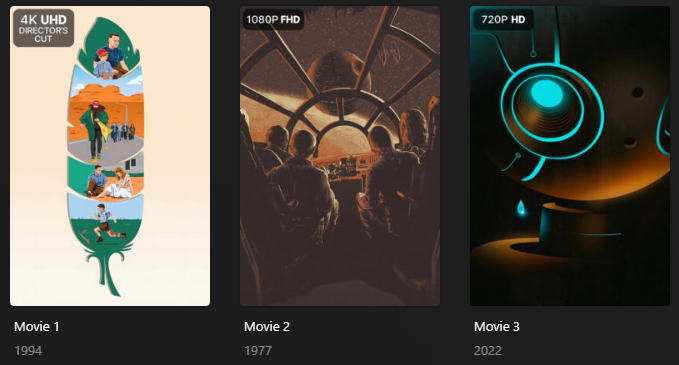

# Resolution/Edition Overlay

The `resolution` Default Overlay File is used to create an overlay based on the resolutions and editions available on 
each item within your library.



## Requirements & Recommendations

Supported Overlay Level: Movie, Show, Episode

Recommendations: Editions overlay is designed to use the Editions field within Plex [which requires Plex Pass to use] or 
the [TRaSH Guides](https://trash-guides.info/) filename naming scheme

## Supported Resolutions

| Resolution     | Key              | Weight |
|:---------------|:-----------------|:-------|
| 4K DV/HDR10+   | `4k_dvhdrplus`   | `159`  |
| 4K DV/HDR      | `4k_dvhdr`       | `158`  |
| 4K HDR10+      | `4k_plus`        | `155`  |
| 4K DV          | `4k_dv`          | `150`  |
| 4K HDR         | `4k_hdr`         | `140`  |
| 4K             | `4k`             | `130`  |
| 1080p DV/HDR10+| `1080p_dvhdrplus`| `129`  |
| 1080P DV/HDR   | `1080p_dvhdr`    | `128`  |
| 1080P HDR10+   | `1080p_plus`     | `125`  |
| 1080P DV       | `1080p_dv`       | `120`  |
| 1080P HDR      | `1080p_hdr`      | `110`  |
| 1080P          | `1080p`          | `100`  |
| 720P DV/HDR10+ | `720p_dvhdrplus` | `99`   |
| 720P DV/HDR    | `720p_dvhdr`     | `98`   |
| 720P HDR10+    | `720p_plus`      | `95`   |
| 720P DV        | `720p_dv`        | `90`   |
| 720P HDR       | `720p_hdr`       | `80`   |
| 720P           | `720p`           | `70`   |
| 576P DV/HDR10+ | `576p_dvhdrplus` | `69`   |
| 576P DV/HDR    | `576p_dvhdr`     | `68`   |
| 576P HDR10+    | `576p_plus`      | `65`   |
| 576P DV        | `576p_dv`        | `60`   |
| 576P HDR       | `576p_hdr`       | `50`   |
| 576P           | `576p`           | `40`   |
| 480P DV/HDR10+ | `480p_dvhdrplus` | `39`   |
| 480P DV/HDR    | `480p_dvhdr`     | `38`   |
| 480P HDR10+    | `480p_plus`      | `35`   |
| 480P DV        | `480p_dv`        | `30`   |
| 480P HDR       | `480p_hdr`       | `20`   |
| 480P           | `480p`           | `10`   |
| DV/HDR10+      | `dvhdrplus`      | `9`    |
| DV/HDR         | `dvhdr`          | `8`    |
| HDR10+         | `plus`           | `7`    |
| DV             | `dv`             | `5`    |
| HDR            | `hdr`            | `1`    |

## Supported Editions

| Edition             | Key             | Weight |
|:--------------------|:----------------|:-------|
| Extended Edition    | `extended`      | `190`  |
| Uncut Edition       | `uncut`         | `180`  |
| Unrated Edition     | `unrated`       | `170`  |
| Special Edition     | `special`       | `160`  |
| Anniversary Edition | `anniversary`   | `150`  |
| Collector's Edition | `collector`     | `140`  |
| Diamond Edition     | `diamond`       | `130`  |
| Platinum Edition    | `platinum`      | `120`  |
| Director's Cut      | `directors`     | `110`  |
| Final Cut           | `final`         | `100`  |
| International Cut   | `international` | `90`   |
| Theatrical Cut      | `theatrical`    | `80`   |
| Ultimate Cut        | `ultimate`      | `70`   |
| Alternate Cut       | `alternate`     | `60`   |
| Coda Cut            | `coda`          | `50`   |
| IMAX Enhanced       | `enhanced`      | `40`   |
| IMAX                | `imax`          | `30`   |
| Remastered          | `remastered`    | `20`   |
| Criterion           | `criterion`     | `10`   |
| Richard Donner      | `richarddonner` | `9`    |
| Black and Chrome    | `blackchrome`   | `8`    |
| Definitive          | `definitive`    | `7`    |
| Ulysses             | `ulysses`       | `6`    |

## "Dovetail" versions

In the PMM log, you may see references to versions of these overlays with `-Dovetail` appended:

```
|                             4K-Plus-Dovetail Overlay in Movies                             |
|                              4K-DV-Dovetail Overlay in Movies                              |
|                             4K-HDR-Dovetail Overlay in Movies                              |
|                               4K-Dovetail Overlay in Movies                                |
...
|                        Extended-Edition-Dovetail Overlay in Movies                         |
|                          Uncut-Edition-Dovetail Overlay in Movies                          |
|                         Unrated-Edition-Dovetail Overlay in Movies                         |
...
```

These `-Dovetail` variations are used when resolution and edition are combined so that one "dovetails" into the other.  
This is not something you can enable or disable independently; it's an internal implementation detail.

## Config

The below YAML in your config.yml will create the overlays:

```yaml
libraries:
  Movies:
    overlay_files:
      - pmm: resolution
  TV Shows:
    overlay_files:
      - pmm: resolution
      - pmm: resolution
        template_variables:
          builder_level: season
      - pmm: resolution
        template_variables:
          builder_level: episode
```

## Template Variables

Template Variables can be used to manipulate the file in various ways to slightly change how it works without having to 
make your own local copy.

Note that the `template_variables:` section only needs to be used if you do want to actually change how the defaults 
work. Any value not specified will use its default value if it has one if not it's just ignored.

??? abstract "Variable Lists (click to expand)"

    * **File-Specific Template Variables** are variables available specifically for this PMM Defaults file.

    * **Overlay Template Variables** are additional variables shared across the PMM Overlay Defaults.

    ??? example "Default Template Variable Values (click to expand)"

        | Variable            | Default     |
        |:--------------------|:------------|
        | `horizontal_offset` | `15`        |
        | `horizontal_align`  | `left`      |
        | `vertical_offset`   | `15`        |
        | `vertical_align`    | `top`       |
        | `back_color`        | `#00000099` |
        | `back_radius`       | `30`        |
        | `back_width`        | `305`       |
        | `back_height`       | `105`/`189` |
        
    === "File-Specific Template Variables"

        | Variable                     | Description & Values                                                                                                                           |
        |:-----------------------------|:-----------------------------------------------------------------------------------------------------------------------------------------------|
        | `use_resolution`             | **Description:** Turns off all Resolution Overlays in the Defaults file.<br>**Values:** `false` to turn off the overlays                       |
        | `use_edition`                | **Description:** Turns off all Edition Overlays in the Defaults file.<br>**Values:** `false` to turn off the overlays                          |
        | `builder_level`              | **Description:** Choose the Overlay Level.<br>**Values:** `season` or `episode`                                                                |
        | `weight_<<key>>`<sup>1</sup> | **Description:** Controls the weight of the Overlay. Higher numbers have priority. **Only works with Edition keys.**<br>**Values:** Any Number |

        1. Each default overlay has a `key` that when calling to effect a specific overlay you must replace `<<key>>` 
        with when calling.

    === "Overlay Template Variables"

        
    
???+ example "Example Template Variable Amendments"

    The below is an example config.yml extract with some Template Variables added in to change how the file works.
    
    ```yaml
    libraries:
      Movies:
        overlay_files:
          - pmm: resolution
            template_variables:
              use_dvhdrplus: false
              use_dv: false
              use_hdr: false
              use_1080p: false
              use_720p: false
              use_576p: false
              use_480p: false
              use_1080p_hdr: false
              use_1080p_dv: false
    ```
