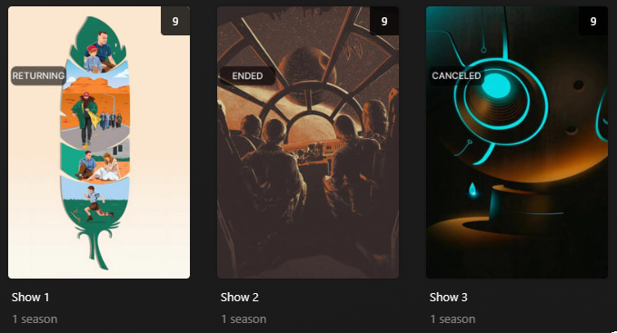

# Status Overlay

The `status` Default Overlay File is used to create an overlay on a show detailing its Current Airing Status for all shows in your library.

**This file only works with Show Libraries.**



## Supported Status

| Audio Codec | Key         | Weight |
|:------------|:------------|:-------|
| AIRING      | `airing`    | `40`   |
| RETURNING   | `returning` | `30`   |
| CANCELED    | `canceled`  | `20`   |
| ENDED       | `ended`     | `10`   |

## Config

The below YAML in your config.yml will create the overlays:

```yaml
libraries:
  Movies:
    overlay_path:
      - pmm: status
  TV Shows:
    overlay_path:
      - pmm: status
```

## Template Variables

Template Variables can be used to manipulate the file in various ways to slightly change how it works without having to make your own local copy.

Note that the `template_variables:` section only needs to be used if you do want to actually change how the defaults work. Any value not specified is its default value if it has one if not it's just ignored.

All [Shared Overlay Variables](../overlay_variables) are available with the default values below as well as the additional Variables below which can be used to customize the file.

| Variable            | Default     |
|:--------------------|:------------|
| `horizontal_offset` | `15`        |
| `horizontal_align`  | `left`      |
| `vertical_offset`   | `330`       |
| `vertical_align`    | `top`       |
| `back_color`        | `#00000099` |
| `back_radius`       | `30`        |
| `back_width`        | `305`       |
| `back_height`       | `105`       |

| Variable                     | Description & Values                                                                                                                                                                                                                                                                                                                                |
|:-----------------------------|:----------------------------------------------------------------------------------------------------------------------------------------------------------------------------------------------------------------------------------------------------------------------------------------------------------------------------------------------------|
| `last`                       | **Description:** Episode Air Date in the last number of days for the AIRING Overlay.<br>**Default:** `14`<br>**Values:** Any Number greater then 0                                                                                                                                                                                                  |
| `text_<<key>>`<sup>1</sup>   | **Description:** Choose the text for the Overlay.<br>**Default:** <table class="clearTable"><tr><th>Key</th><th>Default</th></tr><tr><td>`airing`</td><td>`AIRING`</td></tr><tr><td>`returning`</td><td>`RETURNING`</td></tr><tr><td>`canceled`</td><td>`CANCELED`</td></tr><tr><td>`ended`</td><td>`ENDED`</td></tr></table>**Values:** Any String |
| `weight_<<key>>`<sup>1</sup> | **Description:** Controls the weight of the Overlay. Higher numbers have priority.<br>**Values:** Any Number                                                                                                                                                                                                                                        |
| `font`                       | **Description:** Choose the font for the Overlay.<br>**Default:** `fonts/Inter-Medium.ttf`<br>**Values:** Path to font file                                                                                                                                                                                                                         |
| `font_style`                 | **Description:** Font style for Variable Fonts.<br>**Values:** Variable Font Style                                                                                                                                                                                                                                                                  |
| `font_size`                  | **Description:** Choose the font size for the Overlay.<br>**Default:** `50`<br>**Values:** Any Number greater then 0                                                                                                                                                                                                                                |
| `font_color`                 | **Description:** Choose the font color for the Overlay.<br>**Default:** `#FFFFFF`<br>**Values:** Color Hex Code in format `#RGB`, `#RGBA`, `#RRGGBB` or `#RRGGBBAA`                                                                                                                                                                                 |
| `stroke_width`               | **Description:** Font Stroke Width for the Text Overlay.<br>**Values:** Any Number greater then 0                                                                                                                                                                                                                                                   |
| `stroke_color`               | **Description:** Font Stroke Color for the Text Overlay.<br>**Values:** Color Hex Code in format `#RGB`, `#RGBA`, `#RRGGBB` or `#RRGGBBAA`                                                                                                                                                                                                          |

1. Each default overlay has a `key` that when calling to effect a specific collection you must replace `<<key>>` with when calling.

The below is an example config.yml extract with some Template Variables added in to change how the file works.

```yaml
libraries:
  Movies:
    overlay_path:
      - pmm: status
        template_variables:
          text_canceled: CANCELLED
```
