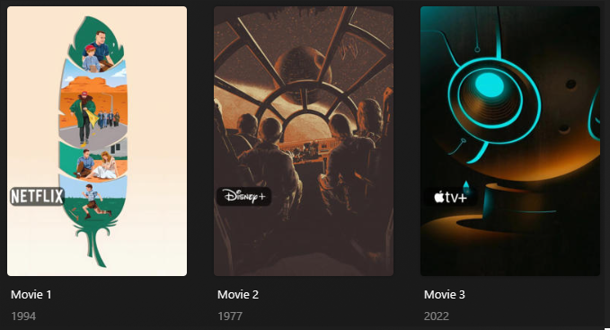

# Streaming Services Overlay

The `streaming` Default Overlay File is used to create an overlay based on the streaming service the file is found on 
for each item within your library.



## Requirements & Recommendations

Supported Overlay Level: Movie, Show

## Supported Streaming Services


!!! important

    As of Kometa release 1.21, the keys associated with this Defaults file has changed.

    If you are setting custom images, you will need to use `<<originals_key>>`

| Streaming Service | Key    | `originals_key` | Weight |
|:------------------|--------|:----------------|:-------|
| Netflix           | `8`    | `netflix`       | `160`  |
| Prime Video       | `9`    | `amazon`        | `150`  |
| Disney+           | `337`  | `disney`        | `140`  |
| Max               | `1189` | `max`           | `130`  |
| Crunchyroll       | `283`  | `Crunchyroll`   | `120`  |
| YouTube           | `188`  | `youtube`       | `110`  |
| Hulu              | `15`   | `hulu`          | `100`  |
| Paramount+        | `531`  | `paramount`     | `90`   |
| AppleTV           | `350`  | `appletv`       | `80`   |
| Peacock           | `387`  | `peacock`       | `70`   |
| Showtime          | `37`   | `showtime`      | `60`   |
| discovery+        | `510`  | `discovery`     | `58`   |
| Crave             | `230`  | `crave`         | `55`   |
| NOW               | `39`   | `now`           | `50`   |
| All 4             | `103`  | `all4`          | `40`   |
| britbox           | `151`  | `britbox`       | `30`   |
| BET+              | `1759` | `bet`           | `20`   |
| hayu              | `223`  | `hayu`          | `10`   |


## Regional Variants

Some logic is applied to allow for regional streaming service lists to be available to users depending on where they 
are, as detailed below:

| Region           | Key                              | Description                                                                                                                         |
|:-----------------|:---------------------------------|-------------------------------------------------------------------------------------------------------------------------------------|
| any besides `GB` | `all4`, `britbox`, `hayu`, `now` | These overlays will not be used if the region is not `uk` as these streaming services are UK-focused                                |
| any besides `CA` | `crave`                          | These overlays will not be used if the region is not `ca` as these streaming services are Canada-focused                            |
| `CA`             | `max`, `showtime`                | These overlays will not be used if the region is `ca` as these streaming services are part of the Crave streaming service in Canada |


## Config

The below YAML in your config.yml will create the overlays:

```yaml
libraries:
  Movies:
    overlay_files:
      - default: streaming
  TV Shows:
    overlay_files:
      - default: streaming
```

## Template Variables

Template Variables can be used to manipulate the file in various ways to slightly change how it works without having to 
make your own local copy.

Note that the `template_variables:` section only needs to be used if you do want to actually change how the defaults 
work. Any value not specified will use its default value if it has one if not it's just ignored.

??? abstract "Variable Lists (click to expand)"

    * **File-Specific Template Variables** are variables available specifically for this Kometa Defaults file.

    * **Overlay Template Variables** are additional variables shared across the Kometa Overlay Defaults.

    ??? example "Default Template Variable Values (click to expand)"

        | Variable            | Default                                                                        |
        |:--------------------|:-------------------------------------------------------------------------------|
        | `horizontal_offset` | **Description:** Change the horizontal offset.<br>**Default Value:** `15`      |
        | `horizontal_align`  | **Description:** Change the horizontal alignment.<br>**Default Value:** `left` |
        | `vertical_offset`   | **Description:** Change the vertical offset.<br>**Default Value:** `390`       |
        | `vertical_align`    | **Description:** Change the vertical alignment.<br>**Default Value:** `bottom` |
        | `back_color`        | **Description:** Change the back color.<br>**Default Value:** `#00000099`      |
        | `back_radius`       | **Description:** Change the back (lozenge) radius .<br>**Default Value:** `30` |
        | `back_width`        | **Description:** Change the back (lozenge) width.<br>**Default Value:** `305`  |
        | `back_height`       | **Description:** Change the back (lozenge) height.<br>**Default Value:** `105` |
        
    === "File-Specific Template Variables"

        | Variable                     | Description & Values                                                                                                                                                                                                                                                                                                            |
        |:-----------------------------|:--------------------------------------------------------------------------------------------------------------------------------------------------------------------------------------------------------------------------------------------------------------------------------------------------------------------------------|
        | `region`                     | **Description:** Changes some Streaming Service lists to regional variants (see below table for more information.<br>**Default:** `US`<br>**Values:** Any [ISO 3166-1 Code](https://en.wikipedia.org/wiki/ISO_3166-1#Current_codes) of the region where the streaming information should be based on.                                                                                                                   |
        | `originals_only`             | **Description:** Changes Streaming Service overlays to only apply to original content produced by the service.<br>**Note**: Cannot be used with `region`, and only produces overlays for `amazon`, `appletv`, `disney`, `max`, `hulu`, `netflix`, `paramount`, `peacock`<br>**Default:** `false`<br>**Values:** `true`, `false` |
        | `weight_<<key>>`<sup>1</sup> | **Description:** Controls the weight of the Overlay. Higher numbers have priority.<br>**Values:** Any Number                                                                                                                                                                                                                    |

        1. Each default overlay has a `key` that when calling to effect a specific overlay you must replace `<<key>>` 
        with when calling.

    === "Overlay Template Variables"

        

???+ example "Example Template Variable Amendments"

    The below is an example config.yml extract with some Template Variables added in to change how the file works.
    
    ```yaml
    libraries:
      Movies:
        overlay_files:
          - default: streaming
            template_variables:
              originals_only: true
              use_peacock: false
              weight_netflix: 100
    ```
