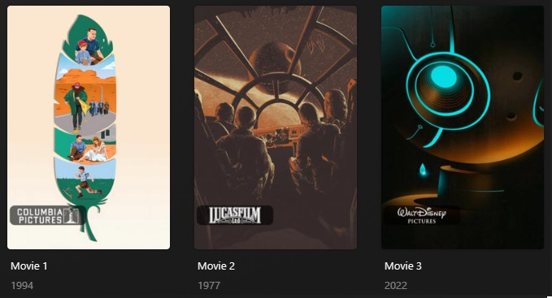

---
hide:
  - toc
---


### Bigger Style

Below is a screenshot of the alternative Bigger (`bigger`) style which can be set via the `style` Template Variable.




    ```yaml
    libraries:
      Movies:
        overlay_files:
          - default: studio
            template_variables:
              vertical_offset: 390 #(1)!
      TV Shows:
        overlay_files:
          - default: studio
          - default: studio
            template_variables:
              builder_level: season #(2)!
              vertical_align: bottom  #(3)!
              vertical_offset: 15  #(1)!
              horizontal_align: left  #(4)!
              horizontal_offset: 15  #(1)!
              style: bigger  #(5)!
          - default: studio
            template_variables:
              builder_level: episode  #(6)!
              vertical_align: top  #(7)!
              vertical_offset: 15 #(1)!
    ```

    1.  Changes the offset of the overlay
    2.  Applies the overlay to seasons
    3.  Moves the overlay position to the bottom
    4.  Moves the overlay position to the left
    5.  Uses the bigger style overlay images
    6.  Applies the overlay to episodes
    7.  Moves the overlay position to the top


    

    




    === "Studio Overlays"
    
        The Studio overlays use the [`plex_search` Builder](../../../files/builders/plex#plex-search) on studio names. 
        The list of studio is not exposed for customization using Template Variables.
