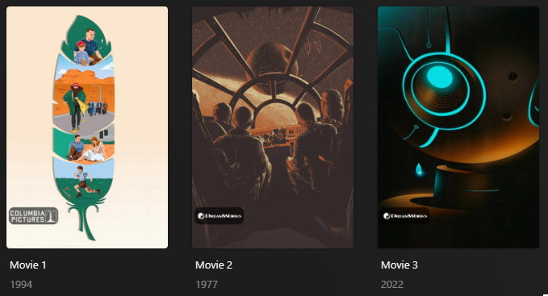

# Studio Overlay

The `studio` Default Overlay File is used to create an overlay based on the show studio on each item within your library.



## Requirements & Recommendations

Supported library types: Movie / Show

## Config

The below YAML in your config.yml will create the overlays:

```yaml
libraries:
  Movies:
    overlay_path:
      - pmm: studio
  TV Shows:
    overlay_path:
      - pmm: studio
```

## Template Variable Default Values

Template Variables can be used to manipulate the file in various ways to slightly change how it works without having to make your own local copy..

| Variable            | Default / Values                                                                                 |
|:--------------------|:-------------------------------------------------------------------------------------------------|
| `horizontal_offset` | `15`                                                                                             |
| `horizontal_align`  | `left`                                                                                           |
| `vertical_offset`   | `150`                                                                                            |
| `vertical_align`    | `bottom`                                                                                         |
| `back_color`        | `#00000099`                                                                                      |
| `back_radius`       | `30`                                                                                             |
| `back_width`        | `305`                                                                                            |
| `back_height`       | `105`                                                                                            |
| `builder_level`     | **Description:** Choose the Overlay Level.<br>**Values:** `season` or `episode`                  |
| `style`             | **Description:** Choose between the standard size or the **bigger** one.<br>**Values:** `bigger` |

Preview of the bigger style




## Example Template Variable Amendments

The below is an example config.yml extract with some Template Variables added in to change how the file works.

```yaml
libraries:
  Movies:
    overlay_path:
      - pmm: studio
        template_variables:
          vertical_offset: 390
  TV Shows:
    overlay_path:
      - pmm: studio
      - pmm: studio
        template_variables:
          builder_level: season
          vertical_align: bottom
          vertical_offset: 15
          horizontal_align: left
          horizontal_offset: 15
          style: bigger
      - pmm: studio
        template_variables:
          builder_level: episode
          vertical_align: top
          vertical_offset: 15
```
