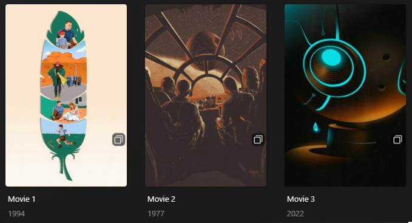

# Versions Overlay

The `versions` Default Overlay File is used to create an overlay based on if there's multiple versions on each item within your library.

**This file works with Movie and Show Libraries.**



## Config

The below YAML in your config.yml will create the overlays:

```yaml
libraries:
  Movies:
    overlay_path:
      - pmm: versions
  TV Shows:
    overlay_path:
      - pmm: versions
      - pmm: versions
        template_variables:
          overlay_level: season
      - pmm: versions
        template_variables:
          overlay_level: episode
```

## Template Variables

Template Variables can be used to manipulate the file in various ways to slightly change how it works without having to make your own local copy.

Note that the `templates_variables:` section only needs to be used if you do want to actually change how the defaults work. Any value not specified is its default value if it has one if not it's just ignored.

All [Shared Overlay Variables](../overlay_variables.md) are available with the default values below as well as the additional Variables below which can be used to customize the file.

| Variable            |     Default      |
|:--------------------|:----------------:|
| `horizontal_offset` |    `15`/`235`    |
| `horizontal_align`  | `right`/`center` |
| `vertical_offset`   |   `1050`/`15`    |
| `vertical_align`    |      `top`       |
| `back_color`        |   `#00000099`    |
| `back_radius`       |       `30`       |
| `back_width`        |      `105`       |
| `back_height`       |      `105`       |

| Variable        | Description & Values                                                            |
|:----------------|:--------------------------------------------------------------------------------|
| `overlay_level` | **Description:** Choose the Overlay Level.<br>**Values:** `season` or `episode` |

The below is an example config.yml extract with some Template Variables added in to change how the file works.

```yaml
libraries:
  Movies:
    overlay_path:
      - pmm: versions
        template_variables:
          font_color: "#FFFFFF99"
```
