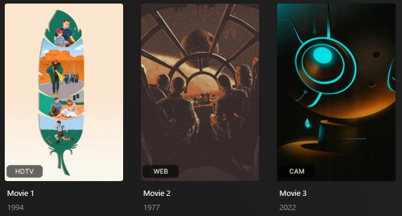

# Video Format Overlay

The `video_format` Default Overlay File is used to create an overlay based on the video format available on each item
within your library.



## Requirements & Recommendations

Supported Overlay Level: Movie, Show, Season, Episode

Recommendations: Designed for [TRaSH Guides](https://trash-guides.info/) filename naming scheme

## Supported Video Formats

| Video Format   | Key        | Weight |
|:---------------|:-----------|:-------|
| REMUX          | `remux`    | `60`   |
| BLU-RAY        | `bluray`   | `50`   |
| WEB            | `web`      | `40`   |
| HDTV           | `hdtv`     | `30`   |
| DVD            | `dvd`      | `20`   |
| SDTV           | `sdtv`     | `10`   |
| TELESYNC       | `telesync` | `9`    |
| CAM            | `cam`      | `8`    |

## Config

The below YAML in your config.yml will create the overlays:

```yaml
libraries:
  Movies:
    overlay_files:
      - pmm: video_format
  TV Shows:
    overlay_files:
      - pmm: video_format
      - pmm: video_format
        template_variables:
          builder_level: season
      - pmm: video_format
        template_variables:
          builder_level: episode
```

## Template Variables

Template Variables can be used to manipulate the file in various ways to slightly change how it works without having to 
make your own local copy.

Note that the `template_variables:` section only needs to be used if you do want to actually change how the defaults 
work. Any value not specified will use its default value if it has one if not it's just ignored.

??? abstract "Variable Lists (click to expand)"

    * **File-Specific Template Variables** are variables available specifically for this PMM Defaults file.

    * **Overlay Template Variables** are additional variables shared across the PMM Overlay Defaults.

    * **Overlay Text Template Variables** are additional variables shared across the PMM Text Overlay Defaults.

    ??? example "Default Template Variable Values (click to expand)"

        | Variable            | Default     |
        |:--------------------|:------------|
        | `horizontal_offset` | `15`        |
        | `horizontal_align`  | `left`      |
        | `vertical_offset`   | `30`        |
        | `vertical_align`    | `bottom`    |
        | `back_color`        | `#00000099` |
        | `back_radius`       | `30`        |
        | `back_width`        | `305`       |
        | `back_height`       | `105`       |
        
    === "File-Specific Template Variables"

        | Variable                     | Description & Values                                                                                                                                                                                                                                                                                                                                                                                         |
        |:-----------------------------|:-------------------------------------------------------------------------------------------------------------------------------------------------------------------------------------------------------------------------------------------------------------------------------------------------------------------------------------------------------------------------------------------------------------|
        | `builder_level`              | **Description:** Choose the Overlay Level.<br>**Values:** `season` or `episode`                                                                                                                                                                                                                                                                                                                              |
        | `text_<<key>>`<sup>1</sup>   | **Description:** Choose the text for the Overlay.<br>**Default:** <table class="clearTable"><tr><th>Key</th><th>Default</th></tr><tr><td>`remux`</td><td>`REMUX`</td></tr><tr><td>`bluray`</td><td>`BLU-RAY`</td></tr><tr><td>`web`</td><td>`WEB`</td></tr><tr><td>`hdtv`</td><td>`HDTV`</td></tr><tr><td>`dvd`</td><td>`DVD`</td></tr><tr><td>`sdtv`</td><td>`SDTV`</td></tr></table>**Values:** Any String |
        | `weight_<<key>>`<sup>1</sup> | **Description:** Controls the weight of the Overlay. Higher numbers have priority.<br>**Values:** Any Number                                                                                                                                                                                                                                                                                                 |
        | `regex_<<key>>`<sup>1</sup>  | **Description:** Controls the regex of the Overlay Search.<br>**Values:** Any Proper Regex                                                                                                                                                                                                                                                                                                                   |

        1. Each default overlay has a `key` that when calling to effect a specific overlay you must replace `<<key>>` 
        with when calling.

    === "Overlay Template Variables"

        

    === "Overlay Text Template Variables"

        
    
???+ example "Example Template Variable Amendments"

    The below is an example config.yml extract with some Template Variables added in to change how the file works.
    
    ```yaml
    libraries:
      Movies:
        overlay_files:
          - pmm: video_format
            template_variables:
              text_bluray: BLURAY
              use_sdtv: false
              use_dvd: false
    ```
