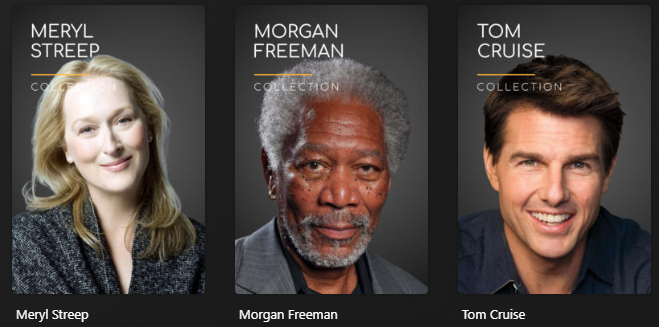
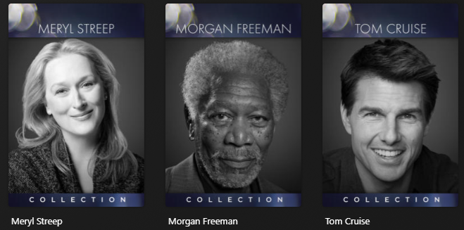

## Poster Styles

This Default can use the `style` template variable to easily change the posters styles.

??? tip "Black & White Style (Default) (click to expand)"

    

??? tip "Rainier Style (click to expand)"

    

??? tip "Signature Style (click to expand)"

    

??? tip "Diiivoy Style (click to expand)"

    

??? tip "Diiivoy Color Style (click to expand)"

    
