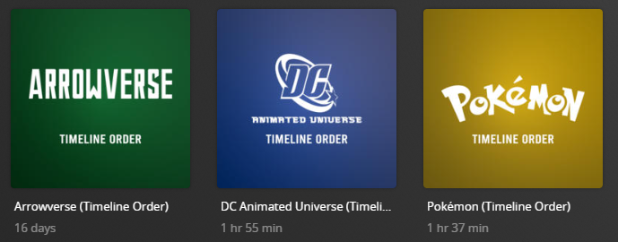

---
hide:
  - toc
---
# Playlists

The `playlist` Default Playlist File is used to create playlists based on popular Movie/TV Show universes (such as the Marvel Cinematic Universe or Star Trek).

This file assumes that you have libraries named `Movies` and `TV Shows`. If you do not have these libraries or want to use alternative/additional libraries, 
use the `libraries` template variable which is outlined in the [Template Variables](#template-variables) table.



## Playlists

| Playlist                                     | Key          | Description                                                                       |
|:---------------------------------------------|:-------------|:----------------------------------------------------------------------------------|
| `Arrowverse (Timeline Order)`                | `arrow`      | Playlist of Movies and Episodes in the Arrowverse (Timeline Order)                |
| `DC Animated Universe (Timeline Order)`      | `dcau`       | Playlist of Movies and Episodes in the DC Animated Universe (Timeline Order)      |
| `Dragon Ball (Timeline Order)`               | `dragonball` | Playlist of Movies and Episodes in the Dragon Ball (Timeline Order)               |
| `Marvel Cinematic Universe (Timeline Order)` | `mcu`        | Playlist of Movies and Episodes in the Marvel Cinematic Universe (Timeline Order) |
| `Pokémon (Timeline Order)`                   | `pokemon`    | Playlist of Movies and Episodes in the Pokémon (Timeline Order)                   |
| `Star Trek (Timeline Order)`                 | `startrek`   | Playlist of Movies and Episodes in the Star Trek (Timeline Order)                 |
| `Star Wars (Timeline Order)`                 | `starwars`   | Playlist of Movies and Episodes in the Star Wars (Timeline Order)                 |
| `Star Wars The Clone Wars (Timeline Order)`  | `clonewars`  | Playlist of Movies and Episodes in the Star Wars The Clone Wars (Timeline Order)  |
| `X-Men (Timeline Order)`                     | `xmen`       | Playlist of Movies and Episodes in the X-Men (Timeline Order)                     |

## Config

The below YAML in your config.yml will create the collections:

```yaml
playlist_files:
  - default: playlist
```


    ```yaml
    playlist_files:
      - default: playlist
        template_variables:
          radarr_add_missing: true #(1)!
    ```

    1. Adds items from the source list which are not in Plex to Radarr

??? example "Example Template Adding Default Playlists (Click to Expand)"

    The below is an example config.yml extract showing how to enable/disable specific playlists using their keys. By default, all keys/playlists are enabled.

    Click the :fontawesome-solid-circle-plus: icon to learn more
    
    ```yaml
    playlist_files:
      - default: playlist
        template_variables:
          use_mcu: true #(1)!
          use_xmen: false #(2)!
    ```

    1. Enable the default MCU playlist
    2. Disable the default X-Men playlist




       

    



    === "Playlists"
        The default Playlists use the [IMDb List Builder](../../files/builders/imdb#imdb-list) and [MDBList List Builder](../../files/builders/mdblist#mdblist-list) to create the playlists.

    === "Default `imdb_list`"
    
        
        imdb_list: 

        ```

    === "Default `mdblist_list`"
    
        
        mdblist_list: 

        ```