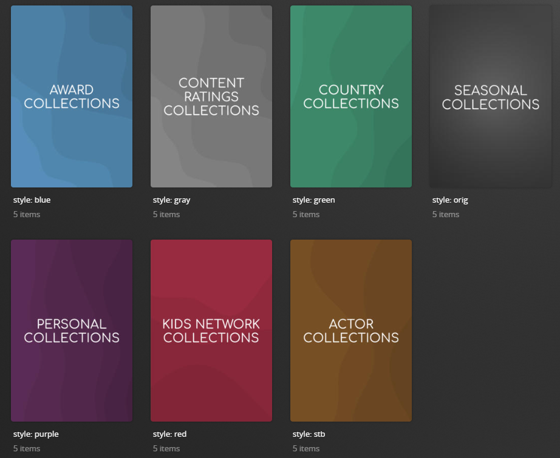

# Separators Default Metadata File

Separators are a special form of collections which are used similar to index cards in a library, they help to "split up" collections by identifying categories (such as "Studio Collections" and "Holiday Collections").

These are empty collections which do not contain any movies/shows themselves, but highlight that the the collections which follow it are of a certain category.

Below is an example of a separator, which can be seen surrounded by a red square.


Separators are enabled by default, but can be disabled/enabled per-file and per-library.

An example of disabling separators at the library-level cam be seen here

```yaml
libraries:
  Movies:
    template_variables:
      use_separator: false
```

And at the file-level

```yaml
libraries:
  Movies:
    metadata_path:
      - pmm: studio
        template_variables:
          use_separator: false
```

## Alternative Styles

Multiple styles are available for Separators, to match Plex's "categories" feature.

The available styles avaiable are:

| Style           | Value  |
|:----------------|:------:|
| Original        |  orig  |
| Blue            |  blue  |
| Brown           |  stb   |
| Gray            |  gray  |
| Green           | green  |
| Purple          | purple |
| Red             |  red   |

This image shows an example separator in each of the above styles



The style of separator can be defined per-file and per-library.

An example of disabling separators at the library-level cam be seen here

```yaml
libraries:
  Movies:
    template_variables:
      sep_style: red
```

And at the file-level

```yaml
libraries:
  Movies:
    metadata_path:
      - pmm: studio
        template_variables:
          sep_style: stb
```


