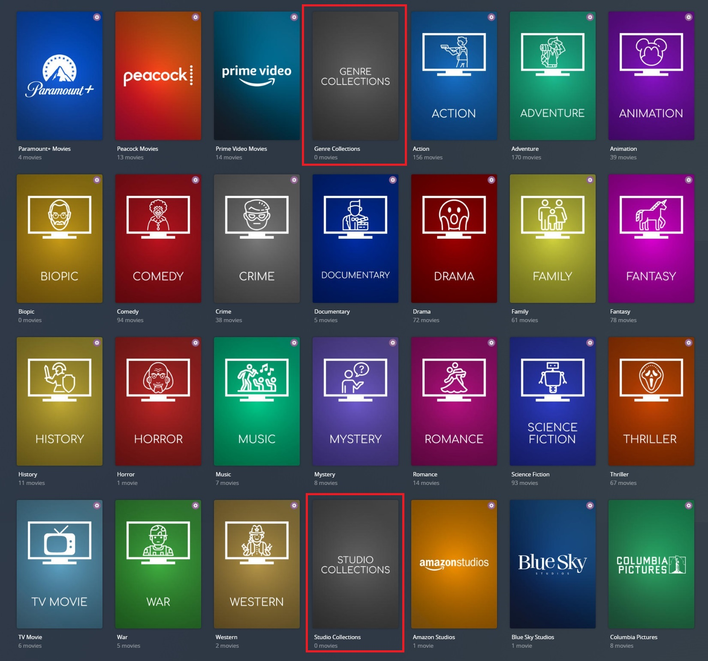
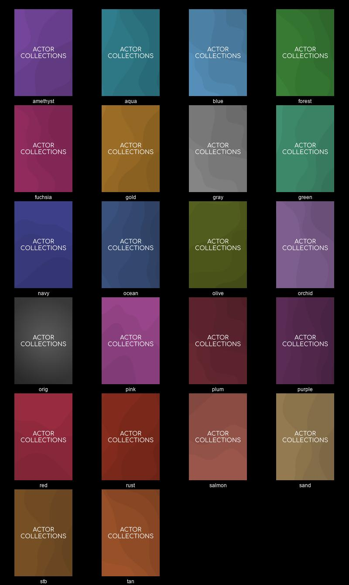

---
hide:
  - toc
---
# Separators Default Collection Files

Separators are a special form of collections which are used similar to index cards in a library, they help to "split up" collections by identifying categories 
(such as "Studio Collections" and "Holiday Collections").

These are empty collections which do not contain any movies/shows themselves, but highlight that the collections which follow it are of a certain category.

Below is an example of a separator, which can be seen surrounded by a red square.



## Important Note:

Plex does not support creating these empty collections natively through its UI, so they can behave strangely in some cases, primarily related to showing/hiding them in 
the main library view. As a workaround, you can use a `placeholder_` [Template Variable](#shared-separator-variables) to specify a single movie/show to add to these collections 
so they have one thing in them and will then behave as expected. For example, `placeholder_imdb_id: tt0068646` will place The Godfather inside the separator in a movie library.

## Separator Files

These are all the files that contain a separator 

| Collection Name               | Default File        |
|-------------------------------|:--------------------|
| Actors Collections            | `actor`             |
| Audio Language Collections    | `audio_language`    |
| Award Collections             | `separator_award`   |
| Based On... Collections       | `based`             |
| Chart Collections             | `separator_chart`   |
| Country Collections           | `country`           |
| Decade Collections            | `decade`            |
| Directors Collections         | `director`          |
| Genre Collections             | `genre`             |
| Network Collections           | `network`           |
| Producers Collections         | `producer`          |
| Ratings Collections           | `content_rating*`   |
| Resolution Collections        | `resolution*`       |
| Seasonal Collections          | `seasonal`          |
| Streaming Collections         | `streaming`         |
| Studio Collections            | `studio`            |
| Subtitle Language Collections | `subtitle_language` |
| Universe Collections          | `universe`          |
| Writers Collections           | `writer`            |
| Year Collections              | `year`              |

## Shared Separator Variables

Template Variables can be used to manipulate the file in various ways to slightly change how it works without having to make your own local copy.

Note that the `template_variables:` section only needs to be used if you do want to actually change how the Defaults work. 
Any value not specified is its default value if it has one if not it's just ignored.

**[Shared Variables](shared.md) are NOT available to separator collections in any Defaults File.**



## Use Separators

Separators are enabled by default, but can be disabled/enabled per-file and per-library.

An example of disabling separators at the library-level can be seen here

```yaml
libraries:
  Movies:
    template_variables:
      use_separator: false
```

And at the file-level

```yaml
libraries:
  Movies:
    collection_files:
      - default: studio
        template_variables:
          use_separator: false
```

## Separator Styles

Multiple styles are available for Separators, to match Plex's "categories" feature.

The available styles available are:

| Style    | Value      |
|:---------|:-----------|
| Amethyst | `amethyst` |
| Aqua     | `aqua`     |
| Blue     | `blue`     |
| Brown    | `stb`      |
| Forest   | `forest`   |
| Fuchsia  | `fuchsia`  |
| Gold     | `gold`     |
| Gray     | `gray`     |
| Green    | `green`    |
| Navy     | `navy`     |
| Ocean    | `ocean`    |
| Olive    | `olive`    |
| Orchid   | `orchid`   |
| Original | `orig`     |
| Pink     | `pink`     |
| Plum     | `plum`     |
| Purple   | `purple`   |
| Red      | `red`      |
| Rust     | `rust`     |
| Salmon   | `salmon`   |
| Sand     | `sand`     |
| Tan      | `tan`      |

This image shows an example separator in each of the above styles



An example of changing the separator style at the library-level can be seen here

```yaml
libraries:
  Movies:
    template_variables:
      sep_style: red
```

And at the file-level

```yaml
libraries:
  Movies:
    collection_files:
      - default: studio
        template_variables:
          sep_style: stb
```
