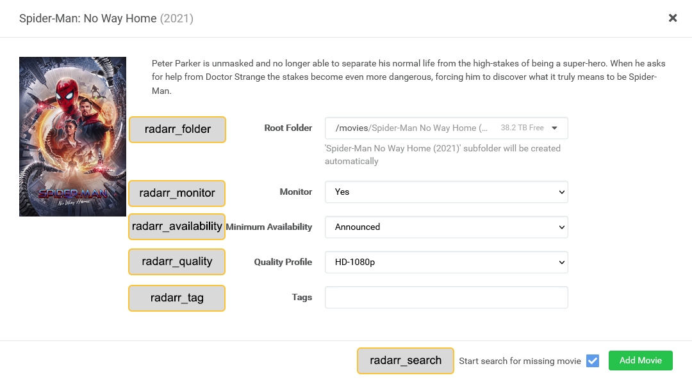
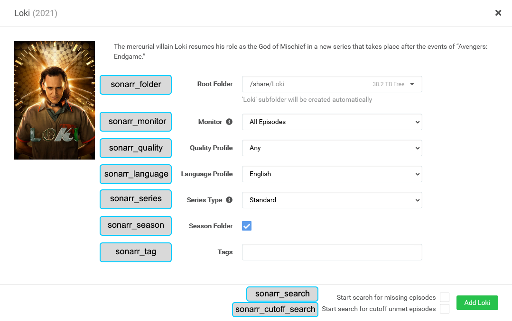

---
hide:
  - tags
  - toc
tags:
  - radarr_add_missing
  - radarr_add_existing
  - radarr_upgrade_existing
  - radarr_monitor_existing
  - radarr_ignore_cache
  - radarr_folder
  - radarr_monitor
  - radarr_availability
  - radarr_quality
  - radarr_tag
  - radarr_search
  - item_radarr_tag
  - item_radarr_tag.remove
  - item_radarr_tag.sync
  - sonarr_add_missing
  - sonarr_add_existing
  - sonarr_upgrade_existing
  - sonarr_monitor_existing
  - sonarr_ignore_cache
  - sonarr_folder
  - sonarr_monitor
  - sonarr_quality
  - sonarr_language
  - sonarr_series
  - sonarr_season
  - sonarr_tag
  - sonarr_search
  - sonarr_cutoff_search
  - item_sonarr_tag
  - item_sonarr_tag.remove
  - item_sonarr_tag.sync
---
# Radarr/Sonarr Definition Settings

## Radarr Definition Settings

All the following attributes can override the global/library [Radarr](../config/radarr.md) attributes which are the default unless otherwise specified.

| Attribute                 | Description & Values                                                                                                                                                                |
|:--------------------------|:------------------------------------------------------------------------------------------------------------------------------------------------------------------------------------|
| `radarr_add_missing`      | **Description:** Override Radarr `add_missing` attribute **Values:** `true` or `false`                                                                                           |
| `radarr_add_existing`     | **Description:** Override Radarr `add_existing` attribute **Values:** `true` or `false`                                                                                          |
| `radarr_upgrade_existing` | **Description:** Override Radarr `upgrade_existing` attribute **Values:** `true` or `false`                                                                                      |
| `radarr_monitor_existing` | **Description:** Override Radarr `monitor_existing` attribute **Values:** `true` or `false`                                                                                      |
| `radarr_ignore_cache`     | **Description:** Override Radarr `ignore_cache` attribute **Values:** `true` or `false`                                                                                          |
| `radarr_folder`           | **Description:** Override Radarr `root_folder_path` attribute **Values:** Folder Path                                                                                            |
| `radarr_monitor`          | **Description:** Override Radarr `monitor` attribute **Values:** `movie`, `collection`, or `none`                                                                                |
| `radarr_availability`     | **Description:** Override Radarr `availability` attribute **Values:** `announced`, `cinemas`, `released`, `db`                                                                   |
| `radarr_quality`          | **Description:** Override Radarr `quality_profile` attribute **Values:** Radarr Quality Profile                                                                                  |
| `radarr_tag`              | **Description:** Override Radarr `tag` attribute **Values:** List (1) or comma-separated string of tags                                                                          |
| `radarr_search`           | **Description:** Override Radarr `search` attribute **Values:** `true` or `false`                                                                                                |
| `item_radarr_tag`         | **Description:** Used to append a tag in Radarr for every movie found by the builders that's in Radarr **Values:** List (2) or comma-separated string of tags                    |
| `item_radarr_tag.remove`  | **Description:** Used to remove existing tags in Radarr for every movie found by the builders that's in Radarr **Values:** List (3)or comma-separated string of tags             |
| `item_radarr_tag.sync`    | **Description:** Matches the tags in Radarr for every movie found by the builders that's in Radarr with the provided tags **Values:** List (4) or comma-separated string of tags |



## Sonarr Definition Settings

All the following attributes can override the global/library [Sonarr](../config/sonarr.md) attributes which are the default unless otherwise specified.

| Attribute                 | Description & Values                                                                                                                                                                 |
|:--------------------------|:-------------------------------------------------------------------------------------------------------------------------------------------------------------------------------------|
| `sonarr_add_missing`      | **Description:** Override Sonarr `add_missing` attribute **Values:** `true` or `false`                                                                                            |
| `sonarr_add_existing`     | **Description:** Override Sonarr `add_existing` attribute **Values:** `true` or `false`                                                                                           |
| `sonarr_upgrade_existing` | **Description:** Override Sonarr `upgrade_existing` attribute **Values:** `true` or `false`                                                                                       |
| `sonarr_monitor_existing` | **Description:** Override Sonarr `monitor_existing` attribute **Values:** `true` or `false`                                                                                       |
| `sonarr_ignore_cache`     | **Description:** Override Sonarr `ignore_cache` attribute **Values:** `true` or `false`                                                                                           |
| `sonarr_folder`           | **Description:** Override Sonarr `root_folder_path` attribute **Values:** Folder Path                                                                                             |
| `sonarr_monitor`          | **Description:** Override Sonarr `monitor` attribute **Values:** `all`, `future`, `missing`, `existing`, `pilot`, `first`, `latest`, `none`                                       |
| `sonarr_quality`          | **Description:** Override Sonarr `quality_profile` attribute **Values:** Sonarr Quality Profile                                                                                   |
| `sonarr_language`         | **Description:** Override Sonarr `language_profile` attribute **Values:** Sonarr Language Profile                                                                                 |
| `sonarr_series`           | **Description:** Override Sonarr `series_type` attribute **Values:** `standard`, `daily`, `anime`                                                                                 |
| `sonarr_season`           | **Description:** Override Sonarr `season_folder` attribute **Values:** `true` or `false`                                                                                          |
| `sonarr_tag`              | **Description:** Override Sonarr `tag` attribute **Values:** List (1) or comma-separated string of tags                                                                           |
| `sonarr_search`           | **Description:** Override Sonarr `search` attribute **Values:** `true` or `false`                                                                                                 |
| `sonarr_cutoff_search`    | **Description:** Override Sonarr `cutoff_search` attribute **Values:** `true` or `false`                                                                                          |
| `item_sonarr_tag`         | **Description:** Used to append a tag in Sonarr for every series found by the builders that's in Sonarr **Values:** List (2) or comma-separated string of tags                    |
| `item_sonarr_tag.remove`  | **Description:** Used to remove existing tags in Sonarr for every series found by the builders that's in Sonarr **Values:** List (3) or comma-separated string of tags            |
| `item_sonarr_tag.sync`    | **Description:** Matches the tags in Sonarr for every series found by the builders that's in Sonarr with the provided tags **Values:** List (4) or comma-separated string of tags |



## Adding to Arr
You can add items to Radarr/Sonarr in two different ways.
  1. Items found by Kometa that are missing from your collections/playlists.
  2. Items found by Kometa that already exist in Plex but are not in Radarr/Sonarr.

### Arr Add Missing

When `radarr_add_missing`/`sonarr_add_missing` are true the items missing from the collection/playlist will be added to Radarr/Sonarr.

### Arr Add Existing

When `radarr_add_existing`/`sonarr_add_existing` are true the items that exist in the collection/playlist will be added to Radarr/Sonarr. 

If your Radarr/Sonarr has different file system mappings from your Plex use `radarr_path`/`sonarr_path` along with `plex_path` from your 
[Radarr](../config/radarr.md)/[Sonarr](../config/sonarr.md)global config settings.

### Radarr Add Settings

When adding a movie in Radarr you get the screen below to set these options use `radarr_folder`, `radarr_monitor`,`radarr_availability`, `radarr_quality`, `radarr_tag`, and `radarr_search`.

### Sonarr Add Settings

When adding a show in Sonarr you get the screen below to set these options use `sonarr_folder`, `sonarr_monitor`, `sonarr_quality`, `sonarr_language`, `sonarr_series`, 
`sonarr_season`, `sonarr_tag`, `sonarr_search`, and `sonarr_cutoff_search`.

## Arr Edit Settings

When editing the details of items that exist in the collection/playlist and in Radarr/Sonarr use `item_radarr_tag` and `item_sonarr_tag`

