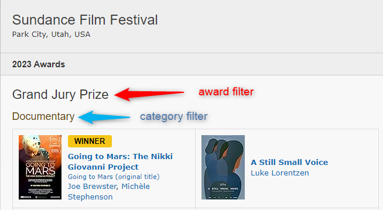

# IMDb Builders

You can find items using the features of [IMDb.com](https://www.imdb.com/) (IMDb).

| Attribute                           | Description                                                                                                           |             Works with Movies              |              Works with Shows              |                 Works with Playlists and Custom Sort                  |
|:------------------------------------|:----------------------------------------------------------------------------------------------------------------------|:------------------------------------------:|:------------------------------------------:|:---------------------------------------------------------------------:|
| [`imdb_id`](#imdb-id)               | Gets the movie/show specified.                                                                                        | :fontawesome-solid-circle-check:{ .green } | :fontawesome-solid-circle-check:{ .green } |               :fontawesome-solid-circle-xmark:{ .red }                |
| [`imdb_chart`](#imdb-chart)         | Gets every movie/show in an IMDb Chart like [IMDb Top 250 Movies](https://www.imdb.com/chart/top).                    | :fontawesome-solid-circle-check:{ .green } | :fontawesome-solid-circle-check:{ .green } |              :fontawesome-solid-circle-check:{ .green }               |
| [`imdb_list`](#imdb-list)           | Gets every movie/show in an IMDb List                                                                                 | :fontawesome-solid-circle-check:{ .green } | :fontawesome-solid-circle-check:{ .green } |              :fontawesome-solid-circle-check:{ .green }               |
| [`imdb_watchlist`](#imdb-watchlist) | Gets every movie/show in an IMDb User's Watchlist.                                                                    | :fontawesome-solid-circle-check:{ .green } | :fontawesome-solid-circle-check:{ .green } |              :fontawesome-solid-circle-check:{ .green }               |
| [`imdb_award`](#imdb-award)         | Gets every movie/show in an [IMDb Event](https://www.imdb.com/event/).                                                | :fontawesome-solid-circle-check:{ .green } | :fontawesome-solid-circle-check:{ .green } |               :fontawesome-solid-circle-xmark:{ .red }                |
| [`imdb_search`](#imdb-search)       | Gets every movie/show in an [IMDb Search](https://www.imdb.com/search/title/). Can also be used for Keyword searches. | :fontawesome-solid-circle-check:{ .green } | :fontawesome-solid-circle-check:{ .green } |              :fontawesome-solid-circle-check:{ .green }               |

## IMDb ID

Gets the movie/show specified.

The expected input is an IMDb ID. Multiple values are supported as either a list or a comma-separated string.

```yaml
collections:
  Star Wars (Animated Shows):
    imdb_id: tt0458290, tt2930604
```

## IMDb Chart

Finds every item in an IMDb Chart.

The expected input are the options below. Multiple values are supported as either a list or a comma-separated string.

The `sync_mode: sync` and `collection_order: custom` Setting are recommended since the lists are continuously updated and in a specific order.

| Name                                                                                 | Attribute         |             Works with Movies              |              Works with Shows              |
|:-------------------------------------------------------------------------------------|:------------------|:------------------------------------------:|:------------------------------------------:|
| [Box Office](https://www.imdb.com/chart/boxoffice)                                   | `box_office`      | :fontawesome-solid-circle-check:{ .green } |  :fontawesome-solid-circle-xmark:{ .red }  |
| [Most Popular Movies](https://www.imdb.com/chart/moviemeter)                         | `popular_movies`  | :fontawesome-solid-circle-check:{ .green } |  :fontawesome-solid-circle-xmark:{ .red }  |
| [Top 250 Movies](https://www.imdb.com/chart/top)                                     | `top_movies`      | :fontawesome-solid-circle-check:{ .green } |  :fontawesome-solid-circle-xmark:{ .red }  |
| [Top Rated English Movies](https://www.imdb.com/chart/top-english-movies)            | `top_english`     | :fontawesome-solid-circle-check:{ .green } |  :fontawesome-solid-circle-xmark:{ .red }  |
| [Most Popular TV Shows](https://www.imdb.com/chart/tvmeter)                          | `popular_shows`   |  :fontawesome-solid-circle-xmark:{ .red }  | :fontawesome-solid-circle-check:{ .green } |
| [Top 250 TV Shows](https://www.imdb.com/chart/toptv)                                 | `top_shows`       |  :fontawesome-solid-circle-xmark:{ .red }  | :fontawesome-solid-circle-check:{ .green } |
| [Lowest Rated Movies](https://www.imdb.com/chart/bottom)                             | `lowest_rated`    | :fontawesome-solid-circle-check:{ .green } |  :fontawesome-solid-circle-xmark:{ .red }  |
| [Top Rated Indian Movies](https://www.imdb.com/india/top-rated-indian-movies/)       | `top_indian`      | :fontawesome-solid-circle-check:{ .green } |  :fontawesome-solid-circle-xmark:{ .red }  |
| [Top Rated Tamil Movies](https://www.imdb.com/india/top-rated-tamil-movies/)         | `top_tamil`       | :fontawesome-solid-circle-check:{ .green } |  :fontawesome-solid-circle-xmark:{ .red }  |
| [Top Rated Telugu Movies](https://www.imdb.com/india/top-rated-telugu-movies/)       | `top_telugu`      | :fontawesome-solid-circle-check:{ .green } |  :fontawesome-solid-circle-xmark:{ .red }  |
| [Top Rated Malayalam Movies](https://www.imdb.com/india/top-rated-malayalam-movies/) | `top_malayalam`   | :fontawesome-solid-circle-check:{ .green } |  :fontawesome-solid-circle-xmark:{ .red }  |
| [Trending Indian Movies & Shows](https://www.imdb.com/india/upcoming/)               | `trending_india`  | :fontawesome-solid-circle-check:{ .green } | :fontawesome-solid-circle-check:{ .green } |
| [Trending Tamil Movies](https://www.imdb.com/india/tamil/)                           | `trending_tamil`  | :fontawesome-solid-circle-check:{ .green } |  :fontawesome-solid-circle-xmark:{ .red }  |
| [Trending Telugu Movies](https://www.imdb.com/india/telugu/)                         | `trending_telugu` | :fontawesome-solid-circle-check:{ .green } |  :fontawesome-solid-circle-xmark:{ .red }  |

```yaml
collections:
  IMDb Top 250:
    imdb_chart: top_movies
    collection_order: custom
    sync_mode: sync
```

## IMDb List

???+ danger "Important Notice"

    Due to recent changes in IMDb's code, `imdb_list` can no longer be used for any url which starts with 
    `https://www.imdb.com/search/` or `https://www.imdb.com/filmosearch/`.

    These must instead use the [IMDb Search Builder](#imdb-search)


Finds every item in an IMDb List.

| List Parameter | Description                                                                                                                                                                                                                                                                                                                                   |
|:---------------|:----------------------------------------------------------------------------------------------------------------------------------------------------------------------------------------------------------------------------------------------------------------------------------------------------------------------------------------------|
| `list_id`      | Specify the IMDb List ID. **This attribute is required.**<br>**Options:** The ID that starts with `ls` found in the URL of the list. (ex. `ls005526372`)                                                                                                                                                                                      |
| `limit`        | Specify how items you want returned by the query.<br>**Options:** Any Integer `0` or greater where `0` get all items.<br>**Default:** `0`                                                                                                                                                                                                     |
| `sort_by`      | Choose from one of the many available sort options.<br>**Options:** `custom.asc`, `custom.desc`, `title.asc`, `title.desc`, `rating.asc`, `rating.desc`, `popularity.asc`, `popularity.desc`, `votes.asc`, `votes.desc`, `release.asc`, `release.desc`, `runtime.asc`, `runtime.desc`, `added.asc`, `added.desc`<br>**Default:** `custom.asc` |

Multiple values are supported as a list only a comma-separated string will not work.

The `sync_mode: sync` and `collection_order: custom` Setting are recommended since the lists are continuously updated and in a specific order.

```yaml
collections:
  James Bonds:
    imdb_list: 
      list_id: ls006405458
      limit: 100
      sort_by: rating.asc
    collection_order: custom
    sync_mode: sync
```

You can search multiple lists in one collection by using a list.

```yaml
collections:
  Christmas:
    imdb_list:
      - list_id: ls025976544
        limit: 10
        sort_by: rating.asc
      - list_id: ls003863000
        limit: 10
        sort_by: rating.asc
      - list_id: ls027454200
        limit: 10
        sort_by: rating.asc
      - list_id: ls027886673
        limit: 10
        sort_by: rating.asc
      - list_id: ls097998599
        limit: 10
        sort_by: rating.asc
    sync_mode: sync
    collection_order: alpha
```

## IMDb Watchlist

Finds every item in an IMDb User's Watchlist.

The expected input is an IMDb User ID (example: `ur12345678`). Multiple values are supported as a list or as a comma-separated string.

The `sync_mode: sync` and `collection_order: custom` Setting are recommended since the lists are continuously updated and in a specific order.

```yaml
collections:
  My Watch Watchlist:
    imdb_watchlist: ur64054558
    collection_order: custom
    sync_mode: sync
```
```yaml
collections:
  My Friends Watchlists:
    imdb_watchlist: ur64054558, ur12345678
    collection_order: custom
    sync_mode: sync
```
```yaml
collections:
  My Friends Watchlists:
    imdb_watchlist: 
      - ur64054558
      - ur12345678
    collection_order: custom
    sync_mode: sync
```

## IMDb Award

Finds every item in an [IMDb Event](https://www.imdb.com/event/).

| Award Parameter           | Description                                                                                                                                                                                                                           |
|:--------------------------|:--------------------------------------------------------------------------------------------------------------------------------------------------------------------------------------------------------------------------------------|
| `event_id`                | Specify the IMDb Event ID to search. **This attribute is required.**<br>**Options:** The ID found in the URLs linked on the [IMDb Events Page](https://www.imdb.com/event/). (ex. `ev0000003`)                                        |
| `event_year`<sup>1</sup>  | Specify the year of the Event to look at. **This attribute is required.**<br>**Options:** Any year, list of years, or year range (ex. `2000-2009` or `2000-current`) from the years under the Event History Sidebar on an Event page. |
| `award_filter`            | Filter by the Award heading. Can only accept multiple values as a list.<br>**Options:** Any Black Award heading on an Event Page.                                                                                                     |
| `category_filter`         | Filter by the Category heading. Can only accept multiple values as a list.<br>**Options:** Any Gold/Yellow Category heading on an Event Page.                                                                                         |
| `winning`                 | Filter by if the Item Won the award.<br>**Options:** `true`/`false`<br>**Default:** `false`                                                                                                                                           |

??? example "Example Award and Category Filter"

    In the below example, "Grand Jury Prize" is the award_filter, and "Documentary" is the `category_filter`. You can use both of these filters together.

    

1. When using multiple years the only available Event IDs are:

```yaml

```

```yaml
collections:
  Academy Award Winners 2023:
    imdb_award: 
      event_id: ev0000003
      event_year: 2023
      winning: true
```
```yaml
collections:
  Academy Award 2023 Best Picture Nominees:
    imdb_award: 
      event_id: ev0000003
      event_year: 2023
      category_filter: Best Motion Picture of the Year
```

## IMDb Search

Finds every item using an [IMDb Advance Title Search](https://www.imdb.com/search/title/).

The `sync_mode: sync` and `collection_order: custom` Setting are recommended since the lists are continuously updated and in a specific order.

???+ tip

     We strongly recommend you use the [IMDb Search website](https://www.imdb.com/search/) to manually verify that the options you have selected are valid.

     You can also view the available keywords on the [IMDb Keyword Search page](https://www.imdb.com/search/keyword/).

| Search Parameter        | Description                                                                                                                                                                                                                                                                                                                                                                                       |
|:------------------------|:--------------------------------------------------------------------------------------------------------------------------------------------------------------------------------------------------------------------------------------------------------------------------------------------------------------------------------------------------------------------------------------------------|
| `limit`                 | Specify how items you want returned by the query.<br>**Options:** Any Integer `0` or greater where `0` get all items.<br>**Default:** `100`                                                                                                                                                                                                                                                       |
| `sort_by`               | Choose from one of the many available sort options.<br>**Options:** `popularity.asc`, `popularity.desc`, `title.asc`, `title.desc`, `rating.asc`, `rating.desc`, `votes.asc`, `votes.desc`, `box_office.asc`, `box_office.desc`, `runtime.asc`, `runtime.desc`, `year.asc`, `year.desc`, `release.asc`, `release.desc`<br>**Default:** `popularity.asc`                                           |
| `title`                 | Search by title name.<br>**Options:** Any String                                                                                                                                                                                                                                                                                                                                                  |
| `type`                  | Item must match at least one given type. Can be a comma-separated list.<br>**Options:** `movie`, `tv_series`, `short`, `tv_episode`, `tv_mini_series`, `tv_movie`, `tv_special`, `tv_short`, `video_game`, `video`, `music_video`, `podcast_series`, `podcast_episode`                                                                                                                            |
| `type.not`              | Item must not match any of the given types. Can be a comma-separated list.<br>**Options:** `movie`, `tv_series`, `short`, `tv_episode`, `tv_mini_series`, `tv_movie`, `tv_special`, `tv_short`, `video_game`, `video`, `music_video`, `podcast_series`, `podcast_episode`                                                                                                                         |
| `release.after`         | Item must have been released after the given date.<br>**Options:** `today` or Date in the format `YYYY-MM-DD`                                                                                                                                                                                                                                                                                     |
| `release.before`        | Item must have been released before the given date.<br>**Options:** `today` or Date in the format `YYYY-MM-DD`                                                                                                                                                                                                                                                                                    |
| `rating.gte`            | Item must have an IMDb Rating greater than or equal to the given number.<br>**Options:** Any Number `0.1` - `10.0`<br>**Example:** `7.5`                                                                                                                                                                                                                                                          |                                                                                                                                                                                                                                                                                
| `rating.lte`            | Item must have an IMDb Rating less than or equal to the given number.<br>**Options:** Any Number `0.1` - `10.0`<br>**Example:** `7.5`                                                                                                                                                                                                                                                             |                                                                                                                                                                                                                                                                                
| `votes.gte`             | Item must have a Number of Votes greater than or equal to the given number.<br>**Options:** Any Integer greater than `0`<br>**Example:** `1000`                                                                                                                                                                                                                                                   |
| `votes.lte`             | Item must have a Number of Votes less than or equal to the given number.<br>**Options:** Any Integer greater than `0`<br>**Example:** `1000`                                                                                                                                                                                                                                                      |
| `genre`                 | Item must match all genres given. Can be a comma-separated list.<br>**Options:** `action`, `adventure`, `animation`, `biography`, `comedy`, `documentary`, `drama`, `crime`, `family`, `history`, `news`, `short`, `western`, `sport`, `reality-tv`, `horror`, `fantasy`, `film-noir`, `music`, `romance`, `talk-show`, `thriller`, `war`, `sci-fi`, `musical`, `mystery`, `game-show`            |
| `genre.any`             | Item must match at least one given genre. Can be a comma-separated list.<br>**Options:** `action`, `adventure`, `animation`, `biography`, `comedy`, `documentary`, `drama`, `crime`, `family`, `history`, `news`, `short`, `western`, `sport`, `reality-tv`, `horror`, `fantasy`, `film-noir`, `music`, `romance`, `talk-show`, `thriller`, `war`, `sci-fi`, `musical`, `mystery`, `game-show`    |
| `genre.not`             | Item must not match any of the given genres. Can be a comma-separated list.<br>**Options:** `action`, `adventure`, `animation`, `biography`, `comedy`, `documentary`, `drama`, `crime`, `family`, `history`, `news`, `short`, `western`, `sport`, `reality-tv`, `horror`, `fantasy`, `film-noir`, `music`, `romance`, `talk-show`, `thriller`, `war`, `sci-fi`, `musical`, `mystery`, `game-show` |
| `event`                 | Item must have been nominated for a category at the event given. Can be a comma-separated list.<br>**Options:** `cannes`, `choice`, `spirit`, `sundance`, `bafta`, `oscar`, `emmy`, `golden`, `oscar_picture`, `oscar_director`, `national_film_board_preserved`, `razzie`, or any [IMDb Event ID](https://www.imdb.com/event/all/) (ex. `ev0050888`)                                             |
| `event.winning`         | Item must have won a category at the event given. Can be a comma-separated list.<br>**Options:** `cannes`, `choice`, `spirit`, `sundance`, `bafta`, `oscar`, `emmy`, `golden`, `oscar_picture`, `oscar_director`, `national_film_board_preserved`, `razzie`, or any [IMDb Event ID](https://www.imdb.com/event/all/) (ex. `ev0050888`)                                                            |
| `imdb_top`              | Item must be in the top number of given Movies.<br>**Options:** Any Integer greater than `0`                                                                                                                                                                                                                                                                                                      |
| `imdb_bottom`           | Item must be in the bottom number of given Movies.<br>**Options:** Any Integer greater than `0`                                                                                                                                                                                                                                                                                                   |
| `topic`                 | Item must match at least one given topic. Can be a comma-separated list.<br>**Options:** `alternate_version`, `award`, `business_info`, `crazy_credit`, `goof`, `location`, `plot`, `quote`, `soundtrack`, `technical`, `trivia`                                                                                                                                                                  |
| `topic.not`             | Item must not match any of the given topic. Can be a comma-separated list.<br>**Options:** `alternate_version`, `award`, `business_info`, `crazy_credit`, `goof`, `location`, `plot`, `quote`, `soundtrack`, `technical`, `trivia`                                                                                                                                                                |
| `alternate_version`     | Item's Alternate Version must contain all the given strings. Can be a comma-separated list.<br>**Options:** Any String                                                                                                                                                                                                                                                                            |
| `alternate_version.any` | Item's Alternate Version must contain at least one of the given strings. Can be a comma-separated list.<br>**Options:** Any String                                                                                                                                                                                                                                                                |
| `alternate_version.not` | Item's Alternate Version must not contain any of the given strings. Can be a comma-separated list.<br>**Options:** Any String                                                                                                                                                                                                                                                                     |
| `crazy_credit`          | Item's Crazy Credits must contain all the given strings. Can be a comma-separated list.<br>**Options:** Any String                                                                                                                                                                                                                                                                                |
| `crazy_credit.any`      | Item's Crazy Credits must contain at least one of the given strings. Can be a comma-separated list.<br>**Options:** Any String                                                                                                                                                                                                                                                                    |
| `crazy_credit.not`      | Item's Crazy Credits must not contain any of the given strings. Can be a comma-separated list.<br>**Options:** Any String                                                                                                                                                                                                                                                                         |
| `location`              | Item's Location must contain all the given strings. Can be a comma-separated list.<br>**Options:** Any String                                                                                                                                                                                                                                                                                     |
| `location.any`          | Item's Location must contain at least one of the given strings. Can be a comma-separated list.<br>**Options:** Any String                                                                                                                                                                                                                                                                         |
| `location.not`          | Item's Location must not contain any of the given strings. Can be a comma-separated list.<br>**Options:** Any String                                                                                                                                                                                                                                                                              |
| `goof`                  | Item's Goofs must contain all the given strings. Can be a comma-separated list.<br>**Options:** Any String                                                                                                                                                                                                                                                                                        |
| `goof.any`              | Item's Goofs must contain at least one of the given strings. Can be a comma-separated list.<br>**Options:** Any String                                                                                                                                                                                                                                                                            |
| `goof.not`              | Item's Goofs must not contain any of the given strings. Can be a comma-separated list.<br>**Options:** Any String                                                                                                                                                                                                                                                                                 |
| `plot`                  | Item's Plot must contain all the given strings. Can be a comma-separated list.<br>**Options:** Any String                                                                                                                                                                                                                                                                                         |
| `plot.any`              | Item's Plot must contain at least one of the given strings. Can be a comma-separated list.<br>**Options:** Any String                                                                                                                                                                                                                                                                             |
| `plot.not`              | Item's Plot must not contain any of the given strings. Can be a comma-separated list.<br>**Options:** Any String                                                                                                                                                                                                                                                                                  |
| `quote`                 | Item's Quote must contain all the given strings. Can be a comma-separated list.<br>**Options:** Any String                                                                                                                                                                                                                                                                                        |
| `quote.any`             | Item's Quote must contain at least one of the given strings. Can be a comma-separated list.<br>**Options:** Any String                                                                                                                                                                                                                                                                            |
| `quote.not`             | Item's Quote must not contain any of the given strings. Can be a comma-separated list.<br>**Options:** Any String                                                                                                                                                                                                                                                                                 |
| `soundtrack`            | Item's Soundtrack must contain all the given strings. Can be a comma-separated list.<br>**Options:** Any String                                                                                                                                                                                                                                                                                   |
| `soundtrack.any`        | Item's Soundtrack must contain at least one of the given strings. Can be a comma-separated list.<br>**Options:** Any String                                                                                                                                                                                                                                                                       |
| `soundtrack.not`        | Item's Soundtrack must not contain any of the given strings. Can be a comma-separated list.<br>**Options:** Any String                                                                                                                                                                                                                                                                            |
| `trivia`                | Item's Trivia must contain all the given strings. Can be a comma-separated list.<br>**Options:** Any String                                                                                                                                                                                                                                                                                       |
| `trivia.any`            | Item's Trivia must contain at least one of the given strings. Can be a comma-separated list.<br>**Options:** Any String                                                                                                                                                                                                                                                                           |
| `trivia.not`            | Item's Trivia must not contain any of the given strings. Can be a comma-separated list.<br>**Options:** Any String                                                                                                                                                                                                                                                                                |
| `company`               | Item must have been released by any company given. Can be a comma-separated list.<br>**Options:** `fox`, `dreamworks`, `mgm`, `paramount`, `sony`, `universal`, `disney`, `warner`, or any IMDb Company ID (ex. `co0023400`)                                                                                                                                                                      |
| `content_rating`        | Item must have the given content rating. Can be a list.<br>**Options:** Dictionary with two attributes `rating` and `region`<br>`rating`: Any String to match the content rating<br>`region`: [2 Digit ISO 3166 Country Code](https://en.wikipedia.org/wiki/List_of_ISO_3166_country_codes)                                                                                                       |
| `country`               | Item must match with every given country. Can be a comma-separated list.<br>**Options:** [2 Digit ISO 3166 Country Code](https://en.wikipedia.org/wiki/List_of_ISO_3166_country_codes)                                                                                                                                                                                                            |
| `country.any`           | Item must match at least one given country. Can be a comma-separated list.<br>**Options:** [2 Digit ISO 3166 Country Code](https://en.wikipedia.org/wiki/List_of_ISO_3166_country_codes)                                                                                                                                                                                                          |
| `country.not`           | Item must not match any given country. Can be a comma-separated list.<br>**Options:** [2 Digit ISO 3166 Country Code](https://en.wikipedia.org/wiki/List_of_ISO_3166_country_codes)                                                                                                                                                                                                               |
| `country.origin`        | Item must match any given country as the origin country. Can be a comma-separated list.<br>**Options:** [2 Digit ISO 3166 Country Code](https://en.wikipedia.org/wiki/List_of_ISO_3166_country_codes)                                                                                                                                                                                             |
| `keyword`               | Item must match with every given keyword. Can be a comma-separated list.<br>**Options:** Any Valid [IMDb Keyword](https://www.imdb.com/search/keyword/)                                                                                                                                                                                                                                           |
| `keyword.any`           | Item must match at least one given keyword. Can be a comma-separated list.<br>**Options:** Any Valid [IMDb Keyword](https://www.imdb.com/search/keyword/)                                                                                                                                                                                                                                         |
| `keyword.not`           | Item must not match any given keyword. Can be a comma-separated list.<br>**Options:** Any Valid [IMDb Keyword](https://www.imdb.com/search/keyword/)                                                                                                                                                                                                                                              |
| `series`                | Item must match at least one given series. Can be a comma-separated list.<br>**Options:** Any IMDb ID (ex. `tt0096697`)                                                                                                                                                                                                                                                                           |
| `series.not`            | Item must not match any given series. Can be a comma-separated list.<br>**Options:** Any IMDb ID (ex. `tt0096697`)                                                                                                                                                                                                                                                                                |
| `list`                  | Item must be on every given list. Can be a comma-separated list.<br>**Options:** Any IMDb List ID (ex. `ls000024621`)                                                                                                                                                                                                                                                                             |
| `list.any`              | Item must be on at least one given lists. Can be a comma-separated list.<br>**Options:** Any IMDb List ID (ex. `ls000024621`)                                                                                                                                                                                                                                                                     |
| `list.not`              | Item must not be on any given lists. Can be a comma-separated list.<br>**Options:** Any IMDb List ID (ex. `ls000024621`)                                                                                                                                                                                                                                                                          |
| `language`              | Item must match any given language. Can be a comma-separated list.<br>**Options:** [ISO 639-2 Language Codes](https://en.wikipedia.org/wiki/List_of_ISO_639-2_codes)                                                                                                                                                                                                                              |
| `language.any`          | Item must match at least one given language. Can be a comma-separated list.<br>**Options:** [ISO 639-2 Language Codes](https://en.wikipedia.org/wiki/List_of_ISO_639-2_codes)                                                                                                                                                                                                                     |
| `language.not`          | Item must not match any given language. Can be a comma-separated list.<br>**Options:** [ISO 639-2 Language Codes](https://en.wikipedia.org/wiki/List_of_ISO_639-2_codes)                                                                                                                                                                                                                          |
| `language.primary`      | Item must match any given language as the primary language. Can be a comma-separated list.<br>**Options:** [ISO 639-2 Language Codes](https://en.wikipedia.org/wiki/List_of_ISO_639-2_codes)                                                                                                                                                                                                      |
| `popularity.gte`        | Item must have a Popularity greater than or equal to the given number.<br>**Options:** Any Integer greater than `0`<br>**Example:** `1000`                                                                                                                                                                                                                                                        |
| `popularity.lte`        | Item must have a Popularity less than or equal to the given number.<br>**Options:** Any Integer greater than `0`<br>**Example:** `1000`                                                                                                                                                                                                                                                           |
| `cast`                  | Item must have all the given cast members. Can be a comma-separated list.<br>**Options:** Any IMDb Person ID (ex. `nm0000138`)                                                                                                                                                                                                                                                                    |  
| `cast.any`              | Item must have any of the given cast members. Can be a comma-separated list.<br>**Options:** Any IMDb Person ID (ex. `nm0000138`)                                                                                                                                                                                                                                                                 |  
| `cast.not`              | Item must not have any of the given cast members. Can be a comma-separated list.<br>**Options:** Any IMDb Person ID (ex. `nm0000138`)                                                                                                                                                                                                                                                             |  
| `runtime.gte`           | Item must have a Runtime greater than or equal to the given number.<br>**Options:** Any Integer greater than `0`<br>**Example:** `1000`                                                                                                                                                                                                                                                           |
| `runtime.lte`           | Item must have a Runtime less than or equal to the given number.<br>**Options:** Any Integer greater than `0`<br>**Example:** `1000`                                                                                                                                                                                                                                                              |
| `adult`                 | Include adult titles in the search results.<br>**Options:** `true`/`false`                                                                                                                                                                                                                                                                                                                        |

### Examples

```yaml
collections:
  IMDb Popular:
    imdb_search:
      type: movie
      sort_by: popularity.asc
      limit: 50
    collection_order: custom
    sync_mode: sync
```

```yaml
collections:
  Top Action:
    imdb_search:
      type: movie
      release.after: 1990-01-01
      rating.gte: 5
      votes.gte: 100000
      genre: action
      sort_by: rating.desc
      limit: 100
```

You can also find episodes using `imdb_search` like so.

```yaml
collections:
  The Simpsons Top 100 Episodes:
    collection_order: custom
    builder_level: episode
    sync_mode: sync
    imdb_search:
      type: tv_episode
      series: tt0096697
      sort_by: rating.desc
      limit: 100
    summary: The top 100 Simpsons episodes by IMDb user rating
```