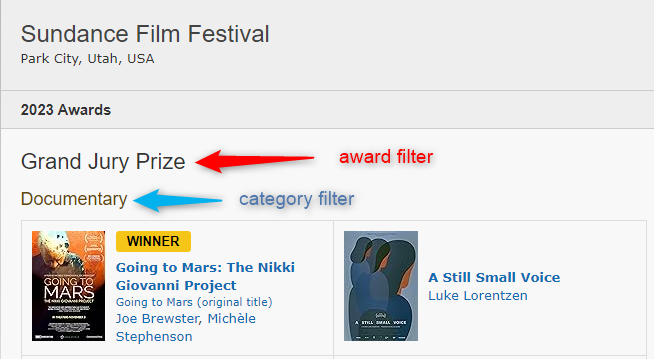

---
hide:
  - toc
---
# IMDb Builders

You can find items using the features of [IMDb.com](https://www.imdb.com/) (IMDb).

| Builder                             | Description                                                                                                           |             Works with Movies              |              Works with Shows              |    Works with Playlists and Custom Sort    |
|:------------------------------------|:----------------------------------------------------------------------------------------------------------------------|:------------------------------------------:|:------------------------------------------:|:------------------------------------------:|
| [`imdb_id`](#imdb-id)               | Gets the movie/show specified.                                                                                        | :fontawesome-solid-circle-check:{ .green } | :fontawesome-solid-circle-check:{ .green } |  :fontawesome-solid-circle-xmark:{ .red }  |
| [`imdb_chart`](#imdb-chart)         | Gets every movie/show in an IMDb Chart like [IMDb Top 250 Movies](https://www.imdb.com/chart/top).                    | :fontawesome-solid-circle-check:{ .green } | :fontawesome-solid-circle-check:{ .green } | :fontawesome-solid-circle-check:{ .green } |
| [`imdb_search`](#imdb-search)       | Gets every movie/show in an [IMDb Search](https://www.imdb.com/search/title/). Can also be used for Keyword searches. | :fontawesome-solid-circle-check:{ .green } | :fontawesome-solid-circle-check:{ .green } | :fontawesome-solid-circle-check:{ .green } |
| [`imdb_list`](#imdb-list)           | Gets every movie/show in an IMDb List                                                                                 | :fontawesome-solid-circle-check:{ .green } | :fontawesome-solid-circle-check:{ .green } | :fontawesome-solid-circle-check:{ .green } |
| [`imdb_watchlist`](#imdb-watchlist) | Gets every movie/show in an IMDb User's Watchlist.                                                                    | :fontawesome-solid-circle-check:{ .green } | :fontawesome-solid-circle-check:{ .green } | :fontawesome-solid-circle-check:{ .green } |
| [`imdb_award`](#imdb-award)         | Gets every movie/show in an [IMDb Event](https://www.imdb.com/event/).                                                | :fontawesome-solid-circle-check:{ .green } | :fontawesome-solid-circle-check:{ .green } |  :fontawesome-solid-circle-xmark:{ .red }  |


=== "IMDb ID"
    
    Gets the movie/show specified.
    
    The expected input is an IMDb ID. Multiple values are supported as either a list or a comma-separated string.

    ### Example IMDb ID Builder(s)

    ```yaml
    collections:
      Star Wars (Animated Shows):
        imdb_id: tt0458290, tt2930604
    ```

=== "IMDb Chart"
    
    Finds every item in an IMDb Chart.
    
    The expected input are the options below. Multiple values are supported as either a list or a comma-separated string.
    
    The `sync_mode: sync` and `collection_order: custom` Setting are recommended since the lists are continuously updated and in a specific order.
    
    | Name                                                                                 | Attribute         |             Works with Movies              |              Works with Shows              |
    |:-------------------------------------------------------------------------------------|:------------------|:------------------------------------------:|:------------------------------------------:|
    | [Box Office](https://www.imdb.com/chart/boxoffice)                                   | `box_office`      | :fontawesome-solid-circle-check:{ .green } |  :fontawesome-solid-circle-xmark:{ .red }  |
    | [Most Popular Movies](https://www.imdb.com/chart/moviemeter)                         | `popular_movies`  | :fontawesome-solid-circle-check:{ .green } |  :fontawesome-solid-circle-xmark:{ .red }  |
    | [Top 250 Movies](https://www.imdb.com/chart/top)                                     | `top_movies`      | :fontawesome-solid-circle-check:{ .green } |  :fontawesome-solid-circle-xmark:{ .red }  |
    | [Top Rated English Movies](https://www.imdb.com/chart/top-english-movies)            | `top_english`     | :fontawesome-solid-circle-check:{ .green } |  :fontawesome-solid-circle-xmark:{ .red }  |
    | [Most Popular TV Shows](https://www.imdb.com/chart/tvmeter)                          | `popular_shows`   |  :fontawesome-solid-circle-xmark:{ .red }  | :fontawesome-solid-circle-check:{ .green } |
    | [Top 250 TV Shows](https://www.imdb.com/chart/toptv)                                 | `top_shows`       |  :fontawesome-solid-circle-xmark:{ .red }  | :fontawesome-solid-circle-check:{ .green } |
    | [Lowest Rated Movies](https://www.imdb.com/chart/bottom)                             | `lowest_rated`    | :fontawesome-solid-circle-check:{ .green } |  :fontawesome-solid-circle-xmark:{ .red }  |
    | [Top Rated Indian Movies](https://www.imdb.com/india/top-rated-indian-movies/)       | `top_indian`      | :fontawesome-solid-circle-check:{ .green } |  :fontawesome-solid-circle-xmark:{ .red }  |
    | [Top Rated Tamil Movies](https://www.imdb.com/india/top-rated-tamil-movies/)         | `top_tamil`       | :fontawesome-solid-circle-check:{ .green } |  :fontawesome-solid-circle-xmark:{ .red }  |
    | [Top Rated Telugu Movies](https://www.imdb.com/india/top-rated-telugu-movies/)       | `top_telugu`      | :fontawesome-solid-circle-check:{ .green } |  :fontawesome-solid-circle-xmark:{ .red }  |
    | [Top Rated Malayalam Movies](https://www.imdb.com/india/top-rated-malayalam-movies/) | `top_malayalam`   | :fontawesome-solid-circle-check:{ .green } |  :fontawesome-solid-circle-xmark:{ .red }  |
    | [Trending Indian Movies & Shows](https://www.imdb.com/india/upcoming/)               | `trending_india`  | :fontawesome-solid-circle-check:{ .green } | :fontawesome-solid-circle-check:{ .green } |
    | [Trending Tamil Movies](https://www.imdb.com/india/tamil/)                           | `trending_tamil`  | :fontawesome-solid-circle-check:{ .green } |  :fontawesome-solid-circle-xmark:{ .red }  |
    | [Trending Telugu Movies](https://www.imdb.com/india/telugu/)                         | `trending_telugu` | :fontawesome-solid-circle-check:{ .green } |  :fontawesome-solid-circle-xmark:{ .red }  |

    ### Example IMDb Chart Builder(s)

    ```yaml
    collections:
      IMDb Top 250:
        imdb_chart: top_movies
        collection_order: custom
        sync_mode: sync
    ```


=== "IMDb Search"
    
    Finds every item using an [IMDb Advance Title Search](https://www.imdb.com/search/title/).
    
    The `sync_mode: sync` and `collection_order: custom` Setting are recommended since the lists are continuously updated and in a specific order.
    
    ???+ warning
    
         We strongly recommend you use the [IMDb Search website](https://www.imdb.com/search/) to manually verify that the options you have selected are valid.
    
         You can also view the available keywords on the [IMDb Keyword Search page](https://www.imdb.com/search/keyword/).
    
    | Search Parameter        | Description                                                                                                                                                                                                                                                                                                                                                                                       |
    |:------------------------|:--------------------------------------------------------------------------------------------------------------------------------------------------------------------------------------------------------------------------------------------------------------------------------------------------------------------------------------------------------------------------------------------------|
    | `limit`                 | Specify how items you want returned by the query.<br>**Options:** Any Integer `0` or greater where `0` get all items.<br>**Default:** `100`                                                                                                                                                                                                                                                       |
    | `sort_by`               | Choose from one of the many available sort options.<br>**Options:** `popularity.asc`, `popularity.desc`, `title.asc`, `title.desc`, `rating.asc`, `rating.desc`, `votes.asc`, `votes.desc`, `box_office.asc`, `box_office.desc`, `runtime.asc`, `runtime.desc`, `year.asc`, `year.desc`, `release.asc`, `release.desc`<br>**Default:** `popularity.asc`                                           |
    | `title`                 | Search by title name.<br>**Options:** Any String                                                                                                                                                                                                                                                                                                                                                  |
    | `type`                  | Item must match at least one given type. Can be a comma-separated list.<br>**Options:** `movie`, `tv_series`, `short`, `tv_episode`, `tv_mini_series`, `tv_movie`, `tv_special`, `tv_short`, `video_game`, `video`, `music_video`, `podcast_series`, `podcast_episode`                                                                                                                            |
    | `type.not`              | Item must not match any of the given types. Can be a comma-separated list.<br>**Options:** `movie`, `tv_series`, `short`, `tv_episode`, `tv_mini_series`, `tv_movie`, `tv_special`, `tv_short`, `video_game`, `video`, `music_video`, `podcast_series`, `podcast_episode`                                                                                                                         |
    | `release.after`         | Item must have been released after the given date.<br>**Options:** `today` or Date in the format `YYYY-MM-DD`                                                                                                                                                                                                                                                                                     |
    | `release.before`        | Item must have been released before the given date.<br>**Options:** `today` or Date in the format `YYYY-MM-DD`                                                                                                                                                                                                                                                                                    |
    | `rating.gte`            | Item must have an IMDb Rating greater than or equal to the given number.<br>**Options:** Any Number `0.1` - `10.0`<br>**Example:** `7.5`                                                                                                                                                                                                                                                          |                                                                                                                                                                                                                                                                                
    | `rating.lte`            | Item must have an IMDb Rating less than or equal to the given number.<br>**Options:** Any Number `0.1` - `10.0`<br>**Example:** `7.5`                                                                                                                                                                                                                                                             |                                                                                                                                                                                                                                                                                
    | `votes.gte`             | Item must have a Number of Votes greater than or equal to the given number.<br>**Options:** Any Integer greater than `0`<br>**Example:** `1000`                                                                                                                                                                                                                                                   |
    | `votes.lte`             | Item must have a Number of Votes less than or equal to the given number.<br>**Options:** Any Integer greater than `0`<br>**Example:** `1000`                                                                                                                                                                                                                                                      |
    | `genre`                 | Item must match all genres given. Can be a comma-separated list.<br>**Options:** `action`, `adventure`, `animation`, `biography`, `comedy`, `documentary`, `drama`, `crime`, `family`, `history`, `news`, `short`, `western`, `sport`, `reality-tv`, `horror`, `fantasy`, `film-noir`, `music`, `romance`, `talk-show`, `thriller`, `war`, `sci-fi`, `musical`, `mystery`, `game-show`            |
    | `genre.any`             | Item must match at least one given genre. Can be a comma-separated list.<br>**Options:** `action`, `adventure`, `animation`, `biography`, `comedy`, `documentary`, `drama`, `crime`, `family`, `history`, `news`, `short`, `western`, `sport`, `reality-tv`, `horror`, `fantasy`, `film-noir`, `music`, `romance`, `talk-show`, `thriller`, `war`, `sci-fi`, `musical`, `mystery`, `game-show`    |
    | `genre.not`             | Item must not match any of the given genres. Can be a comma-separated list.<br>**Options:** `action`, `adventure`, `animation`, `biography`, `comedy`, `documentary`, `drama`, `crime`, `family`, `history`, `news`, `short`, `western`, `sport`, `reality-tv`, `horror`, `fantasy`, `film-noir`, `music`, `romance`, `talk-show`, `thriller`, `war`, `sci-fi`, `musical`, `mystery`, `game-show` |
    | `interests`             | Item must match all interests given. Can be a comma-separated list.<br>**Options:** see below Interests Options table                                                                                                                                                                                                                                                                             |
    | `interests.any`         | Item must match at least one given interest. Can be a comma-separated list.<br>**Options:** see below Interests Options table                                                                                                                                                                                                                                                                     |
    | `interests.not`         | Item must not match any of the given interests. Can be a comma-separated list.<br>**Options:** see below Interests Options table                                                                                                                                                                                                                                                                  |
    | `event`                 | Item must have been nominated for a category at the event given. Can be a comma-separated list.<br>**Options:** `cannes`, `choice`, `spirit`, `sundance`, `bafta`, `oscar`, `emmy`, `golden`, `oscar_picture`, `oscar_director`, `national_film_board_preserved`, `razzie`, or any [IMDb Event ID](https://www.imdb.com/event/all/) (ex. `ev0050888`)                                             |
    | `event.winning`         | Item must have won a category at the event given. Can be a comma-separated list.<br>**Options:** `cannes`, `choice`, `spirit`, `sundance`, `bafta`, `oscar`, `emmy`, `golden`, `oscar_picture`, `oscar_director`, `national_film_board_preserved`, `razzie`, or any [IMDb Event ID](https://www.imdb.com/event/all/) (ex. `ev0050888`)                                                            |
    | `imdb_top`              | Item must be in the top number of given Movies.<br>**Options:** Any Integer greater than `0`                                                                                                                                                                                                                                                                                                      |
    | `imdb_bottom`           | Item must be in the bottom number of given Movies.<br>**Options:** Any Integer greater than `0`                                                                                                                                                                                                                                                                                                   |
    | `topic`                 | Item must match at least one given topic. Can be a comma-separated list.<br>**Options:** `alternate_version`, `award`, `business_info`, `crazy_credit`, `goof`, `location`, `plot`, `quote`, `soundtrack`, `technical`, `trivia`                                                                                                                                                                  |
    | `topic.not`             | Item must not match any of the given topic. Can be a comma-separated list.<br>**Options:** `alternate_version`, `award`, `business_info`, `crazy_credit`, `goof`, `location`, `plot`, `quote`, `soundtrack`, `technical`, `trivia`                                                                                                                                                                |
    | `alternate_version`     | Item's Alternate Version must contain all the given strings. Can be a comma-separated list.<br>**Options:** Any String                                                                                                                                                                                                                                                                            |
    | `alternate_version.any` | Item's Alternate Version must contain at least one of the given strings. Can be a comma-separated list.<br>**Options:** Any String                                                                                                                                                                                                                                                                |
    | `alternate_version.not` | Item's Alternate Version must not contain any of the given strings. Can be a comma-separated list.<br>**Options:** Any String                                                                                                                                                                                                                                                                     |
    | `crazy_credit`          | Item's Crazy Credits must contain all the given strings. Can be a comma-separated list.<br>**Options:** Any String                                                                                                                                                                                                                                                                                |
    | `crazy_credit.any`      | Item's Crazy Credits must contain at least one of the given strings. Can be a comma-separated list.<br>**Options:** Any String                                                                                                                                                                                                                                                                    |
    | `crazy_credit.not`      | Item's Crazy Credits must not contain any of the given strings. Can be a comma-separated list.<br>**Options:** Any String                                                                                                                                                                                                                                                                         |
    | `location`              | Item's Location must contain all the given strings. Can be a comma-separated list.<br>**Options:** Any String                                                                                                                                                                                                                                                                                     |
    | `location.any`          | Item's Location must contain at least one of the given strings. Can be a comma-separated list.<br>**Options:** Any String                                                                                                                                                                                                                                                                         |
    | `location.not`          | Item's Location must not contain any of the given strings. Can be a comma-separated list.<br>**Options:** Any String                                                                                                                                                                                                                                                                              |
    | `goof`                  | Item's Goofs must contain all the given strings. Can be a comma-separated list.<br>**Options:** Any String                                                                                                                                                                                                                                                                                        |
    | `goof.any`              | Item's Goofs must contain at least one of the given strings. Can be a comma-separated list.<br>**Options:** Any String                                                                                                                                                                                                                                                                            |
    | `goof.not`              | Item's Goofs must not contain any of the given strings. Can be a comma-separated list.<br>**Options:** Any String                                                                                                                                                                                                                                                                                 |
    | `plot`                  | Item's Plot must contain all the given strings. Can be a comma-separated list.<br>**Options:** Any String                                                                                                                                                                                                                                                                                         |
    | `plot.any`              | Item's Plot must contain at least one of the given strings. Can be a comma-separated list.<br>**Options:** Any String                                                                                                                                                                                                                                                                             |
    | `plot.not`              | Item's Plot must not contain any of the given strings. Can be a comma-separated list.<br>**Options:** Any String                                                                                                                                                                                                                                                                                  |
    | `quote`                 | Item's Quote must contain all the given strings. Can be a comma-separated list.<br>**Options:** Any String                                                                                                                                                                                                                                                                                        |
    | `quote.any`             | Item's Quote must contain at least one of the given strings. Can be a comma-separated list.<br>**Options:** Any String                                                                                                                                                                                                                                                                            |
    | `quote.not`             | Item's Quote must not contain any of the given strings. Can be a comma-separated list.<br>**Options:** Any String                                                                                                                                                                                                                                                                                 |
    | `soundtrack`            | Item's Soundtrack must contain all the given strings. Can be a comma-separated list.<br>**Options:** Any String                                                                                                                                                                                                                                                                                   |
    | `soundtrack.any`        | Item's Soundtrack must contain at least one of the given strings. Can be a comma-separated list.<br>**Options:** Any String                                                                                                                                                                                                                                                                       |
    | `soundtrack.not`        | Item's Soundtrack must not contain any of the given strings. Can be a comma-separated list.<br>**Options:** Any String                                                                                                                                                                                                                                                                            |
    | `trivia`                | Item's Trivia must contain all the given strings. Can be a comma-separated list.<br>**Options:** Any String                                                                                                                                                                                                                                                                                       |
    | `trivia.any`            | Item's Trivia must contain at least one of the given strings. Can be a comma-separated list.<br>**Options:** Any String                                                                                                                                                                                                                                                                           |
    | `trivia.not`            | Item's Trivia must not contain any of the given strings. Can be a comma-separated list.<br>**Options:** Any String                                                                                                                                                                                                                                                                                |
    | `company`               | Item must have been released by any company given. Can be a comma-separated list.<br>**Options:** `fox`, `dreamworks`, `mgm`, `paramount`, `sony`, `universal`, `disney`, `warner`, or any IMDb Company ID (ex. `co0023400`)                                                                                                                                                                      |
    | `content_rating`        | Item must have the given content rating. Can be a list.<br>**Options:** Dictionary with two attributes `rating` and `region`<br>`rating`: Any String to match the content rating<br>`region`: [2 Digit ISO 3166 Country Code](https://en.wikipedia.org/wiki/List_of_ISO_3166_country_codes)                                                                                                       |
    | `country`               | Item must match with every given country. Can be a comma-separated list.<br>**Options:** [2 Digit ISO 3166 Country Code](https://en.wikipedia.org/wiki/List_of_ISO_3166_country_codes)                                                                                                                                                                                                            |
    | `country.any`           | Item must match at least one given country. Can be a comma-separated list.<br>**Options:** [2 Digit ISO 3166 Country Code](https://en.wikipedia.org/wiki/List_of_ISO_3166_country_codes)                                                                                                                                                                                                          |
    | `country.not`           | Item must not match any given country. Can be a comma-separated list.<br>**Options:** [2 Digit ISO 3166 Country Code](https://en.wikipedia.org/wiki/List_of_ISO_3166_country_codes)                                                                                                                                                                                                               |
    | `country.origin`        | Item must match any given country as the origin country. Can be a comma-separated list.<br>**Options:** [2 Digit ISO 3166 Country Code](https://en.wikipedia.org/wiki/List_of_ISO_3166_country_codes)                                                                                                                                                                                             |
    | `keyword`               | Item must match with every given keyword. Can be a comma-separated list.<br>**Options:** Any Valid [IMDb Keyword](https://www.imdb.com/search/keyword/)                                                                                                                                                                                                                                           |
    | `keyword.any`           | Item must match at least one given keyword. Can be a comma-separated list.<br>**Options:** Any Valid [IMDb Keyword](https://www.imdb.com/search/keyword/)                                                                                                                                                                                                                                         |
    | `keyword.not`           | Item must not match any given keyword. Can be a comma-separated list.<br>**Options:** Any Valid [IMDb Keyword](https://www.imdb.com/search/keyword/)                                                                                                                                                                                                                                              |
    | `series`                | Item must match at least one given series. Can be a comma-separated list.<br>**Options:** Any IMDb ID (ex. `tt0096697`)                                                                                                                                                                                                                                                                           |
    | `series.not`            | Item must not match any given series. Can be a comma-separated list.<br>**Options:** Any IMDb ID (ex. `tt0096697`)                                                                                                                                                                                                                                                                                |
    | `list`                  | Item must be on every given list. Can be a comma-separated list.<br>**Options:** Any IMDb List ID (ex. `ls000024621`)                                                                                                                                                                                                                                                                             |
    | `list.any`              | Item must be on at least one given lists. Can be a comma-separated list.<br>**Options:** Any IMDb List ID (ex. `ls000024621`)                                                                                                                                                                                                                                                                     |
    | `list.not`              | Item must not be on any given lists. Can be a comma-separated list.<br>**Options:** Any IMDb List ID (ex. `ls000024621`)                                                                                                                                                                                                                                                                          |
    | `language`              | Item must match any given language. Can be a comma-separated list.<br>**Options:** [ISO 639-2 Language Codes](https://en.wikipedia.org/wiki/List_of_ISO_639-2_codes)                                                                                                                                                                                                                              |
    | `language.any`          | Item must match at least one given language. Can be a comma-separated list.<br>**Options:** [ISO 639-2 Language Codes](https://en.wikipedia.org/wiki/List_of_ISO_639-2_codes)                                                                                                                                                                                                                     |
    | `language.not`          | Item must not match any given language. Can be a comma-separated list.<br>**Options:** [ISO 639-2 Language Codes](https://en.wikipedia.org/wiki/List_of_ISO_639-2_codes)                                                                                                                                                                                                                          |
    | `language.primary`      | Item must match any given language as the primary language. Can be a comma-separated list.<br>**Options:** [ISO 639-2 Language Codes](https://en.wikipedia.org/wiki/List_of_ISO_639-2_codes)                                                                                                                                                                                                      |
    | `popularity.gte`        | Item must have a Popularity greater than or equal to the given number.<br>**Options:** Any Integer greater than `0`<br>**Example:** `1000`                                                                                                                                                                                                                                                        |
    | `popularity.lte`        | Item must have a Popularity less than or equal to the given number.<br>**Options:** Any Integer greater than `0`<br>**Example:** `1000`                                                                                                                                                                                                                                                           |
    | `cast`                  | Item must have all the given cast members. Can be a comma-separated list.<br>**Options:** Any IMDb Person ID (ex. `nm0000138`)                                                                                                                                                                                                                                                                    |  
    | `cast.any`              | Item must have any of the given cast members. Can be a comma-separated list.<br>**Options:** Any IMDb Person ID (ex. `nm0000138`)                                                                                                                                                                                                                                                                 |  
    | `cast.not`              | Item must not have any of the given cast members. Can be a comma-separated list.<br>**Options:** Any IMDb Person ID (ex. `nm0000138`)                                                                                                                                                                                                                                                             |  
    | `character`             | Item must have any of the given character listed in its credits. Can be a comma-separated list.<br>**Options:** Any String                                                                                                                                                                                                                                                                        |
    | `runtime.gte`           | Item must have a Runtime greater than or equal to the given number.<br>**Options:** Any Integer greater than `0`<br>**Example:** `1000`                                                                                                                                                                                                                                                           |
    | `runtime.lte`           | Item must have a Runtime less than or equal to the given number.<br>**Options:** Any Integer greater than `0`<br>**Example:** `1000`                                                                                                                                                                                                                                                              |
    | `adult`                 | Include adult titles in the search results.<br>**Options:** `true`/`false`                                                                                                                                                                                                                                                                                                                        |
    
    ??? tip "Interests Options"
    
        You can use the Key or the ID for interests
     
        | Name                             | Key                                | ID           |
        |:---------------------------------|:-----------------------------------|--------------|
        | Action                           | `action`                           | `in0000001`  |
        | Action Epic                      | `action_epic`                      | `in0000002`  |
        | Adult Animation                  | `adult_animation`                  | `in0000025`  |
        | Adventure                        | `adventure`                        | `in0000012`  |
        | Adventure Epic                   | `adventure_epic`                   | `in0000015`  |
        | Alien Invasion                   | `alien_invasion`                   | `in0000157`  |
        | Animal Adventure                 | `animal_adventure`                 | `in0000092`  |
        | Animation                        | `animation`                        | `in0000026`  |
        | Anime                            | `anime`                            | `in0000027`  |
        | Artificial Intelligence          | `artificial_intelligence`          | `in0000158`  |
        | B-Action                         | `b_action`                         | `in0000003`  |
        | B-Horror                         | `b_horror`                         | `in0000108`  |
        | Baseball                         | `baseball`                         | `in0000167`  |
        | Basketball                       | `basketball`                       | `in0000168`  |
        | Beauty Competition               | `beauty_competition`               | `in0000102`  |
        | Beauty Makeover                  | `beauty_makeover`                  | `in0000123`  |
        | Biography                        | `biography`                        | `in0000072`  |
        | Body Horror                      | `body_horror`                      | `in0000109`  |
        | Body Swap Comedy                 | `body_swap_comedy`                 | `in0000031`  |
        | Boxing                           | `boxing`                           | `in0000169`  |
        | Buddy Comedy                     | `buddy_comedy`                     | `in0000032`  |
        | Buddy Cop                        | `buddy_cop`                        | `in0000033`  |
        | Bumbling Detective               | `bumbling_detective`               | `in0000136`  |
        | Business Reality TV              | `business_reality_tv`              | `in0000142`  |
        | Caper                            | `caper`                            | `in0000050`  |
        | Car Action                       | `car_action`                       | `in0000004`  |
        | Classic Musical                  | `classic_musical`                  | `in0000131`  |
        | Classical Western                | `classical_western`                | `in0000187`  |
        | Comedy                           | `comedy`                           | `in0000034`  |
        | Coming-of-Age                    | `coming_of_age`                    | `in0000073`  |
        | Computer Animation               | `computer_animation`               | `in0000028`  |
        | Concert                          | `concert`                          | `in0000129`  |
        | Conspiracy Thriller              | `conspiracy_thriller`              | `in0000176`  |
        | Contemporary Western             | `contemporary_western`             | `in0000188`  |
        | Cooking & Food                   | `cooking_&_food`                   | `in0000124`  |
        | Cooking Competition              | `cooking_competition`              | `in0000103`  |
        | Cop Drama                        | `cop_drama`                        | `in0000051`  |
        | Costume Drama                    | `costume_drama`                    | `in0000074`  |
        | Cozy Mystery                     | `cozy_mystery`                     | `in0000137`  |
        | Crime                            | `crime`                            | `in0000052`  |
        | Crime Documentary                | `crime_documentary`                | `in0000059`  |
        | Crime Reality TV                 | `crime_reality_tv`                 | `in0000143`  |
        | Cyber Thriller                   | `cyber_thriller`                   | `in0000177`  |
        | Cyberpunk                        | `cyberpunk`                        | `in0000159`  |
        | Dark Comedy                      | `dark_comedy`                      | `in0000035`  |
        | Dark Fantasy                     | `dark_fantasy`                     | `in0000095`  |
        | Dark Romance                     | `dark_romance`                     | `in0000149`  |
        | Dating Reality TV                | `dating_reality_tv`                | `in0000144`  |
        | Desert Adventure                 | `desert_adventure`                 | `in0000013`  |
        | Dinosaur Adventure               | `dinosaur_adventure`               | `in0000014`  |
        | Disaster                         | `disaster`                         | `in0000005`  |
        | Docudrama                        | `docudrama`                        | `in0000075`  |
        | Documentary                      | `documentary`                      | `in0000060`  |
        | Docuseries                       | `docuseries`                       | `in0000061`  |
        | Docusoap Reality TV              | `docusoap_reality_tv`              | `in0000145`  |
        | Drama                            | `drama`                            | `in0000076`  |
        | Drug Crime                       | `drug_crime`                       | `in0000053`  |
        | Dystopian Sci-Fi                 | `dystopian_sci_fi`                 | `in0000160`  |
        | Epic                             | `epic`                             | `in0000077`  |
        | Erotic Thriller                  | `erotic_thriller`                  | `in0000178`  |
        | Extreme Sport                    | `extreme_sport`                    | `in0000170`  |
        | Fairy Tale                       | `fairy_tale`                       | `in0000097`  |
        | Faith & Spirituality Documentary | `faith_&_spirituality_documentary` | `in0000062`  |
        | Family                           | `family`                           | `in0000093`  |
        | Fantasy                          | `fantasy`                          | `in0000098`  |
        | Fantasy Epic                     | `fantasy_epic`                     | `in0000096`  |
        | Farce                            | `farce`                            | `in0000036`  |
        | Feel-Good Romance                | `feel_good_romance`                | `in0000151`  |
        | Film Noir                        | `film_noir`                        | `in0000054`  |
        | Financial Drama                  | `financial_drama`                  | `in0000078`  |
        | Folk Horror                      | `folk_horror`                      | `in0000110`  |
        | Food Documentary                 | `food_documentary`                 | `in0000063`  |
        | Football                         | `football`                         | `in0000171`  |
        | Found Footage Horror             | `found_footage_horror`             | `in0000111`  |
        | Game Show                        | `game_show`                        | `in0000105`  |
        | Gangster                         | `gangster`                         | `in0000055`  |
        | Giallo                           | `giallo`                           | `in0000179`  |
        | Globetrotting Adventure          | `globetrotting_adventure`          | `in0000016`  |
        | Gun Fu                           | `gun_fu`                           | `in0000197`  |
        | Hand-Drawn Animation             | `hand_drawn_animation`             | `in0000029`  |
        | Hard-boiled Detective            | `hard_boiled_detective`            | `in0000138`  |
        | Heist                            | `heist`                            | `in0000056`  |
        | Hidden Camera                    | `hidden_camera`                    | `in0000146`  |
        | High-Concept Comedy              | `high_concept_comedy`              | `in0000037`  |
        | Historical Epic                  | `historical_epic`                  | `in0000079`  |
        | History                          | `history`                          | `in0000080`  |
        | History Documentary              | `history_documentary`              | `in0000064`  |
        | Holiday                          | `holiday`                          | `in0000192`  |
        | Holiday Animation                | `holiday_animation`                | `in0000193`  |
        | Holiday Comedy                   | `holiday_comedy`                   | `in0000194`  |
        | Holiday Family                   | `holiday_family`                   | `in0000195`  |
        | Holiday Romance                  | `holiday_romance`                  | `in0000196`  |
        | Home Improvement                 | `home_improvement`                 | `in0000125`  |
        | Horror                           | `horror`                           | `in0000112`  |
        | Isekai                           | `isekai`                           | `in0000201`  |
        | Iyashikei                        | `iyashikei`                        | `in0000202`  |
        | Josei                            | `josei`                            | `in0000203`  |
        | Jukebox Musical                  | `jukebox_musical`                  | `in0000132`  |
        | Jungle Adventure                 | `jungle_adventure`                 | `in0000017`  |
        | Kaiju                            | `kaiju`                            | `in0000161`  |
        | Korean Drama                     | `korean_drama`                     | `in0000209`  |
        | Kung Fu                          | `kung_fu`                          | `in0000198`  |
        | Legal Drama                      | `legal_drama`                      | `in0000081`  |
        | Legal Thriller                   | `legal_thriller`                   | `in0000180`  |
        | Lifestyle                        | `lifestyle`                        | `in0000126`  |
        | Martial Arts                     | `martial_arts`                     | `in0000006`  |
        | Mecha                            | `mecha`                            | `in0000204`  |
        | Medical Drama                    | `medical_drama`                    | `in0000082`  |
        | Military Documentary             | `military_documentary`             | `in0000065`  |
        | Mockumentary                     | `mockumentary`                     | `in0000038`  |
        | Monster Horror                   | `monster_horror`                   | `in0000113`  |
        | Motorsport                       | `motorsport`                       | `in0000172`  |
        | Mountain Adventure               | `mountain_adventure`               | `in0000018`  |
        | Music                            | `music`                            | `in0000130`  |
        | Music Documentary                | `music_documentary`                | `in0000066`  |
        | Musical                          | `musical`                          | `in0000133`  |
        | Mystery                          | `mystery`                          | `in0000139`  |
        | Nature Documentary               | `nature_documentary`               | `in0000067`  |
        | News                             | `news`                             | `in0000211`  |
        | One-Person Army Action           | `one_person_army_action`           | `in0000007`  |
        | Paranormal Reality TV            | `paranormal_reality_tv`            | `in0000147`  |
        | Parody                           | `parody`                           | `in0000039`  |
        | Period Drama                     | `period_drama`                     | `in0000083`  |
        | Police Procedural                | `police_procedural`                | `in0000057`  |
        | Political Documentary            | `political_documentary`            | `in0000068`  |
        | Political Drama                  | `political_drama`                  | `in0000084`  |
        | Political Thriller               | `political_thriller`               | `in0000181`  |
        | Pop Musical                      | `pop_musical`                      | `in0000134`  |
        | Prison Drama                     | `prison_drama`                     | `in0000085`  |
        | Psychological Drama              | `psychological_drama`              | `in0000086`  |
        | Psychological Horror             | `psychological_horror`             | `in0000114`  |
        | Psychological Thriller           | `psychological_thriller`           | `in0000182`  |
        | Quest                            | `quest`                            | `in0000019`  |
        | Quirky Comedy                    | `quirky_comedy`                    | `in0000040`  |
        | Quiz Show                        | `quiz_show`                        | `in0000104`  |
        | Raunchy Comedy                   | `raunchy_comedy`                   | `in0000041`  |
        | Reality TV                       | `reality_tv`                       | `in0000148`  |
        | Road Trip                        | `road_trip`                        | `in0000020`  |
        | Rock Musical                     | `rock_musical`                     | `in0000135`  |
        | Romance                          | `romance`                          | `in0000152`  |
        | Romantic Comedy                  | `romantic_comedy`                  | `in0000153`  |
        | Romantic Epic                    | `romantic_epic`                    | `in0000150`  |
        | Samurai                          | `samurai`                          | `in0000199`  |
        | Satire                           | `satire`                           | `in0000042`  |
        | Sci-Fi                           | `sci_fi`                           | `in0000162`  |
        | Sci-Fi Epic                      | `sci_fi_epic`                      | `in0000163`  |
        | Science & Technology Documentary | `science_&_technology_documentary` | `in0000069`  |
        | Screwball Comedy                 | `screwball_comedy`                 | `in0000043`  |
        | Sea Adventure                    | `sea_adventure`                    | `in0000021`  |
        | Seinen                           | `seinen`                           | `in0000205`  |
        | Serial Killer                    | `serial_killer`                    | `in0000183`  |
        | Short                            | `short`                            | `in0000212`  |
        | Showbiz Drama                    | `showbiz_drama`                    | `in0000087`  |
        | Shōjo                            | `shōjo`                            | `in0000207`  |
        | Shōnen                           | `shōnen`                           | `in0000206`  |
        | Sitcom                           | `sitcom`                           | `in0000044`  |
        | Sketch Comedy                    | `sketch_comedy`                    | `in0000045`  |
        | Slapstick                        | `slapstick`                        | `in0000046`  |
        | Slasher Horror                   | `slasher_horror`                   | `in0000115`  |
        | Slice of Life                    | `slice_of_life`                    | `in0000208`  |
        | Soap Opera                       | `soap_opera`                       | `in0000088`  |
        | Soccer                           | `soccer`                           | `in0000173`  |
        | Space Sci-Fi                     | `space_sci_fi`                     | `in0000164`  |
        | Spaghetti Western                | `spaghetti_western`                | `in0000190`  |
        | Splatter Horror                  | `splatter_horror`                  | `in0000116`  |
        | Sport                            | `sport`                            | `in0000174`  |
        | Sports Documentary               | `sports_documentary`               | `in0000070`  |
        | Spy                              | `spy`                              | `in0000184`  |
        | Stand-Up                         | `stand_up`                         | `in0000047`  |
        | Steampunk                        | `steampunk`                        | `in0000165`  |
        | Steamy Romance                   | `steamy_romance`                   | `in0000154`  |
        | Stoner Comedy                    | `stoner_comedy`                    | `in0000048`  |
        | Stop Motion Animation            | `stop_motion_animation`            | `in0000030`  |
        | Superhero                        | `superhero`                        | `in0000008`  |
        | Supernatural Fantasy             | `supernatural_fantasy`             | `in0000099`  |
        | Supernatural Horror              | `supernatural_horror`              | `in0000117`  |
        | Survival                         | `survival`                         | `in0000185`  |
        | Survival Competition             | `survival_competition`             | `in0000106`  |
        | Suspense Mystery                 | `suspense_mystery`                 | `in0000140`  |
        | Swashbuckler                     | `swashbuckler`                     | `in0000022`  |
        | Sword & Sandal                   | `sword_&_sandal`                   | `in0000009`  |
        | Sword & Sorcery                  | `sword_&_sorcery`                  | `in0000100`  |
        | Talent Competition               | `talent_competition`               | `in0000107`  |
        | Talk Show                        | `talk_show`                        | `in0000127`  |
        | Teen Adventure                   | `teen_adventure`                   | `in0000023`  |
        | Teen Comedy                      | `teen_comedy`                      | `in0000049`  |
        | Teen Drama                       | `teen_drama`                       | `in0000089`  |
        | Teen Fantasy                     | `teen_fantasy`                     | `in0000101`  |
        | Teen Horror                      | `teen_horror`                      | `in0000118`  |
        | Teen Romance                     | `teen_romance`                     | `in0000155`  |
        | Telenovela                       | `telenovela`                       | `in0000210`  |
        | Thriller                         | `thriller`                         | `in0000186`  |
        | Time Travel                      | `time_travel`                      | `in0000166`  |
        | Tragedy                          | `tragedy`                          | `in0000090`  |
        | Tragic Romance                   | `tragic_romance`                   | `in0000156`  |
        | Travel                           | `travel`                           | `in0000128`  |
        | Travel Documentary               | `travel_documentary`               | `in0000071`  |
        | True Crime                       | `true_crime`                       | `in0000058`  |
        | Urban Adventure                  | `urban_adventure`                  | `in0000024`  |
        | Vampire Horror                   | `vampire_horror`                   | `in0000119`  |
        | War                              | `war`                              | `in0000010`  |
        | War Epic                         | `war_epic`                         | `in0000011`  |
        | Water Sport                      | `water_sport`                      | `in0000175`  |
        | Werewolf Horror                  | `werewolf_horror`                  | `in0000120`  |
        | Western                          | `western`                          | `in0000191`  |
        | Western Epic                     | `western_epic`                     | `in0000189`  |
        | Whodunnit                        | `whodunnit`                        | `in0000141`  |
        | Witch Horror                     | `witch_horror`                     | `in0000121`  |
        | Workplace Drama                  | `workplace_drama`                  | `in0000091`  |
        | Wuxia                            | `wuxia`                            | `in0000200`  |
        | Zombie Horror                    | `zombie_horror`                    | `in0000122`  |
    
    
    ### Example IMDb Search Builder(s)
    
    ```yaml
    collections:
      IMDb Popular:
        imdb_search:
          type: movie
          sort_by: popularity.asc
          limit: 50
        collection_order: custom
        sync_mode: sync
    ```
    
    ```yaml
    collections:
      Top Action:
        imdb_search:
          type: movie
          release.after: 1990-01-01
          rating.gte: 5
          votes.gte: 100000
          genre: action
          sort_by: rating.desc
          limit: 100
    ```
    
    You can also find episodes using `imdb_search` like so.
    
    ```yaml
    collections:
      The Simpsons Top 100 Episodes:
        collection_order: custom
        builder_level: episode
        sync_mode: sync
        imdb_search:
          type: tv_episode
          series: tt0096697
          sort_by: rating.desc
          limit: 100
        summary: The top 100 Simpsons episodes by IMDb user rating
    ```

=== "IMDb List"
    
    ???+ danger "Important Notice"
    
        Due to recent changes in IMDb's code, `imdb_list` can no longer be used for any url which starts with 
        `https://www.imdb.com/search/` or `https://www.imdb.com/filmosearch/`.
    
        These must instead use the [IMDb Search Builder](#imdb-search)
    
    
    Finds every item in an IMDb List.
    
    | List Parameter | Description                                                                                                                                                                                                                                                                                                                                   |
    |:---------------|:----------------------------------------------------------------------------------------------------------------------------------------------------------------------------------------------------------------------------------------------------------------------------------------------------------------------------------------------|
    | `list_id`      | Specify the IMDb List ID. **This attribute is required.**<br>**Options:** The ID that starts with `ls` found in the URL of the list. (ex. `ls005526372`)                                                                                                                                                                                      |
    | `limit`        | Specify how items you want returned by the query.<br>**Options:** Any Integer `0` or greater where `0` get all items.<br>**Default:** `0`                                                                                                                                                                                                     |
    | `sort_by`      | Choose from one of the many available sort options.<br>**Options:** `custom.asc`, `custom.desc`, `title.asc`, `title.desc`, `rating.asc`, `rating.desc`, `popularity.asc`, `popularity.desc`, `votes.asc`, `votes.desc`, `release.asc`, `release.desc`, `runtime.asc`, `runtime.desc`, `added.asc`, `added.desc`<br>**Default:** `custom.asc` |
    
    Multiple values are supported as a list only a comma-separated string will not work.
    
    The `sync_mode: sync` and `collection_order: custom` Setting are recommended since the lists are continuously updated and in a specific order.

    ### Example IMDb List Builder(s)

    ```yaml
    collections:
      James Bonds:
        imdb_list: 
          list_id: ls006405458
          limit: 100
          sort_by: rating.asc
        collection_order: custom
        sync_mode: sync
    ```
    
    You can search multiple lists in one collection by using a list.
    
    ```yaml
    collections:
      Christmas:
        imdb_list:
          - list_id: ls025976544
            limit: 10
            sort_by: rating.asc
          - list_id: ls003863000
            limit: 10
            sort_by: rating.asc
          - list_id: ls027454200
            limit: 10
            sort_by: rating.asc
          - list_id: ls027886673
            limit: 10
            sort_by: rating.asc
          - list_id: ls097998599
            limit: 10
            sort_by: rating.asc
        sync_mode: sync
        collection_order: alpha
    ```

=== "IMDb Watchlist"
    
    Finds every item in an IMDb User's Watchlist.
    
    | List Parameter | Description                                                                                                                                                                                                                                                                                                                                   |
    |:---------------|:----------------------------------------------------------------------------------------------------------------------------------------------------------------------------------------------------------------------------------------------------------------------------------------------------------------------------------------------|
    | `user_id`      | Specify the User ID for the IMDb Watchlist. **This attribute is required.**<br>**Options:** The ID that starts with `ur` found in the URL of the watchlist. (ex. `ur12345678`)                                                                                                                                                                |
    | `limit`        | Specify how items you want returned by the query.<br>**Options:** Any Integer `0` or greater where `0` get all items.<br>**Default:** `0`                                                                                                                                                                                                     |
    | `sort_by`      | Choose from one of the many available sort options.<br>**Options:** `custom.asc`, `custom.desc`, `title.asc`, `title.desc`, `rating.asc`, `rating.desc`, `popularity.asc`, `popularity.desc`, `votes.asc`, `votes.desc`, `release.asc`, `release.desc`, `runtime.asc`, `runtime.desc`, `added.asc`, `added.desc`<br>**Default:** `custom.asc` |
    
    Multiple values are supported as a list only a comma-separated string will not work.
    
    The `sync_mode: sync` and `collection_order: custom` Setting are recommended since the lists are continuously updated and in a specific order.

    ### Example IMDb Watchlist Builder(s)

    ```yaml
    collections:
      My Watch Watchlist:
        imdb_watchlist: 
          user_id: ur64054558
          sort_by: rating.asc
        collection_order: custom
        sync_mode: sync
    ```
    
    ```yaml
    collections:
      My Friends Watchlists:
        imdb_watchlist: 
          - user_id: ur64054558
            sort_by: rating.asc
            limit: 100
          - user_id: ur12345678
            sort_by: rating.asc
            limit: 100
        sync_mode: sync
    ```

=== "IMDb Award"
    
    Finds every item in an [IMDb Event](https://www.imdb.com/event/).
    
    | Award Parameter           | Description                                                                                                                                                                                                                                                                                                                 |
    |:--------------------------|:----------------------------------------------------------------------------------------------------------------------------------------------------------------------------------------------------------------------------------------------------------------------------------------------------------------------------|
    | `event_id`                | Specify the IMDb Event ID to search. **This attribute is required.**<br>**Options:** The ID found in the URLs linked on the [IMDb Events Page](https://www.imdb.com/event/). (ex. `ev0000003`)                                                                                                                              |
    | `event_year`<sup>**1**</sup>  | Specify the year of the Event to look at. **This attribute is required.**<br>**Options:** `all`, any year, any negative year (ex. `-10` for 10 years ago), list of years, or year range (ex. `2000-2009`,  `2000-latest`, or `-30-latest` (Last 30 Years)) from the years under the Event History Sidebar on an Event page. |
    | `award_filter`            | Filter by the Award heading. Can only accept multiple values as a list.<br>**Options:** Any Black Award heading on an Event Page.                                                                                                                                                                                           |
    | `category_filter`         | Filter by the Category heading. Can only accept multiple values as a list.<br>**Options:** Any Gold/Yellow Category heading on an Event Page.                                                                                                                                                                               |
    | `winning`                 | Filter by if the Item Won the award.<br>**Options:** `true`/`false`<br>**Default:** `false`                                                                                                                                                                                                                                 |
    
    ???+ example "Example Award and Category Filter"
    
        In the below example, "Grand Jury Prize" is the award_filter, and "Documentary" is the `category_filter`. You can use both of these filters together.
    
        
    
    1. When using multiple years the only available Event IDs are:
    
    ```yaml
    
    ```
    ### Example IMDb Award Builder(s)

    ```yaml
    collections:
      Academy Award Winners 2023:
        imdb_award: 
          event_id: ev0000003
          event_year: 2023
          winning: true
    ```
    ```yaml
    collections:
      Academy Award 2023 Best Picture Nominees:
        imdb_award: 
          event_id: ev0000003
          event_year: 2023
          category_filter: Best Motion Picture of the Year
    ```
