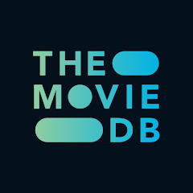

---
hide:
  - toc
---
# Builders

Builders use third-party services to source items to be added to the collection. Multiple builders can be used in the same collection from a variety of sources listed below.

!!! builder

    { align=right }

    **[Plex](plex.md)** builders create Collections based on the metadata inside your Plex Server. Can be Smart Collections (i.e. the Collection will automatically update as new media is added to your library), or non-Smart Collections (i.e. you must run Kometa for the Collection to be updated)

    [:octicons-home-16: View Builder](plex.md){ .md-button .md-button--primary }

    ??? quicklink "Popular Builders"

        - [:simple-plex: Smart Filter](plex.md#smart-filter) - Create a Smart Collection based on the filter parameters provided.
        - [:simple-plex: Plex Search](plex.md#plex-search) - Create a Collection based on items within the Plex library.

!!! builder

    { align=right }

    **[TMDb](tmdb.md)** builders grab items based on metadata and lists on TheMovieDb.org

    [:octicons-home-16: View Builder](tmdb.md){ .md-button .md-button--primary }

    ??? quicklink "Popular Builders"

        - [:simple-themoviedatabase: TMDb Collection](tmdb.md#collection) - Gets every movie/show in your library.
        - [:simple-themoviedatabase: TMDb List](tmdb.md#list) - Gets every movie/show in your Watchlist.
        - [:simple-themoviedatabase: TMDb Company](tmdb.md#company) - Gets the first episode of every show in your library.
        - [:simple-themoviedatabase: TMDb Network](tmdb.md#network) - Gets the first episode of every show in your library.

!!! builder

    { align=right }

    **[Trakt](trakt.md)** builders grab items based on metadata and lists on Trakt.tv

    [:octicons-home-16: View Builder](trakt.md){ .md-button .md-button--primary }

    ??? quicklink "Popular Builders"

        - [:simple-trakt: Trakt List](trakt.md#trakt-list) - Gets  every movie/show in the Trakt List
        - [:simple-trakt: Trakt Chart](trakt.md#trakt-chart) - Gets every movie/show in the Trakt Chart
        - [:simple-trakt: Trakt Recommendations](trakt.md#trakt-recommendations) - Gets every movie/show in Trakt's Personal Recommendations for your User

!!! builder

    { align=right }

    **[MDBList](mdblist.md)** builders grab items based on lists on MDBList.com

    [:octicons-home-16: View Builder](mdblist.md){ .md-button .md-button--primary }

    ??? quicklink "Popular Builders"

        - [:octicons-list-ordered-16: MDBList List](mdblist.md#mdblist-list) - Gets every movie/show in a MDBList List.

!!! builder

    { align=right }

    **[IMDb](imdb.md)** builders grab items based on metadata and lists on IMDb.com

    [:octicons-home-16: View Builder](imdb.md){ .md-button .md-button--primary }

    ??? quicklink "Popular Builders"

        - [:simple-imdb: IMDb Search](imdb.md#imdb-search) - Gets every movie/show in an IMDb Search. Can also be used for Keyword searches.
        - [:simple-imdb: IMDb Chart](imdb.md#imdb-chart) - Gets every movie/show in an IMDb Chart like IMDb Top 250 Movies.
        - [:simple-imdb: IMDb List](imdb.md#imdb-list) - Gets every movie/show in an IMDb List.
        - [:simple-imdb: IMDb Award](imdb.md#imdb-award) - Gets every movie/show in an IMDb Event.

!!! builder

    { align=right }

    **[TVDb](tvdb.md)** builders grab items based on metadata and lists on TheTVDb.com

    [:octicons-home-16: View Builder](tvdb.md){ .md-button .md-button--primary }

    ??? quicklink "Popular Builders"

        - [:material-television-guide: TVDb Show](tvdb.md#tvdb-show) - Grabs the specified series.
        - [:material-television-guide: TVDb Movie](tvdb.md#tvdb-movie) - Gets the specified movies.
        - [:material-television-guide: TVDb List](tvdb.md#tvdb-list) - Gets every item in a TVDb List or TVDb UserList.

!!! builder

    { align=right }

    **[BoxOfficeMojo](mojo.md)** builders grab items based on metadata and lists on Boxofficemojo.com

    [:octicons-home-16: View Builder](mojo.md){ .md-button .md-button--primary }
    [:octicons-alert-24:](""){ .card-link title="Only works with Movie libraries" }

    ??? quicklink "Popular Builders"

        - [:material-ticket: Mojo World](mojo.md#mojo-world) - Grabs items in the Worldwide Box Office chart.
        - [:material-ticket: Mojo Domestic](mojo.md#mojo-domestic) - Grabs items in the Domestic Box Office chart.
        - [:material-ticket: Mojo Record](mojo.md#mojo-record) - Grabs items in miscellaneous lists such as Weekend Records and Daily Records.

!!! builder

    { align=right }

    **[Tautulli](tautulli.md)** builders grab items based on lists on Tautulli

    [:octicons-home-16: View Builder](tautulli.md){ .md-button .md-button--primary }

    ??? quicklink "Popular Builders"

        - [:material-movie-search: Tautulli Popular](tautulli.md#tautlli-popularwatched) - Gets  every movie/show in the Tautulli Most Popular List
        - [:material-movie-search: Tautulli Watched](tautulli.md#tautulli-popularwatched) - Gets every movie/show in the Tautulli Most Watched List

!!! builder

    { align=right }

    **[Radarr](radarr.md)** builders grab items based on tags in Radarr

    [:octicons-home-16: View Builder](radarr.md){ .md-button .md-button--primary }
    [:octicons-alert-24:](""){ .card-link title="Only works with Movie libraries" }

    ??? quicklink "Popular Builders"

        - [:octicons-tag-16: Radarr All](radarr.md#radarr-all) - Gets every movie in Radarr
        - [:octicons-tag-16: Radarr Taglist](radarr.md#radarr-taglist) - Gets every movie with the specified tags

!!! builder

    { align=right }

    **[Sonarr](sonarr.md)** builders grab items based on tags in Sonarr

    [:octicons-home-16: View Builder](sonarr.md){ .md-button .md-button--primary }
    [:octicons-alert-24:](""){ .card-link title="Only works with Show libraries" }

    ??? quicklink "Popular Builders"

        - [:octicons-tag-16: Sonarr All](sonarr.md#sonarr-all) - Gets every show in Sonarr
        - [:octicons-tag-16: Sonarr Taglist](sonarr.md#sonarr-taglist) - Gets every show with the specified tags

!!! builder

    { align=right }

    **[Letterboxd](letterboxd.md)** builders grab items based on lists on Letterboxd.com

    [:octicons-home-16: View Builder](letterboxd.md){ .md-button .md-button--primary }
    [:octicons-alert-24:](""){ .card-link title="Only works with Movie libraries" }

    ??? quicklink "Popular Builders"

        - [:simple-letterboxd: Letterboxd List](letterboxd.md#letterboxd-list) - Gets every movie in the Letterboxd list

!!! builder

    { align=right }

    **[ICheckMovies](icheckmovies.md)** builders grab items based on lists on ICheckMovies.com

    [:octicons-home-16: View Builder](icheckmovies.md){ .md-button .md-button--primary }
    [:octicons-alert-24:](""){ .card-link title="Only works with Movie libraries" }

    ??? quicklink "Popular Builders"

        - [:material-check: ICheckMovies List](icheckmovies.md#icheckmovies-list) - Gets every show in the ICheckMovies list

!!! builder

    { align=right }

    **[AniDB](anidb.md)** builders grab items based on metadata and lists on AniDB.com

    [:octicons-home-16: View Builder](anidb.md){ .md-button .md-button--primary }

    ??? quicklink "Popular Builders"

        - [:octicons-database-16: AniDB ID](anidb.md#andb-id) - Finds the anime specified by the AniDB ID
        - [:octicons-database-16: AniDB Popular](anidb.md#anidb-popular) - Finds every anime in AniDB's Popular Anime list
        - [:octicons-database-16: AniDB Tags](anidb.md#anidb-tag) - Finds every anime with the specified AniDB Tag

!!! builder

    { align=right }

    **[AniList](anilist.md)** builders grab items based on metadata and lists on AniList.com

    [:octicons-home-16: View Builder](anilist.md){ .md-button .md-button--primary }

    ??? quicklink "Popular Builders"

        - [:simple-anilist: AniList Top Rated](anilist.md#anilist-top-rated) - Gets every anime in AniList's Top Rated Anime list
        - [:simple-anilist: AniList Popular](anilist.md#anilist-popular) - Gets every anime in AniList's Popular Anime list
        - [:simple-anilist: AniList Trending](anilist.md#anilist-trending) - Gets every anime in AniList's Trending Anime list
        - [:simple-anilist: AniList Search](anilist.md#anilist-search) - Gets every anime specified by the AniList search parameters provided

!!! builder

    { align=right }

    **[MyAnimeList](myanimelist.md)** builders grab items based on metadata and lists on MyAnimeList.com

    [:octicons-home-16: View Builder](myanimelist.md){ .md-button .md-button--primary }

    ??? quicklink "Popular Builders"

        - [:simple-myanimelist: MyAnimeList Popular](myanimelist.md#myanimelist-most-popular) - Gets every anime in MyAnimeList's Most Popular Anime list
        - [:simple-myanimelist: MyAnimeList Top All](myanimelist.md#myanimelist-top-all) - Gets every anime in MyAnimeList's Top All Anime list
        - [:simple-myanimelist: MyAnimeList Top Airing](myanimelist.md#myanimelist-top-airing) - Gets every anime in MyAnimeList's Top Airing Anime list
        - [:simple-myanimelist: MyAnimeList Suggested](myanimelist.md#myanimelist-suggested) - Gets every suggested anime in by MyAnimeList for the authorized user

!!! builder

    { align=right }

    **[Reciperr](reciperr.md)** builders grab items based on lists on Reciperr.com

    [:octicons-home-16: View Builder](reciperr.md){ .md-button .md-button--primary }
    [:octicons-alert-24:](""){ .card-link title="Only works with Movie libraries" }

    ??? quicklink "Popular Builders"

        - [:material-chef-hat: Reciperr List](reciperr.md#reciperr-list) - Gets every movie returned by the Reciperr JSON data URL.

!!! builder

    { align=right }

    **[StevenLu](stevenlu.md)** builders grab items based on lists on StevenLu.com

    [:octicons-home-16: View Builder](stevenlu.md){ .md-button .md-button--primary }
    [:octicons-alert-24:](""){ .card-link title="Only works with Movie libraries" }

    ??? quicklink "Popular Builders"

        - [:material-pirate: StevenLu Popular](stevenlu.md#stevenlus-popular-movies-list) - Gets every movie on StevenLu's Popular Movies List.